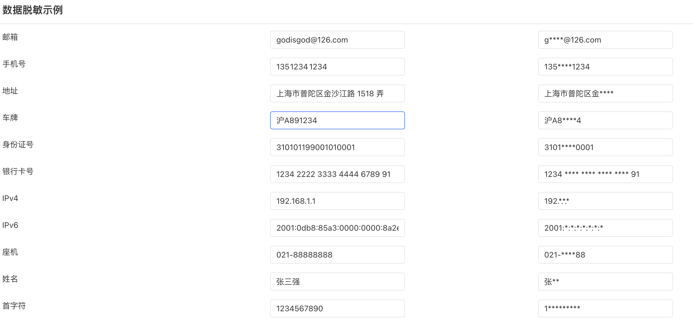

# DataMaskingUtil

数据掩码工具，主要功能是将敏感数据字段进行掩码处理，目前支持的字段类型有：姓名、座机号、地址、身份证、车牌、手机号、邮箱、IP地址、银行卡号

核心方法提取自开源工具 [hutool](https://github.com/dromara/hutool/)

## 逻辑详情

### firstMask

只显示第一个字符，其余用*号表示  
入参：String 字符串
出参：String 脱敏后的字符串

### chineseName

姓名脱敏，除第一个汉字其余用*号表示  
入参：String 字符串  
出参：String 脱敏后的姓名

### idCardNum

身份证号脱敏
入参1：String 字符串，身份证号  
入参2：Integer 保留：前面的front位数；从1开始   
入参3：Integer 保留：后面的end位数；从1开始  
出参：String 脱敏后的身份证号  

### fixedPhone

座机号脱敏，保留前四位，后两位，其余用*号表示  
入参：String 字符串，座机号  
出参：String 脱敏后的座机号  

### mobilePhone

手机号脱敏，保留前三位，后四位，其余用*号表示   
入参：String 字符串，手机号   
出参：String 脱敏后的手机号   

### address

地址脱敏，只显示到地区，不显示详细地址    
入参：String 字符串，地址  
出参：String 脱敏后的地址  

### email

邮箱前缀仅显示第一个字母，前缀其他隐藏，用*代替, @及后面的地址显示  
入参：String 字符串，邮箱地址  
出参：String 脱敏后的邮箱地址  

### carLicense

【中国车牌】车牌中间用*代替   
入参：String 字符串，车牌号   
出参：String 脱敏后的车牌号  

### bankCard

银行卡号脱敏，只展示前4位，后面的位数根据卡号决定展示1-4位  
入参：String 字符串，银行卡号  
出参：String 脱敏后的银行卡号  

### ipv4

IP地址脱敏，只展示第一个IP段，其他用*号表示  
入参：String 字符串，IP地址  
出参：String 脱敏后的IP地址  

### ipv6

IP地址脱敏，只展示第一个IP段，其他用*号表示  
入参：String 字符串，IP地址  
出参：String 脱敏后的IP地址  

## 使用步骤说明

1.  应用引用依赖库
2.  无需配置
3.  逻辑调用示例截图

## 应用演示链接

[使用了本依赖库的制品应用链接]

https://dev-testapp-qa.app.codewave.163.com/datamasking_page