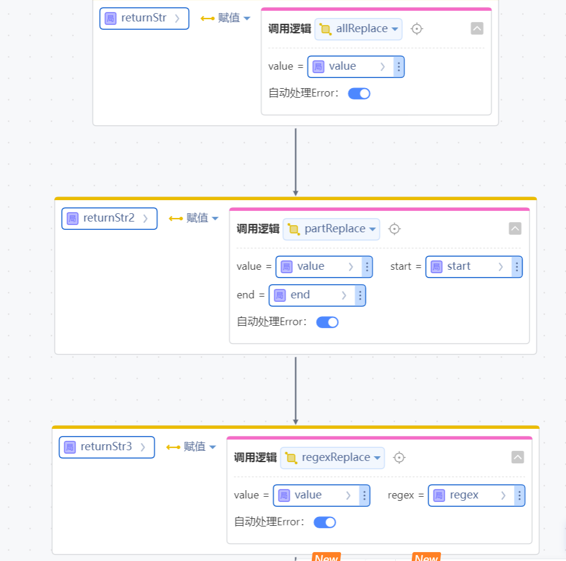

# DataMaskingUtil依赖库
提供常用的数据脱敏逻辑

## 逻辑详情

### 逻辑一  全部数据进行脱敏，

随机生成1-5个*  防止知道数据长度
入参：要脱敏的字符串，支持空字符串
返回1-5个*

### 逻辑二  指定区间进行数据脱敏

入参1 value   要脱敏的字符串
入参2 start  开始位置 从1开始计算
入参3 end    结束位置 从1开始计算
返回  按要求脱敏后的数据

### 逻辑三  正则脱敏
入参1 value 要脱敏的字符串
入参2 regex 正则表达式
返回 满足正则表达式的部分进行脱敏后的字符串

## 使用步骤说明

1.  应用引用依赖库
2.  配置应用配置参数（如果有的话）
3.  逻辑调用示例截图
4.  

## 应用演示链接

[使用了本依赖库的制品应用链接]
