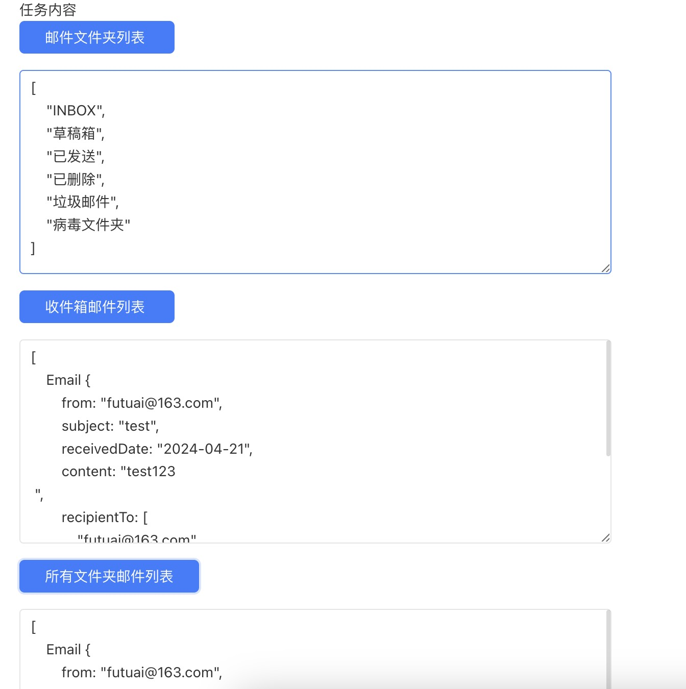

# 邮件拉取器
邮件拉取器，适配IMAP, POP3协议邮箱

## 逻辑详情

### getFolders

获取邮箱文件夹列表

* 入参：无
* 出参：List<String>

### getInboxEmails

获取邮箱收件箱邮件列表

* 入参：int page, int pageSize
* 出参：List<Email>

### extractEmails

提取邮件内容
* 入参：includes 文件夹包含, excludes 文件夹不包含, keywords 关键词
* 出参：List<Email>

## 使用步骤说明

1.  应用引用依赖库
2.  配置应用配置参数
3.  逻辑调用示例截图

## 应用演示链接

[使用了本依赖库的制品应用链接]
https://dev-test430-qa.app.codewave.163.com/email