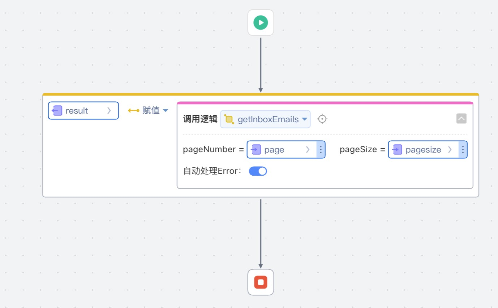

# 邮件拉取器
邮件拉取器，适配IMAP, POP3协议邮箱。支持将附件保存到阿里云OSS中。

## 逻辑详情

### getInboxEmails

获取邮箱收件箱邮件列表

* 入参：int page, int pageSize
* 出参：`List<Email>`

### extractEmails

提取邮件内容
* 入参：无
* 出参：`List<Email>`

## 使用步骤说明

1.  应用引用依赖库
2.  配置应用配置参数
3.  逻辑调用示例截图

## 应用演示链接

[使用了本依赖库的制品应用链接]
https://dev-test430-qa.app.codewave.163.com/email