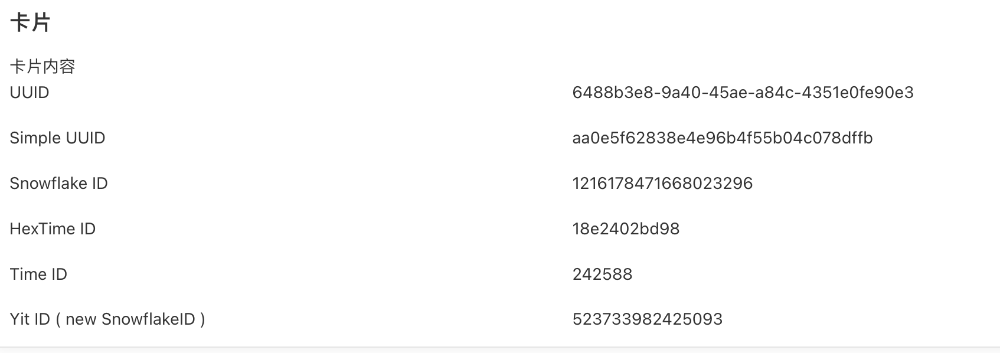

# IDUtil
ID生成工具包

## 逻辑详情

### UUID

生成随机UUID
无入参
出参为String

### UUIDSimple

生成随机UUID，"-"被替换为空字符
无入参
出参为String

### isValidUUID

验证是否为32位UUID字符串
出参：String: "1"或"0"

### SnowflakeId

生成雪花ID，无入参
出参: String

### HexTimeId

将当前时间戳转换为十六进制，无入参
出参: String

### TimeId

从指定时间算起的时间戳差值加上指定位数的随机值
入参：IDUtilTime结构体

startTime String：起始时间，格式 yyyy-MM-dd HH:mm:ss
randomLength int: 随机数位数

出参：String: 

### YitId
根据开源新的雪花算法随机的ID https://gitee.com/yitter/idgenerator
入参：YitIdGeneratorOptions 
出参：String:

## 使用步骤说明

1.  应用引用依赖库
2.  无需配置
3.  逻辑调用示例截图

## 应用演示链接

[使用了本依赖库的制品应用链接]
https://dev-testapp-qa.app.codewave.163.com/idutil_page