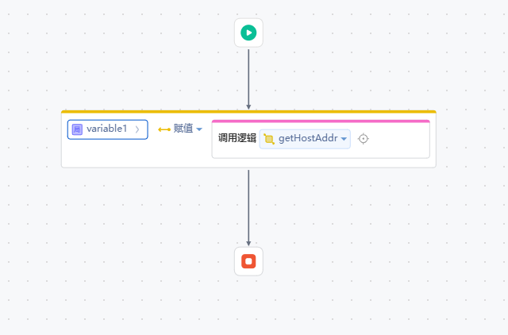

# IPUitl工具类
本依赖库封装了一些常用的ip常用方法，如果获取ipv4地址，判断地址是否是有效的等

## 逻辑详情

### 逻辑一

获取主机地址，返回 String

### 逻辑二

获取ipv4地址，返回List<String>

### 逻辑三

判断ip地址是否是有效的ipv4地址  入参 String  返回 boolean

## 使用步骤说明

1.  应用引用依赖库
2.  配置应用配置参数（如果有的话）
3.  逻辑调用示例截图
4.  
5. 

## 应用演示链接

[使用了本依赖库的制品应用链接]
