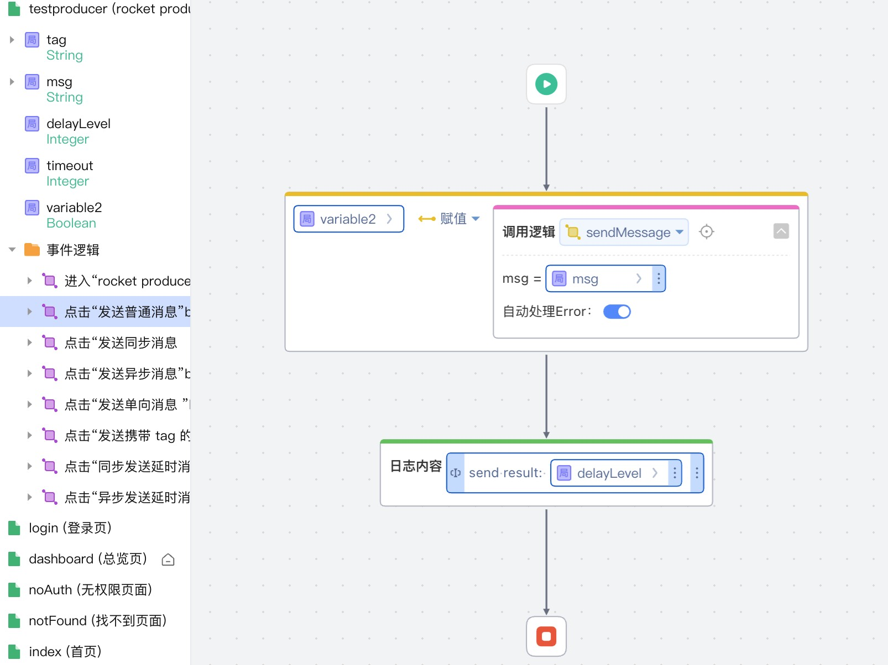

# RocketMQ依赖库
RocketMQ依赖库，提供发送消息方法和订阅消费消息方法，支持普通消息和延时消息。

## 逻辑详情

### sendMessage

发送普通消息

入参：
* msg String 消息体

出参：
* boolean

### syncSendMessage

发送同步消息

入参：
* msg String 消息体

出参：
* boolean

### asyncSendMessage

发送异步消息

入参：
* msg String 消息体
* callback Function<Boolean, Boolean> 回调函数

出参：
* boolean

### sendOneWayMessage

发送单向消息

入参：
* msg String 消息体

出参：
* boolean

### syncSendMessageWithTag

发送携带 tag 的消息（过滤消息）

入参：
* tag String 消息标签
* msg String 消息体

出参：
* boolean

### syncSendDelay

同步发送延时消息

入参：
* msg String 消息体
* timeout Long 超时时间
* delayLevel Integer 延时等级（1-18）

出参：
* boolean

### asyncSendDelay

异步发送延时消息

入参：
* msg String 消息体
* timeout Long 超时时间
* delayLevel Integer 延时等级（1-18）
* callback Function<Boolean, Boolean> 回调函数

出参：
* boolean

### sendTopicMessage

发送普通消息

入参：
* topic String 主题
* msg String 消息体
* group String 组

出参：
* boolean

### syncSendTopicMessage

发送同步消息

入参：
* topic String 主题
* msg String 消息体
* group String 组

出参：
* boolean

### asyncSendTopicMessage

发送异步消息

入参：
* topic String 主题
* msg String 消息体
* callback Function<Boolean, Boolean> 回调函数
* group String 组

出参：
* boolean

### sendOneWayTopicMessage

发送单向消息

入参：
* topic String 主题
* msg String 消息体
* group String 组

出参：
* boolean

### syncSendTopicMessageWithTag

发送携带 tag 的消息（过滤消息）

入参：
* topic String 主题
* tag String 标签
* msg String 消息体
* group String 组

出参：
* boolean

### syncSendTopicDelay

同步发送延时消息

入参：
* topic String 主题
* msg String 消息体
* timeout Long 超时时间
* delayLevel Integer 延时等级（1-18）
* group String 组

出参：
* boolean

### asyncSendTopicDelay

异步发送延时消息

入参：
* topic String 主题
* msg String 消息体
* timeout Long 超时时间
* delayLevel Integer 延时等级（1-18）
* callback Function<Boolean, Boolean> 回调函数
* group String 组

出参：
* boolean

## 使用步骤说明

1.  应用引用依赖库
2.  配置应用配置参数
    * nameServer  消息队列地址
    * producerGroup 生产者组
    * producerAccessKey 消息队列访问密钥
    * producerSecretKey 消息队列访问密钥
    * consumerGroup 消费者组
    * consumerTopic 消息队列主题
    * consumerAccessKey 消息队列访问密钥
    * consumerSecretKey 消息队列访问密钥
3.  逻辑调用示例截图

## 应用演示链接

[使用了本依赖库的制品应用链接]

https://dev-testrocketm-qa.app.codewave.163.com/testproducer