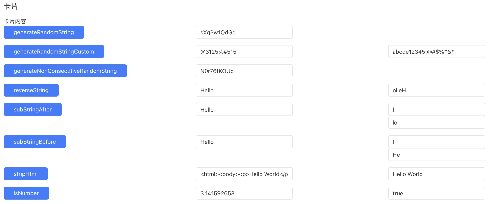

# StringUtils
StringUtils

## 逻辑详情

### generateRandomString

生成随机字符串，包含大小写字母和数字的字符集

入参：
- len int：字符串长度

出参：
- String：生成的随机字符串

### generateRandomStringCustom

使用自定义字符集，生成长度为len的随机字符串

入参：
- len int：字符串长度
- CustomCharacterSet String：自定义字符集

出参：
- String：生成的随机字符串

### generateNonConsecutiveRandomString

生成随机字符串，包含大小写字母和数字的字符集，且相邻字符不能一样

入参：
- len int：字符串长度

出参：
- String：生成的随机字符串

### subStringAfter

返回原始字符串中匹配给定子字符串后的剩余部分

入参：
- origin String：原始字符串
- needle String：给定子字符串

出参：
- String：匹配子字符串后的剩余部分

### subStringBefore

返回原始字符串中匹配给定子字符串之前的剩余部分

入参：
- origin String：原始字符串
- needle String：给定子字符串

出参：
- String：匹配子字符串之前的剩余部分

### stripHtml

移除HTML标签

入参：
- html String：包含HTML标签的字符串

出参：
- String：移除HTML标签后的字符串

### isNumber

判断输入字符串是否是有效数字

入参：
- str String：待判断的字符串

出参：
- boolean：如果是有效数字返回true，否则返回false

### reverseString

反转字符串

入参：
- str String：待反转的字符串

出参：
- String：反转后的字符串

## 使用步骤说明

1.  应用引用依赖库
2.  无需配置
3.  逻辑调用示例截图

## 应用演示链接

[使用了本依赖库的制品应用链接]

https://dev-testapp2024-qa.app.codewave.163.com/stringutils
