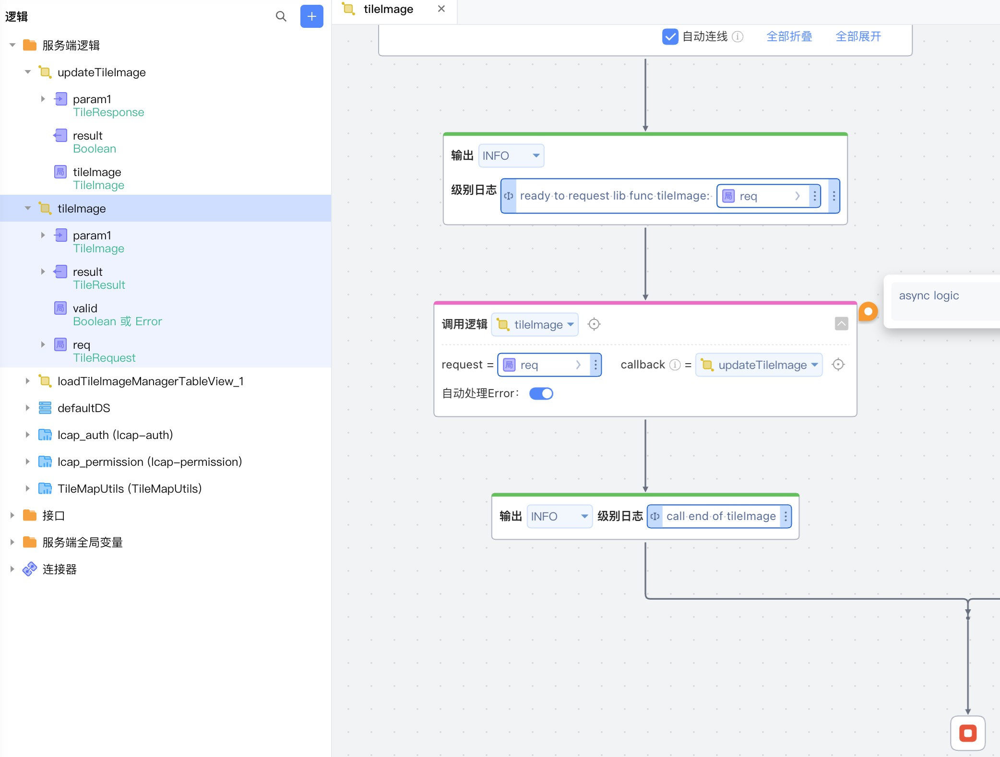

# TileMapUtils
超大图片渲染切片依赖库， 支持Amazon S3协议存储；本依赖库可配合前端依赖库library_tilemap实现瓦片切片渲染。

## 逻辑详情

### validate

检查图片信息是否可以切图

入参：request TileRequest   
出参：TileValidateResponse 或 TileRuntimeException

#### TileValidateResponse中的 errorCode枚举值：
* 0: 成功
* 1: 无效URL
* 2: 瓦片大小不合法
* 3: 输出目录不合法
* 4: 图片类型不支持 (jpg/png)
* 5: 图片尺寸太小
* 6: 可用内存不足

### tileImage

瓦片图片切图

入参：
* request TileRequest
* callback Function<TileResponse, Boolean>

出参：boolean, 实际为异步执行，需通过回调获取结果

## 使用步骤说明

1.  应用引用依赖库
2.  配置应用配置参数
    * ossBucketDomain oss存储桶域名
    * ossEndpoint oss存储桶域名
    * ossAccessKeyId oss访问密钥id
    * ossAccessKeySecret oss访问密钥
    * ossBucketName oss存储桶名称
    * imageMaxWidth 图片最大宽度
    * imageMaxHeight 图片最大高度
3.  逻辑调用示例截图

## 应用演示链接

[使用了本依赖库的制品应用链接]

https://dev-tilemap-qa.app.codewave.163.com/maps