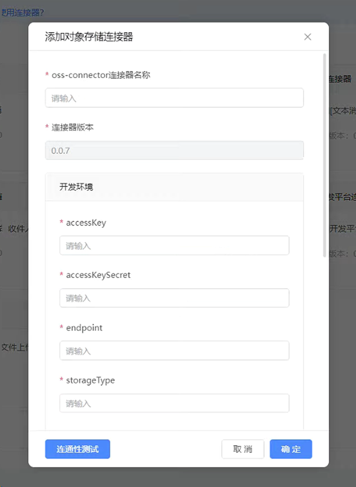
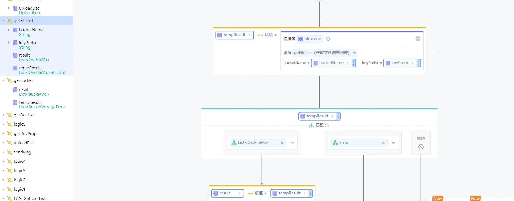

# aliyun对象存储连接器
支持文件上传、文件访问控制、删除文件、获取文件信息列表

## 逻辑详情

### 逻辑一  列举所有的bucket listBuckets  
* @return List<BucketVo> 
* BucketVo 介绍参考 <com.yu.vo.BucketVo>
* 
### 逻辑二  简单文件上传 simpleUpload
* @param uploadDto 入参类型 UploadDto 介绍参考<com.yu.dto.UploadDto>
* @return UploadReturnVo  介绍参考 <com.yu.vo.UploadReturnVo>
* 
### 逻辑三  获取文件信息列表 geFileList
* @param bucketName bucket名称
* @param keyPrefix  文件前缀 如果不设置keyPrefix，则列举存储空间下的所有文件。如果设置keyPrefix，则列举包含指定前缀的文件。
* @return List<OssFileVo> 介绍参考<com.yu.vo.OssFileVo>

### 逻辑四  修改文件读写权限 setFileAcl
* @param bucketName bucket名称
* @param objectName 对象名
* @param acl        权限 取值为 default private public-read public-read-write
* @return Boolean true代表修改成功 false 代表修改失败
* 
### 逻辑五 删除上传的文件或目录 如果要删除目录，目录必须为空。 deleteFile
* @param bucketName bucket名称
* @param objectName 对象名
* @return Boolean true代表修改成功 false 代表修改失败

## 使用步骤说明

1.  应用引用依赖库
2.  配置应用配置参数（如果有的话）
3.  逻辑调用示例截图
4.  填写accessKey和accessKeySecret和endpoint

5. 测试完成后点击确定，然后新建一个服务端逻辑，调用新建的连接器的相应逻辑，传入参数进行使用独享连接器方法

## 应用演示链接

[使用了本依赖库的制品应用链接]
