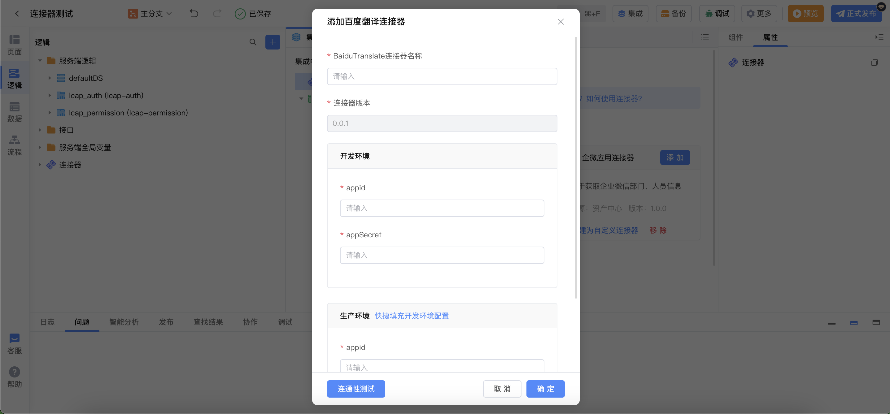
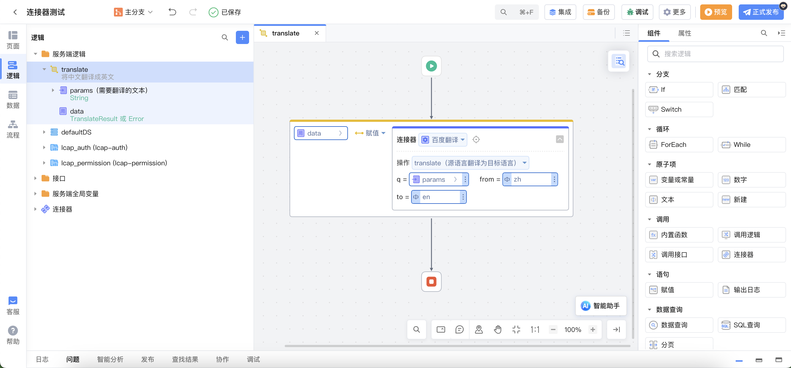
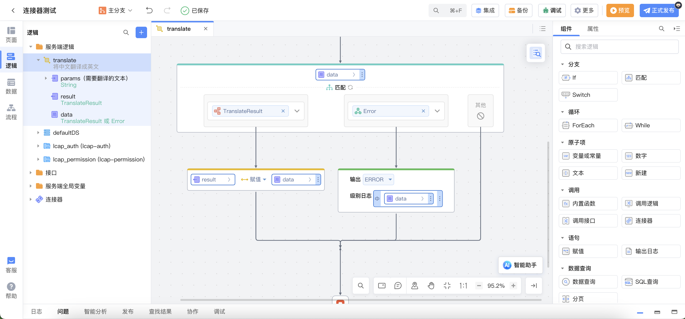
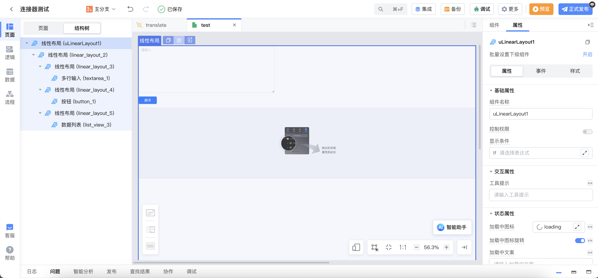
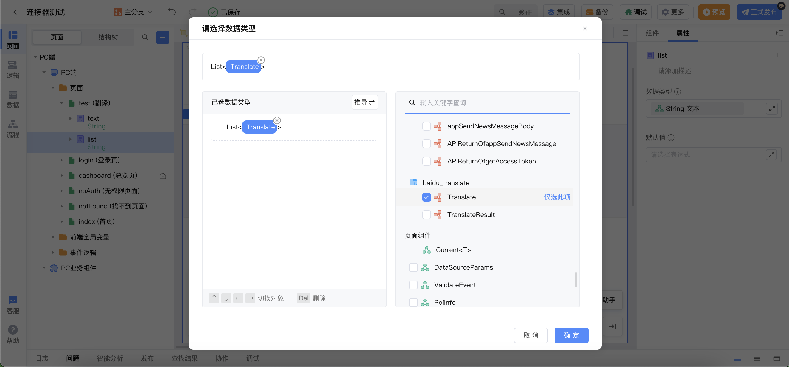
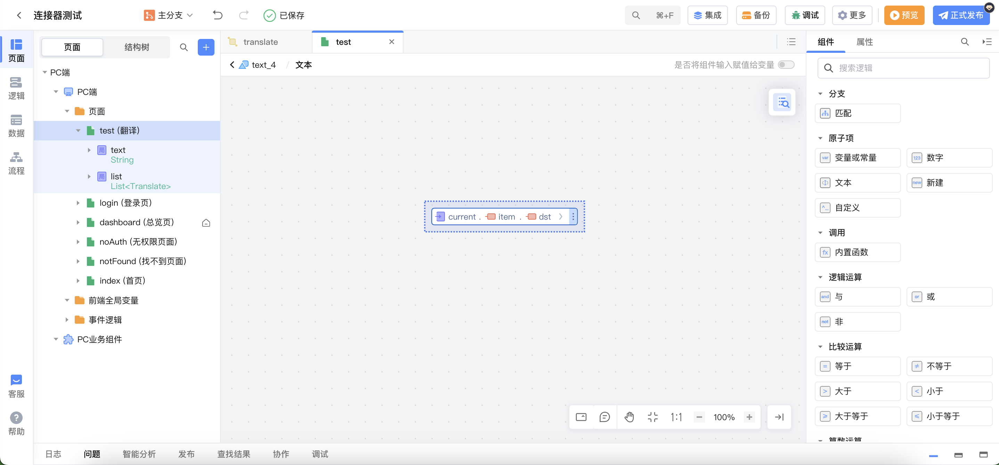
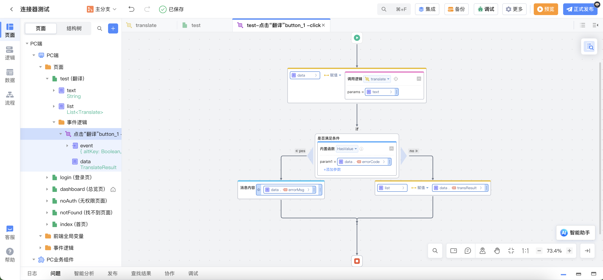

# 百度翻译连接器

## 功能概述

百度翻译连接器用于调用百度翻译 API。

调用百度翻译 API，需要接入百度翻译服务，请参考：[百度翻译-接入服务](https://fanyi-api.baidu.com/doc/13)

## 功能介绍

用于将给定的文本，从源语言翻译为目标语言。文本中可通过`\n`来分隔要翻译的多个单词或者多段文本，这样就能得到多段文本独立的翻译结果。

| 操作标识  | 操作名称     | 对应百度翻译接口文档               |
| --------- | ------------ | ---------------------------------- |
| translate | 通用文本翻译 | https://fanyi-api.baidu.com/doc/21 |

### translate 标识入参/出参说明

`translate 标识` 入参说明

| 参数名 | 类型   | 是否必填 | 描述           | 备注                                     |
| ------ | ------ | -------- | -------------- | ---------------------------------------- |
| q      | string | 是       | 请求翻译 query | 使用`\n`分隔要翻译的多个单词或者多段文本 |
| from   | string | 是       | 翻译源语言     | 可设置为 auto                            |
| to     | string | 是       | 翻译目标语言   | 不可设置为 auto                          |

`translate 标识` 出参说明

| 参数名      | 类型            | 是否必填 | 描述                                                           | 备注 |
| ----------- | --------------- | -------- | -------------------------------------------------------------- | ---- |
| from        | string          | 源语言   | 返回用户指定的语言，或者自动检测出的语种（源语言设为 auto 时） |
| to          | string          | 目标语言 | 返回用户指定的目标语言                                         |
| transResult | List<Translate> | 翻译结果 | 返回翻译结果，包括 `src` 和 `dst` 字段                         |
| errorCode   | string          | 错误码   | 仅当存在错误时有值                                             |
| errorMsg    | string          | 错误信息 | 仅当存在错误时有值                                             |

`Translate`结构说明

| 字段名 | 说明 |
| ------ | ---- |
| src    | 原文 |
| dst    | 译文 |

## 操作示例

### 1. 添加连接器

添加连接器并填入`appid`（应用 ID）和`appSecret`（密钥）。

### 2. 调用连接器

示例：使用百度翻译连接器将中文翻译成英文。

创建服务端逻辑，添加输入参数`params`，类型为`String`，代表需要翻译的文本，调用百度翻译连接器，操作选择`translate`(通用文本翻译)，`from参数`输入文本`zh`，`to参数`输入文本`en`，创建局部变量`data`接收连接器调用结果。

添加输出参数`result`，对接收的结果`data`进行匹配，当结果正确返回时，将`data`赋值给`result`；当结果返回`Error`时，输出日志。

创建页面如下图所示，使用`多行输入组件`接收用户输入的需要翻译的文本，使用`数据列表组件`展示翻译结果列表。

在页面创建`text局部变量`用于绑定多行输入组件的值，创建`list局部变量`用于绑定翻译结果。`list`类型选择如下图所示。

数据列表组件项插入文本，文本绑定值如下图所示。

翻译按钮添加事件逻辑，调用之前创建的服务端逻辑。对调用返回结果进行判断，当结果中存在错误码时，弹出消息；当调用结果中不存在错误码时，将翻译结果赋值给数据列表绑定的`局部变量list`。

预览应用，输入需要翻译的文本，点击翻译，即可看到翻译结果。

## 补充说明

百度翻译支持语种列表请参考[百度翻译-通用文本翻译-语种列表](https://fanyi-api.baidu.com/doc/21)
