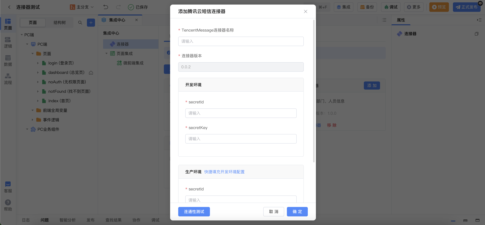
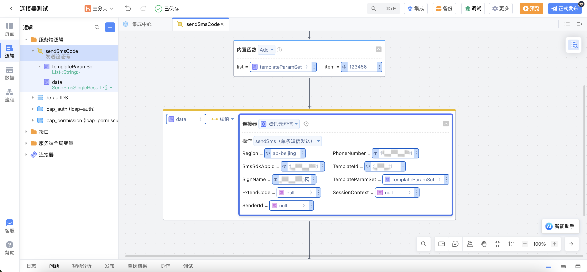
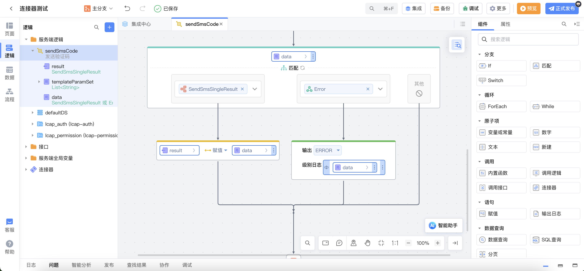
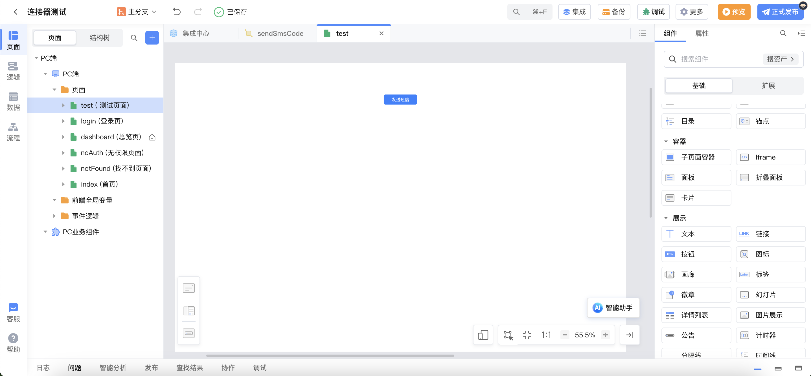
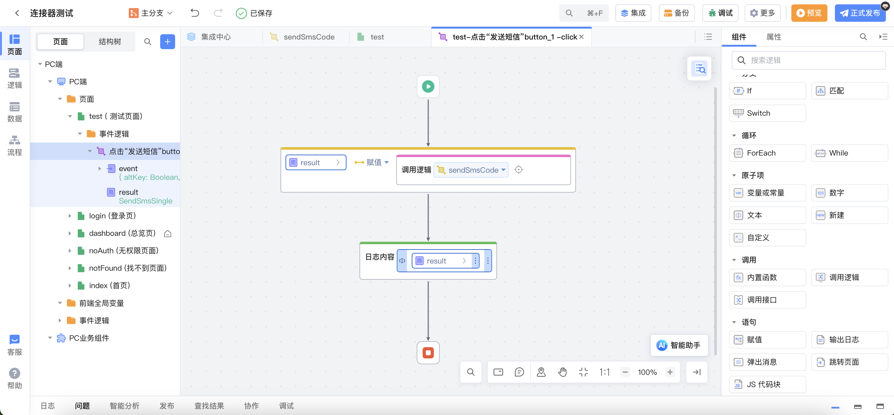
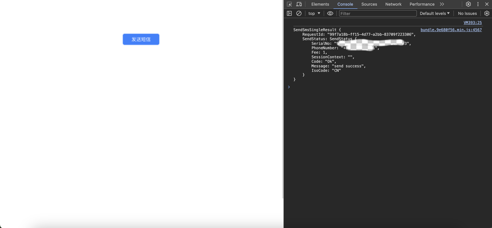

# 腾讯短信连接器

## 功能概述

腾讯云短信（Short Message Service，SMS）沉淀腾讯十多年短信服务技术和经验，为 QQ、微信等亿级平台和 10 万+客户提供国内短信和国际/港澳台短信服务。国内短信验证秒级触达，99%到达率；国际/港澳台短信覆盖全球 200+国家/地区，稳定可靠。腾讯短信连接器用于腾讯云短信 API 进行短信发送。

[腾讯云短信常用概念](https://cloud.tencent.com/document/product/382/13299)

腾讯云短信使用流程可参考[腾讯云短信](https://console.cloud.tencent.com/smsv2)

## 功能介绍

用于向国内短信和国际/港澳台号码发送短信。

| 操作标识     | 操作名称     |
| ------------ | ------------ |
| sendSms      | 单条短信发送 |
| sendSmsBatch | 批量短信发送 |

### sendSms 标识说明

`sendSms 标识` 入参说明

| 参数名 | 类型 | 是否必填 | 描述 | 备注 |
| --- | --- | --- | --- | --- |
| Region | String | 是 | 服务器地域 | 产品支持的 [地域列表](https://cloud.tencent.com/document/api/382/52071#.E5.9C.B0.E5.9F.9F.E5.88.97.E8.A1.A8) |
| PhoneNumber | String | 是 | 下发手机号码，采用 E.164 标准，格式为 **+[国家或地区码][手机号]** | 例如：+8613711112222， 其中前面有一个+号 ，86 为国家码，13711112222 为手机号。注：发送国内短信格式还支持 0086、86 或无任何国家或地区码的 11 位手机号码，前缀默认为+86。示例值：+8618511122233 |
| SmsSdkAppId | String | 是 | 短信 SdkAppId | 在 [短信控制台](https://console.cloud.tencent.com/smsv2/app-manage) 添加应用后生成的实际 SdkAppId，示例如 1400006666。示例值：1400006666 |
| TemplateId | String | 是 | 模板 ID，**注：必须填写已审核通过的模板 ID** | 模板 ID 可前往 [国内短信](https://console.cloud.tencent.com/smsv2/csms-template) 或 [国际/港澳台短信](https://console.cloud.tencent.com/smsv2/isms-template) 的正文模板管理查看，若向境外手机号发送短信，仅支持使用国际/港澳台短信模板。示例值：1110 |
| SignName | String | 否 | 短信签名内容，使用 UTF-8 编码，**必须填写已审核通过的签名**，**发送国内短信该参数必填，且需填写签名内容而非签名 ID** | 例如：腾讯云，签名信息可前往 [国内短信](https://console.cloud.tencent.com/smsv2/csms-sign) 或 [国际/港澳台短信](https://console.cloud.tencent.com/smsv2/isms-sign) 的签名管理查看。 |
| TemplateParamSet | `List<String>` | 否 | 模板参数，若无模板参数，则设置为空。 | 模板参数的个数需要与 TemplateId 对应模板的变量个数保持一致。 |
| ExtendCode | String | 否 | 短信码号扩展号 | 默认未开通， 示例值：12 |
| SessionContext | String | 否 | 用户的 session 内容，可以携带用户侧 ID 等上下文信息，server 会原样返回。 | 注意长度需小于 512 字节。示例值：test |
| SenderId | String | 否 | 国内短信无需填写该项；国际/港澳台短信已申请独立 SenderId 需要填写该字段，默认使用公共 SenderId，无需填写该字段。 | 示例值：Qsms |

`sendSms 标识` 出参说明

| 参数名     | 类型       | 描述                                                                                                                                                  |
| ---------- | ---------- | ----------------------------------------------------------------------------------------------------------------------------------------------------- |
| RequestId  | String     | 唯一请求 ID，由服务端生成，每次请求都会返回（若请求因其他原因未能抵达服务端，则该次请求不会获得 RequestId）。定位问题时需要提供该次请求的 RequestId。 |
| SendStatus | SendStatus | 短信发送状态。                                                                                                                                        |

`SendStatus 结构` 说明

| 字段名         | 类型   | 说明                                                                                                                                                                                       |
| -------------- | ------ | ------------------------------------------------------------------------------------------------------------------------------------------------------------------------------------------ |
| SerialNo       | String | 发送流水号。示例值：5000:1045710669157053657849499619                                                                                                                                      |
| PhoneNumber    | String | 手机号码，E.164 标准，+[国家或地区码][手机号] ，示例如：+8613711112222， 其中前面有一个+号 ，86 为国家码，13711112222 为手机号。示例值：+8618511122233                                     |
| Fee            | Long   | 计费条数。示例值：1                                                                                                                                                                        |
| SessionContext | String | 用户 session 内容。                                                                                                                                                                        |
| Code           | String | 短信请求错误码，具体含义请参考 [错误码](https://cloud.tencent.com/document/api/382/55981#6.-.E9.94.99.E8.AF.AF.E7.A0.81)，发送成功返回 "Ok"。                                              |
| Message        | String | 短信请求错误码描述。                                                                                                                                                                       |
| IsoCode        | String | 国家码或地区码，例如 CN、US 等，对于未识别出国家码或者地区码，默认返回 DEF，具体支持列表请参考 [国际/港澳台短信价格总览](https://cloud.tencent.com/document/product/382/18051)。示例值：CN |

### sendSmsBatch 标识说明

`sendSmsBatch 标识` 入参说明

| 参数名 | 类型 | 是否必填 | 描述 | 备注 |
| --- | --- | --- | --- | --- |
| Region | String | 是 | 服务器地域 | 产品支持的 [地域列表](https://cloud.tencent.com/document/api/382/52071#.E5.9C.B0.E5.9F.9F.E5.88.97.E8.A1.A8) |
| PhoneNumberSet | `List<String>` | 是 | 下发手机号码列表，采用 E.164 标准，格式为 **+[国家或地区码][手机号]** 。单次请求最多支持 200 个手机号且要求全为境内手机号或全为境外手机号。 | 例如：+8613711112222， 其中前面有一个+号 ，86 为国家码，13711112222 为手机号。注：发送国内短信格式还支持 0086、86 或无任何国家或地区码的 11 位手机号码，前缀默认为+86。示例值：+8618511122233 |
| SmsSdkAppId | String | 是 | 短信 SdkAppId | 在 [短信控制台](https://console.cloud.tencent.com/smsv2/app-manage) 添加应用后生成的实际 SdkAppId，示例如 1400006666。示例值：1400006666 |
| TemplateId | String | 是 | 模板 ID，**注：必须填写已审核通过的模板 ID** | 模板 ID 可前往 [国内短信](https://console.cloud.tencent.com/smsv2/csms-template) 或 [国际/港澳台短信](https://console.cloud.tencent.com/smsv2/isms-template) 的正文模板管理查看，若向境外手机号发送短信，仅支持使用国际/港澳台短信模板。示例值：1110 |
| SignName | String | 否 | 短信签名内容，使用 UTF-8 编码，**必须填写已审核通过的签名**，**发送国内短信该参数必填，且需填写签名内容而非签名 ID** | 例如：腾讯云，签名信息可前往 [国内短信](https://console.cloud.tencent.com/smsv2/csms-sign) 或 [国际/港澳台短信](https://console.cloud.tencent.com/smsv2/isms-sign) 的签名管理查看。 |
| TemplateParamSet | `List<String>` | 否 | 模板参数，若无模板参数，则设置为空。 | 模板参数的个数需要与 TemplateId 对应模板的变量个数保持一致。 |
| ExtendCode | String | 否 | 短信码号扩展号 | 默认未开通， 示例值：12 |
| SessionContext | String | 否 | 用户的 session 内容，可以携带用户侧 ID 等上下文信息，server 会原样返回。 | 注意长度需小于 512 字节。示例值：test |
| SenderId | String | 否 | 国内短信无需填写该项；国际/港澳台短信已申请独立 SenderId 需要填写该字段，默认使用公共 SenderId，无需填写该字段。 | 示例值：Qsms |

`sendSmsBatch 标识` 出参说明

| 参数名        | 类型               | 描述                                                                                                                                                  |
| ------------- | ------------------ | ----------------------------------------------------------------------------------------------------------------------------------------------------- |
| RequestId     | String             | 唯一请求 ID，由服务端生成，每次请求都会返回（若请求因其他原因未能抵达服务端，则该次请求不会获得 RequestId）。定位问题时需要提供该次请求的 RequestId。 |
| SendStatusSet | `List<SendStatus>` | 短信发送状态。                                                                                                                                        |

`SendStatus 结构` 说明

| 字段名         | 类型   | 说明                                                                                                                                                                                       |
| -------------- | ------ | ------------------------------------------------------------------------------------------------------------------------------------------------------------------------------------------ |
| SerialNo       | String | 发送流水号。示例值：5000:1045710669157053657849499619                                                                                                                                      |
| PhoneNumber    | String | 手机号码，E.164 标准，+[国家或地区码][手机号] ，示例如：+8613711112222， 其中前面有一个+号 ，86 为国家码，13711112222 为手机号。示例值：+8618511122233                                     |
| Fee            | Long   | 计费条数。示例值：1                                                                                                                                                                        |
| SessionContext | String | 用户 session 内容。                                                                                                                                                                        |
| Code           | String | 短信请求错误码，具体含义请参考 [错误码](https://cloud.tencent.com/document/api/382/55981#6.-.E9.94.99.E8.AF.AF.E7.A0.81)，发送成功返回 "Ok"。                                              |
| Message        | String | 短信请求错误码描述。                                                                                                                                                                       |
| IsoCode        | String | 国家码或地区码，例如 CN、US 等，对于未识别出国家码或者地区码，默认返回 DEF，具体支持列表请参考 [国际/港澳台短信价格总览](https://cloud.tencent.com/document/product/382/18051)。示例值：CN |

## 操作示例

### 1. 添加连接器

添加连接器并填入`secretId`（应用 ID）和`secretKey`（密钥）。

### 2. 调用连接器

示例：使用服务端逻辑发送单条短信

模板示例：

> 验证码为：{1}，您正在登录，若非本人操作，请勿泄露。

创建服务端逻辑，调用腾讯短信连接器，操作选择`sendSms`(发送单条短信)。

-   [`Region`参数](https://cloud.tencent.com/document/api/382/52071#.E5.9C.B0.E5.9F.9F.E5.88.97.E8.A1.A8)填写`ap-beijing`
-   `PhoneNumber参数`填写需要发送短信的手机号，[`SmsSdkAppId 参数`](https://console.cloud.tencent.com/smsv2/app-manage)填写对应应用的`SDKAppId`
-   `TemplateId 参数`填写**审核通过**的模板 Id
-   `SignName 参数`填写**审核通过**的短信签名内容

创建`List<String>`类型的局部变`templateParamSet`，同时添加向列表添加一条数据`123456`。

-   `TemplateParamSet 参数`的值设置为`templateParamSet`。
-   其它项的值可置空。

创建局部变量`data`接收连接器调用结果。

添加输出参数`result`，对接收的结果`data`进行匹配，当结果正确返回时，将`data`赋值给`result`；当结果返回`Error`时，输出日志。

创建页面如下图所示，按钮添加点击事件，调用之前创建的服务端逻辑，将结果赋值给局部变量`result`，打印返回结果。

预览应用，点击`发送短信`按钮，即可在控制台看到打印结果。

