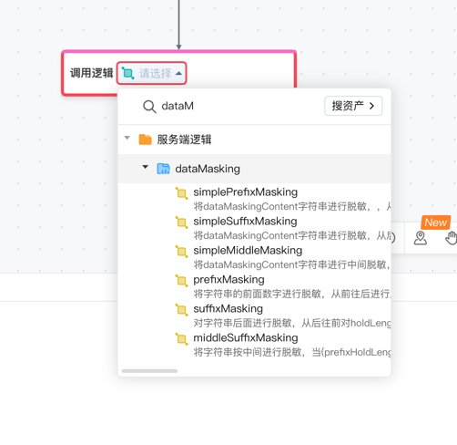
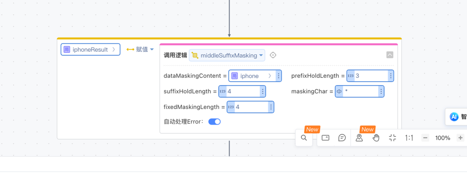
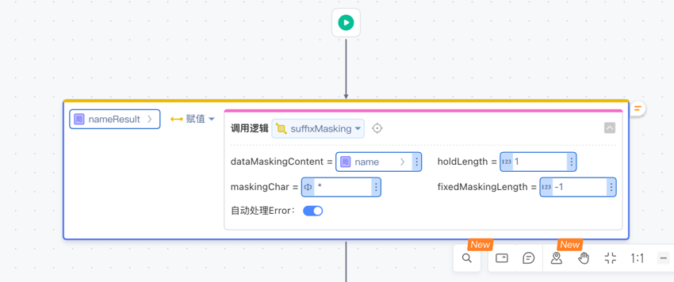

# DataMaskingUtil依赖库
提供数据脱敏逻辑，支持诸多包含后四位加逻辑，前3为加逻辑和中间4位加等逻辑
## 逻辑详情
### prefixMasking
将字符串的前面数字进行脱敏，从前往后进行脱敏，保留holdLength对应位数明文，按maskingChar格式进行脱敏，
fixedMaskingLength固定脱敏字符长度； -1表示按照实际脱敏长度（最短长度为1），正数代表：固定脱敏字符
param dataMaskingContent 待脱敏数据
param holdLength 保留位数
param maskingChar 脱敏字符
param fixedMaskingLength 固定脱敏字符长度； -1表示按照实际脱敏长度，正数代表：固定脱敏字符
return 脱敏字符串, 异常情况返回null

### suffixMasking

对字符串后面进行脱敏，从后往前对holdLength位数进行脱敏，按maskingChar格式进行脱敏
fixedMaskingLength固定脱敏字符长度； -1表示按照实际脱敏长度（最小长度为1），正数代表：固定脱敏字符
param dataMaskingContent 待脱敏数据
param holdLength 保留位数
param maskingChar 脱敏字符
param fixedMaskingLength 固定脱敏字符长度； -1表示按照实际脱敏长度，正数代表：固定脱敏字符
return 脱敏字符串, 异常情况返回null

### middleSuffixMasking

将字符串按中间进行脱敏，当(prefixHoldLength + suffixHoldLength > dataMaskingContent.length) 时，当前方法优先保证后面明文保留位数
fixedMaskingLength固定脱敏字符长度； -1表示按照实际脱敏长度（最小长度为1），正数代表：固定脱敏字符
param dataMaskingContent 待脱敏数据
param prefixHoldLength 前面保留位数
param suffixHoldLength 后面保留位数
param maskingChar 脱敏字符
param fixedMaskingLength 固定脱敏字符长度； -1表示按照实际脱敏长度，正数代表：固定脱敏字符
return 脱敏字符串, 异常情况返回null

```java
    @Test
    public void testDataMaskingApiUse(){
        String maskingChar = "*";

        // 姓名脱敏 脱敏规则一：显示姓名中的第一个字，其它用*号代替。
        Assert.assertEquals("方*",DataMaskingApi.suffixMasking("方钟", 1, maskingChar, -1));
        Assert.assertEquals("方**",DataMaskingApi.suffixMasking("方大钟", 1, maskingChar, -1));
        // 姓名脱敏 脱敏规则二：显示姓名中的第一个和最后一个字，其它用*号代替。
        Assert.assertEquals("方*钟",DataMaskingApi.middleSuffixMasking("方钟", 1, 1,  maskingChar, -1));
        Assert.assertEquals("方*钟",DataMaskingApi.middleSuffixMasking("方大钟", 1, 1,  maskingChar, -1));
        // 证件号码脱敏 对固定位数进行脱敏， 显示前2位和后2位，其它用*号代替。
        Assert.assertEquals("36**************23",DataMaskingApi.middleSuffixMasking("362322199702130023", 2, 2,  maskingChar, -1));
        // 手机号码脱敏 显示前3位+****+后4位。
        Assert.assertEquals("157****6113",DataMaskingApi.middleSuffixMasking("15709626113", 3, 4,  maskingChar, -1));
        // 银行卡卡号脱敏 显示前3位+ *（实际位数）+后4位
        Assert.assertEquals("232********3432",DataMaskingApi.middleSuffixMasking("232323432423432", 3, 4,  maskingChar, -1));
    }
```

## 使用步骤说明

1.  应用引用依赖库

2.  配置应用配置参数（如果有的话）

3.  逻辑调用示例截图
    手机号码脱敏 显示前3位+****+后4位。
    
    姓名脱敏 脱敏规则一：显示姓名中的第一个字，其它用*号代替。
    


## 应用演示链接


https://dev-testlib1-nt.app.codewave.163.com/test_lib3