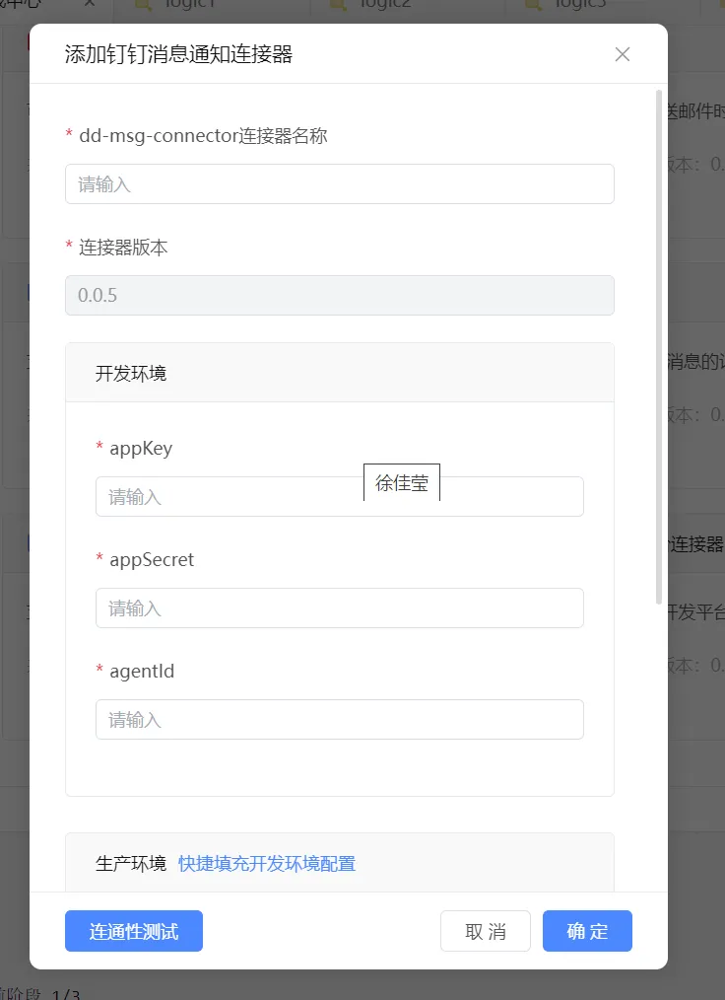
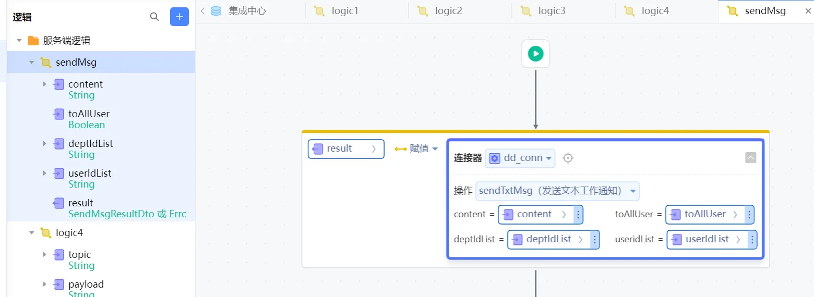

# 依赖库名称 钉钉消息通知连接器
支持发送工作通知[文本消息]，发送工作通知[图片消息]，发送工作通知[OA消息]，获取工作通知消息的发送进度，撤回工作通知消息

## 逻辑详情

### 逻辑一 sendTxtMsg 发送文本工作通知

* @param content    文本内容 String类型 必填
* @param toAllUser  是否全体发送 Boolean类型
* @param deptIdList 部门列表 英文逗号分隔 String类型
* @param useridList 用户列表 英文逗号分隔 String类型
* @return SendMsgResultDto类型 介绍参考<com.yu.dto.SendMsgResultDto>

### 逻辑二 sendImgMsg 发送图片工作通知

* @param mediaId    图片媒体文件id String类型 必填
* @param toAllUser  是否全体发送 Boolean类型
* @param deptIdList 部门列表 英文逗号分隔 String类型
* @param useridList 用户列表 英文逗号分隔 String类型
* @return SendMsgResultDto类型 介绍参考<com.yu.dto.SendMsgResultDto>

### 逻辑三 sendOAMsg 发送OA消息
* @param useridList 用户列表 不得超过5个
* @param msgBody    消息体 例如 {"message_url":"http://dingtalk.com","head":{"bgcolor":"FFBBBBBB","text":"头部标题"},"body":{"title":"正文标题","form":[{"key":"姓名:","value":"张三"},{"key":"年龄:","value":"20"},{"key":"身高:","value":"1.8米"},{"key":"体重:","value":"130斤"},{"key":"学历:","value":"本科"},{"key":"爱好:","value":"打球、听音乐"}],"rich":{"num":"15.6","unit":"元"},"content":"大段文本大段文本大段文本大段文本大段文本大段文本","image":"@lADOADmaWMzazQKA","file_count":"3","author":"李四 "}}
* @return SendMsgResultDto类型 介绍参考<com.yu.dto.SendMsgResultDto>

### 逻辑四 uploadFile 上传图片到钉钉
* @param filePath 互联网文件路径
* @return 图片的媒体id 后面需要使用这个媒体id发送图片通知

### 逻辑五 getSendProgress 获取工作通知消息的发送进度
* @param taskId 通知发送成功后返回的任务ID
* @return GetSendProgressDto 介绍参考<com.yu.dto.GetSendProgressDto>

### 逻辑六 getSendResult 获取工作通知消息的发送结果
* @param taskId 通知发送成功后返回的任务ID
* @return GetSendProgressDto 介绍参考<com.yu.dto.GetSendProgressDto>

### 逻辑七 getSendProgress 获取工作通知消息的发送进度
* @param taskId 通知发送成功后返回的任务ID
* @return GetSendResultDto 介绍参考<com.yu.dto.GetSendResultDto>

## 使用步骤说明

1.  应用引用依赖库
2.  配置应用配置参数（如果有的话）
3.  逻辑调用示例截图
4.  填入相应的appKey和appSecret和agentId

5. 测试完成后点击确定，然后新建一个服务端逻辑，调用新建的连接器的相应逻辑，传入参数进行使用钉钉的连接器方法

## 应用演示链接

[使用了本依赖库的制品应用链接]
