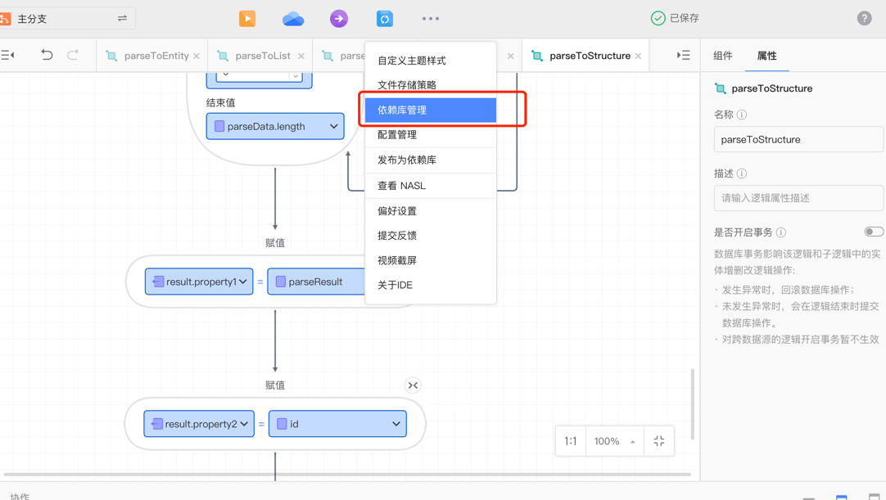
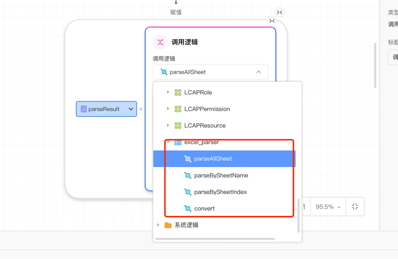
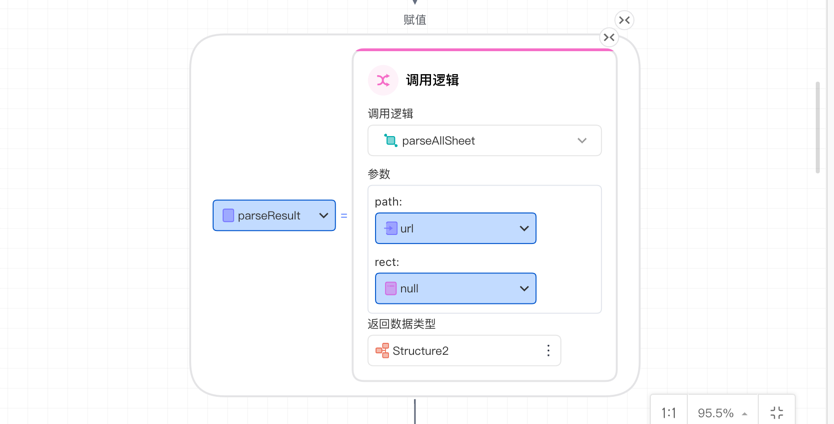
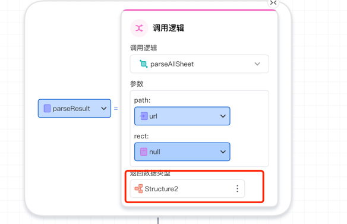
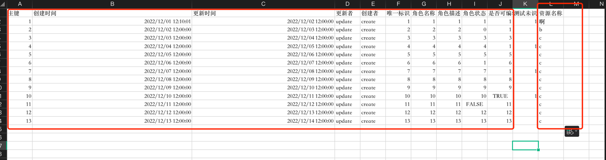
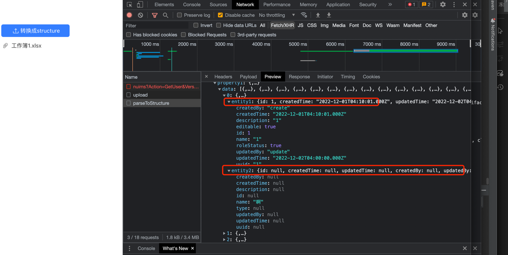
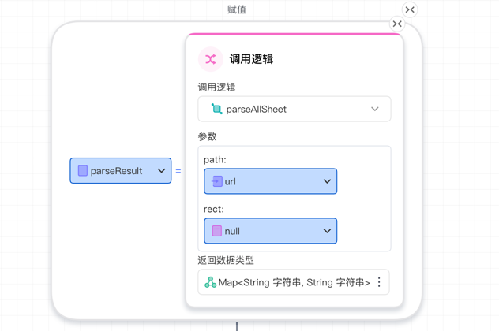

### excel解析拓展模块

#### 使用说明:

##### 导入拓展模块

1. 资产中心 -> 依赖库管理(租户或平台均可，建议租户) -> 手动上传

   

2. 注册excel解析依赖库

   

   导入usage.json文件或者粘贴对应json内容

    ```json
   {
   "name":"excel_parser",
   "title":"excel解析",
   "description":"excel解析工具包",
   "specVersion":"1.0.0",
   "type":"module",
   "subType":"extension",
   "version":"1.0.1",
   "editable":false,
   "externalDependencyMap": {
   "maven": [
   {
   "groupId": "com.netease.lowcode.extension",
   "artifactId": "excel-parser",
   "version": "1.0.1"
   }
   ]
   },
   "structures": [{
   "concept": "Structure",
   "name": "ExcelParseResult",
   "typeParams": null,
   "compilerInfo": {
   "java": {
   "packageName": "com.netease.lowcode.extension.excel.dto",
   "className": "ExcelParseResult"
   }
   },
   "properties": [
   {
   "concept": "StructureProperty",
   "name": "errors",
   "typeAnnotation": {
   "concept": "TypeAnnotation",
   "name": "",
   "typeKind": "generic",
   "typeNamespace": "nasl.collection",
   "typeName": "List",
   "typeArguments": [
   {
   "concept": "TypeAnnotation",
   "name": "",
   "typeKind": "reference",
   "typeNamespace": "extensions.excel_parser.structures",
   "typeName": "ExcelParseError",
   "typeArguments": null
   }
   ]
   },
   "isLeaf": true,
   "changedTime": 1667477064094,
   "updatebyapp": "79844f17-96a5-4e64-941b-0f09d8e13beb"
   },
   {
   "concept": "StructureProperty",
   "name": "data",
   "typeAnnotation": {
   "concept": "TypeAnnotation",
   "name": "",
   "typeKind": "generic",
   "typeNamespace": "nasl.collection",
   "typeName": "List",
   "typeArguments": [
   {
   "concept": "TypeAnnotation",
   "name": "",
   "typeKind": "typeParam",
   "typeName": "T",
   "typeArguments": null
   }
   ]
   },
   "isLeaf": true,
   "changedTime": 1667477033992,
   "updatebyapp": "79844f17-96a5-4e64-941b-0f09d8e13beb"
   },
   {
   "concept": "StructureProperty",
   "name": "unParsedData",
   "typeAnnotation": {
   "concept": "TypeAnnotation",
   "name": "",
   "typeKind": "generic",
   "typeNamespace": "nasl.collection",
   "typeName": "List",
   "typeArguments": [
   {
   "concept": "TypeAnnotation",
   "name": "",
   "typeKind": "generic",
   "typeNamespace": "nasl.collection",
   "typeName": "Map",
   "typeArguments": [
   {
   "concept": "TypeAnnotation",
   "name": "",
   "typeKind": "primitive",
   "typeNamespace": "nasl.core",
   "typeName": "String",
   "typeArguments": null
   },
   {
   "concept": "TypeAnnotation",
   "name": "",
   "typeKind": "primitive",
   "typeNamespace": "nasl.core",
   "typeName": "String",
   "typeArguments": null
   }
   ]
   }
   ]
   },
   "isLeaf": true,
   "changedTime": 1667477033992,
   "updatebyapp": "79844f17-96a5-4e64-941b-0f09d8e13beb"
   },
   {
   "concept": "StructureProperty",
   "name": "success",
   "typeAnnotation": {
   "concept": "TypeAnnotation",
   "name": "",
   "typeKind": "primitive",
   "typeNamespace": "nasl.core",
   "typeName": "Boolean",
   "typeArguments": null
   },
   "isLeaf": true,
   "changedTime": 1667477055022,
   "updatebyapp": "79844f17-96a5-4e64-941b-0f09d8e13beb"
   }
   ],
   "changedTime": 1667477064095,
   "updatebyapp": "79844f17-96a5-4e64-941b-0f09d8e13beb",
   "description": "excel解析结果"
   },{
   "concept": "Structure",
   "name": "ExcelParseError",
   "typeParams": null,
   "compilerInfo": {
   "java": {
   "packageName": "com.netease.lowcode.extension.excel.dto",
   "className": "ExcelParseError"
   }
   },
   "properties": [
   {
   "concept": "StructureProperty",
   "name": "errorCell",
   "typeAnnotation": {
   "concept": "TypeAnnotation",
   "name": "",
   "typeKind": "primitive",
   "typeNamespace": "nasl.core",
   "typeName": "String",
   "typeArguments": null
   },
   "isLeaf": true,
   "changedTime": 1667476937855,
   "updatebyapp": "79844f17-96a5-4e64-941b-0f09d8e13beb",
   "description": "错误的单元格"
   },
   {
   "concept": "StructureProperty",
   "name": "errorValue",
   "typeAnnotation": {
   "concept": "TypeAnnotation",
   "name": "",
   "typeKind": "primitive",
   "typeNamespace": "nasl.core",
   "typeName": "String",
   "typeArguments": null
   },
   "isLeaf": true,
   "changedTime": 1667476942779,
   "updatebyapp": "79844f17-96a5-4e64-941b-0f09d8e13beb",
   "description": "错误的数据"
   },
   {
   "concept": "StructureProperty",
   "name": "errorMessage",
   "typeAnnotation": {
   "concept": "TypeAnnotation",
   "name": "",
   "typeKind": "primitive",
   "typeNamespace": "nasl.core",
   "typeName": "String",
   "typeArguments": null
   },
   "isLeaf": true,
   "changedTime": 1667476956187,
   "updatebyapp": "79844f17-96a5-4e64-941b-0f09d8e13beb",
   "description": "错误信息"
   }
   ],
   "changedTime": 1667476956188,
   "updatebyapp": "79844f17-96a5-4e64-941b-0f09d8e13beb",
   "description": "excel单元格解析失败信息"
   },{
   "concept": "Structure",
   "name": "ExcelParseRect",
   "typeParams": null,
   "compilerInfo": {
   "java": {
   "packageName": "com.netease.lowcode.extension.excel.dto",
   "className": "ExcelParseRect"
   }
   },
   "properties": [
   {
   "concept": "StructureProperty",
   "name": "startCell",
   "typeAnnotation": {
   "concept": "TypeAnnotation",
   "name": "",
   "typeKind": "primitive",
   "typeNamespace": "nasl.core",
   "typeName": "String",
   "typeArguments": null
   },
   "isLeaf": true,
   "changedTime": 1667476303768,
   "updatebyapp": "79844f17-96a5-4e64-941b-0f09d8e13beb",
   "label": "起始单元格"
   },
   {
   "concept": "StructureProperty",
   "name": "endCell",
   "typeAnnotation": {
   "concept": "TypeAnnotation",
   "name": "",
   "typeKind": "primitive",
   "typeNamespace": "nasl.core",
   "typeName": "String",
   "typeArguments": null
   },
   "isLeaf": true,
   "label": "结束单元格",
   "description": "指定excel读取区域"
   }
   ],
   "changedTime": 1667476348804,
   "updatebyapp": "79844f17-96a5-4e64-941b-0f09d8e13beb"
   }],
   "enums": [],
   "logics": [
   {
   "concept": "Logic",
   "name": "parseAllSheet",
   "description": "解析excel文件",
   "compilerInfoMap": {
   "java": {
   "packageName": "com.netease.lowcode.extension.excel",
   "className": "ExcelParser"
   }
   },
   "typeParams": [
   {
   "concept": "TypeParam",
   "name": "T"
   }
   ],
   "params": [
   {
   "concept": "Param",
   "name": "path",
   "description": "文件路径",
   "typeAnnotation": {
   "concept": "TypeAnnotation",
   "name": "",
   "typeKind": "primitive",
   "typeNamespace": "nasl.core",
   "typeName": "String",
   "typeArguments": null
   }
   },
   {
   "concept": "Param",
   "name": "rect",
   "description": "数据读取区域，可以为空",
   "typeAnnotation": {
   "concept": "TypeAnnotation",
   "name": "",
   "typeKind": "reference",
   "typeNamespace": "extensions.excel_parser.structures",
   "typeName": "ExcelParseRect",
   "typeArguments": null
   }
   }
   ],
   "returns": [{
   "concept": "Return",
   "name": "result",
   "typeAnnotation": {
   "concept": "TypeAnnotation",
   "name": "",
   "typeKind": "reference",
   "typeNamespace": "extensions.excel_parser.structures",
   "typeName": "ExcelParseResult",
   "typeArguments": null
   }
   }],
   "variables": [],
   "body": [
   {
   "concept": "Start",
   "name": "",
   "label": "开始",
   "folded": false
   },
   {
   "concept": "End",
   "name": "",
   "label": "结束",
   "folded": false
   }
   ],
   "playground": []
   },
   {
   "concept": "Logic",
   "name": "parseBySheetName",
   "description": "解析excel文件,指定页名",
   "compilerInfoMap": {
   "java": {
   "packageName": "com.netease.lowcode.extension.excel",
   "className": "ExcelParser"
   }
   },
   "typeParams": [
   {
   "concept": "TypeParam",
   "name": "T"
   }
   ],
   "params": [
   {
   "concept": "Param",
   "name": "path",
   "description": "文件路径",
   "typeAnnotation": {
   "concept": "TypeAnnotation",
   "name": "",
   "typeKind": "primitive",
   "typeNamespace": "nasl.core",
   "typeName": "String",
   "typeArguments": null
   }
   },
   {
   "concept": "Param",
   "name": "sheetNames",
   "description": "待读取页的名称列表",
   "typeAnnotation": {
   "concept": "TypeAnnotation",
   "name": "",
   "typeKind": "generic",
   "typeNamespace": "nasl.collection",
   "typeName": "List",
   "typeArguments": [
   {
   "concept": "TypeAnnotation",
   "name": "",
   "typeKind": "primitive",
   "typeNamespace": "nasl.core",
   "typeName": "String",
   "typeArguments": null
   }
   ]
   }
   },
   {
   "concept": "Param",
   "name": "rect",
   "description": "数据读取区域，可以为空",
   "typeAnnotation": {
   "concept": "TypeAnnotation",
   "name": "",
   "typeKind": "reference",
   "typeNamespace": "extensions.excel_parser.structures",
   "typeName": "ExcelParseRect",
   "typeArguments": null
   }
   }
   ],
   "returns": [{
   "concept": "Return",
   "name": "result",
   "typeAnnotation": {
   "concept": "TypeAnnotation",
   "name": "",
   "typeKind": "reference",
   "typeNamespace": "extensions.excel_parser.structures",
   "typeName": "ExcelParseResult",
   "typeArguments": null
   }
   }],
   "variables": [],
   "body": [
   {
   "concept": "Start",
   "name": "",
   "label": "开始",
   "folded": false
   },
   {
   "concept": "End",
   "name": "",
   "label": "结束",
   "folded": false
   }
   ],
   "playground": []
   },
   {
   "concept": "Logic",
   "name": "parseBySheetIndex",
   "description": "解析excel文件,指定页名",
   "compilerInfoMap": {
   "java": {
   "packageName": "com.netease.lowcode.extension.excel",
   "className": "ExcelParser"
   }
   },
   "typeParams": [
   {
   "concept": "TypeParam",
   "name": "T"
   }
   ],
   "params": [
   {
   "concept": "Param",
   "name": "path",
   "description": "文件路径",
   "typeAnnotation": {
   "concept": "TypeAnnotation",
   "name": "",
   "typeKind": "primitive",
   "typeNamespace": "nasl.core",
   "typeName": "String",
   "typeArguments": null
   }
   },
   {
   "concept": "Param",
   "name": "sheetIndexes",
   "description": "待读取页的下标列表",
   "typeAnnotation": {
   "concept": "TypeAnnotation",
   "name": "",
   "typeKind": "generic",
   "typeNamespace": "nasl.collection",
   "typeName": "List",
   "typeArguments": [
   {
   "concept": "TypeAnnotation",
   "name": "",
   "typeKind": "primitive",
   "typeNamespace": "nasl.core",
   "typeName": "Integer",
   "typeArguments": null
   }
   ]
   }
   },
   {
   "concept": "Param",
   "name": "rect",
   "description": "数据读取区域，可以为空",
   "typeAnnotation": {
   "concept": "TypeAnnotation",
   "name": "",
   "typeKind": "reference",
   "typeNamespace": "extensions.excel_parser.structures",
   "typeName": "ExcelParseRect",
   "typeArguments": null
   }
   }
   ],
   "returns": [{
   "concept": "Return",
   "name": "result",
   "typeAnnotation": {
   "concept": "TypeAnnotation",
   "name": "",
   "typeKind": "reference",
   "typeNamespace": "extensions.excel_parser.structures",
   "typeName": "ExcelParseResult",
   "typeArguments": null
   }
   }],
   "variables": [],
   "body": [
   {
   "concept": "Start",
   "name": "",
   "label": "开始",
   "folded": false
   },
   {
   "concept": "End",
   "name": "",
   "label": "结束",
   "folded": false
   }
   ],
   "playground": []
   },
   {
   "concept": "Logic",
   "name": "convert",
   "description": "类型转换",
   "compilerInfoMap": {
   "java": {
   "packageName": "com.netease.lowcode.extension.excel",
   "className": "ReflectionUtils"
   }
   },
   "typeParams": [
   {
   "concept": "TypeParam",
   "name": "T"
   }
   ],
   "params": [
   {
   "concept": "Param",
   "name": "value",
   "description": "待转换类型的字符串",
   "typeAnnotation": {
   "concept": "TypeAnnotation",
   "name": "",
   "typeKind": "primitive",
   "typeNamespace": "nasl.core",
   "typeName": "String",
   "typeArguments": null
   }
   }
   ],
   "returns": [{
   "concept": "Return",
   "name": "result",
   "typeAnnotation": {
   "concept": "TypeAnnotation",
   "name": "",
   "typeKind": "typeParam",
   "typeName": "T",
   "typeArguments": null
   }
   }],
   "variables": [],
   "body": [
   {
   "concept": "Start",
   "name": "",
   "label": "开始",
   "folded": false
   },
   {
   "concept": "End",
   "name": "",
   "label": "结束",
   "folded": false
   }
   ],
   "playground": []
   }
   ],
   "interfaces": [],
   "views": [],
   "processes": [],
   "viewComponents": []
   }
    ```
2. 将jar包上传到maven仓库(不懂请教技术人员)

##### 引用拓展组件

1. 进入应用ide
2. 选择"依赖库管理"，将第一步注册的拓展组件导入

   
   

##### excel解析组件使用

1. excel解析功能

   
   

   解析功能相关的一共有以下3个方法:
   
   * parseAllSheet: 解析所有excel数据页
   * parseBySheetName: 解析指定名称的数据页
   * parseBySheetName: 解析指定下标的数据页

   三个方法的参数说明如下:

   * path: 指定文件路径，目前默认只支持http(s)协议的路径
   * rect: 指定解析区域，数据结构`{startCellName: String, endCellName: String}`
     * 两个属性分别表示起始单元坐标和结束单元格坐标，坐标格式和excel保持一致(如A1、Z100)
     * 如果只传入字母没有数字则表示不限制行比如(A1,D)表示从第一列读到第4列，从第一行读到数据结束行
     * null表示读取所有数据
   * 返回数据类型: 表示将每一行excel数据解析成的对象，支持Entity和Structure
   * sheetNames: 表示要读取的数据页名称列表，不在这个列表的数据页将忽略
   * sheetIndexes: 表示要读取的数据页下标，不在这个列表的数据页将忽略

   返回ExcelParseResult类型的结果，属性如下:

   * errors: 解析错误的单元格列表，数据结构List<ExcelParseError>
       * sheetName: 出错的数据页
       * errorCell: String, 解析错误的单元格坐标
       * errorValue: String, 解析错误的单元格取值
       * errorMessage: String, 解析错误描述
   * data: 解析得到的数据列表，列表元素为指定的返回类型
   * unParsedData: List<Map<String, String>, 未解析的单元格数据，解析时没有和对象属性映射上的excel列数据,key为这一列的表头，value为每一个单元格的取值
   * success: 是否全部解析成功，根据判断errors是否为空得到
   
1. 类型转换功能

   类型转换功能由convert相关的方法提供，方法参数说明如下:
   
   * value: 字符串类型的excel单元格取值
   * 返回数据类型: 期望转换的数据类型

   注: 这个方法如果转换发生异常会跑错直接终止，(todo 是否需要提供不中断的转换方法?)

1. 表头映射规则

   * 默认取第一行为表头
   * 表头的值支持属性的名称或标题自动映射，比如name(名字)，则excel中表头设置为**name**或者**名字**都可以和这个字段对应上
   * 自动映射规则适用于实体和Structure

2. excel数据自动拆分为多个实体
   
   有时候一个excel数据页可能包括多个实体的数据，可以通过定义Structure包含这些实体，并将返回类型选择为这个Structure则工具会根据表头自动将excel的单元格取值设置到对应的实体属性上

   
   
   
   
   
   **注意: 如果多个实体有同名属性(或标题相同)则这一列的值只会赋给第一个匹配到的实体属性**

2. 返回类型为集合类型(List或Map)

   
   

   