freemarker工具

# 接口详情
## FreeMarkerUtil.createFile 根据模板创建文件
入参：
- request: [CreateRequest](#createrequest)

出参：

## FreeMarkerUtil.createNewDocxFile 根据模板创建docx文件
入参：
- request：[CreateDocxRequest](#createdocxrequest)

出参：

# 结构体详情
## CreateRequest
| 属性          | 类型     | 描述         |
|-------------|--------|------------|
| templateUrl | String | 模板url      |
| outFileName | String | 模板数据       |
| outFileName | String | 输出文件名(带后缀) |

## CreateDocxRequest
| 属性                  | 类型                 | 描述                                                                                                                                                                                              |
|---------------------|--------------------|-------------------------------------------------------------------------------------------------------------------------------------------------------------------------------------------------|
| templateUrl         | Map<String,String> | k=模板名称,v=模板url <ul><li>word/document.xml</li><li>word/_rels/document.xml.rels</li><li>word/header1.xml</li><li>word/header2.xml</li><li>word/footer1.xml</li><li>word/footer2.xml</li></ul> |
| outFileName         | String             | 输出文件名(带后缀)                                                                                                                                                                                      |
| templateDocxFileUrl | String             | 模板文件url                                                                                                                                                                                         |
| jsonData            | String             | 模板数据                                                                                                                                                                                            |
| imageMap            | Map<String,String> | k=图片名称,v=图片信息                                                                                                                                                                                   |
| base64              | Boolean            | 图片是否编码 <ul><li>false:传入图片url</li><li>true:传入图片base64编码</li></ul>                                                                                                                            |

# 如何制作docx模板
## 1.创建一个docx文件，内容如下

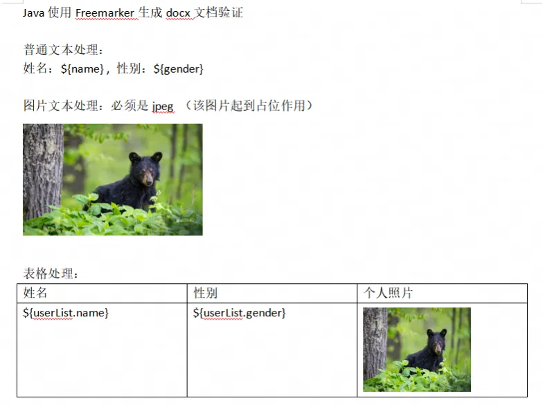

说明：
- 普通文本使用占位符`${param}` ，其中`param`为变量名称；
  - 图片先随便找个图片占位，并调整好格式；
  - 列表使用占位符`${list.param}`，其中`list`为列表名称，`param`为列表中每一项的属性;
  - 列表中的图片同样随意使用图片占位即可；
  - 列表只需使用占位符填充第一行。

## 2.解压docx文件
### 2.1 将docx文件后缀修改为zip
重命名修改后缀

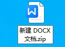

### 2.2 使用压缩工具解压缩
解压后的目录如下图所示，我们只需关心`word`文件夹里的内容

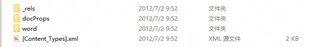

`word`内容介绍：

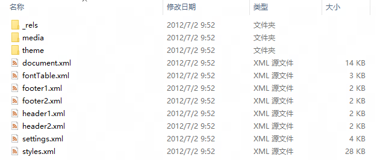

- word/document.xml: 我们输入的文本内容、表格、图片等就是在该文档中定义；
- word/media/: 文本与图片是分开存储的，我们输入的图片都保存在这个文件夹内；
- word/_rels/document.xml.rels: 这里保存了document.xml中图片名称与media中实际图片文件的映射；
- word/header1.xml: 页眉，如果只有1个页眉就是header1，多个页眉按顺序递增，header2、header3、...；
- word/footer1.xml: 页脚，如果只有1个页脚就是footer1，多个页脚按顺序递增，footer2、footer3、...

### 2.3 普通文本模板
如果文档中没有图片、没有页眉页脚，我们只需关注`word/document.xml`，否则需要继续看后续章节。

打开`word/document.xml`发现我们输入的占位符`${name},${gender}`等已经填充到模板对应位置，不需要修改；如果发现占位符被切分填充到了不同的标签内，我们需要将其合并。

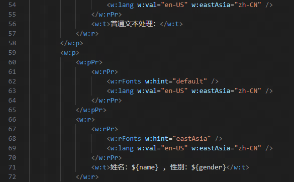

### 2.4 图片模板
如果文档中包含图片，我们需要关注三个文件：
- `word/document.xml`
- `word/media/`
- `word/_rels/document.xml.rels`

首先我们根据图片附近的文本在`document.xml`中定位到图片

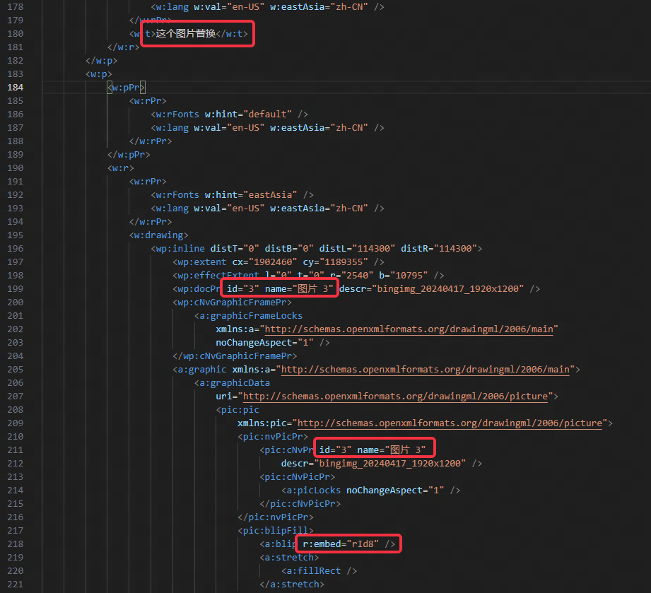

其中的`id="3" name="图片 3"`是图片在`document.xml`中的标识，
`r:embed="rId8"`是图片的映射关系，我们打开`word/_rels/document.xml.rels`，找到`Id="rId8"`

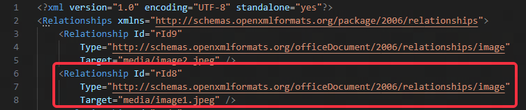

`Target="media/image1.jpeg"`这部分内容就指向了真正的图片文件。

打开文件夹`word/media/`，其中`image1.jpeg`的确是文本中输入的图片。

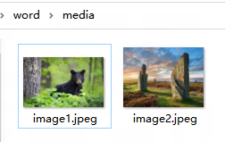

#### 普通文本区域图片
普通文本区域的图片，我们已经使用任意图片占位，因此我们只需要替换所需图片即可。
我们将`word/_rels/document.xml.rels`中`Id="rId8"`的图片地址使用占位符替代：

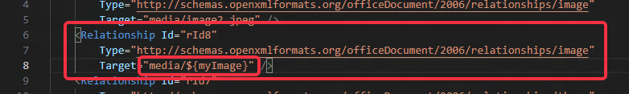

后续我们在模板数据中就可以使用参数`myImage`来替换我们所需的图片。

#### 表格区域图片
表格区域的图片会复杂一些，如果图片跟随行动态插入，那么我们就需要生成对应的标签和占位符：

第一步: 在`word/_rels/document.xml.rels`添加映射：

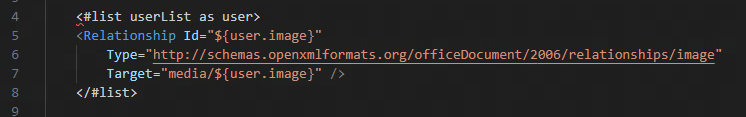

上图中使用了freemarker的遍历集合语法，具体可自行搜索。

第二步: 在`document.xml`添加：

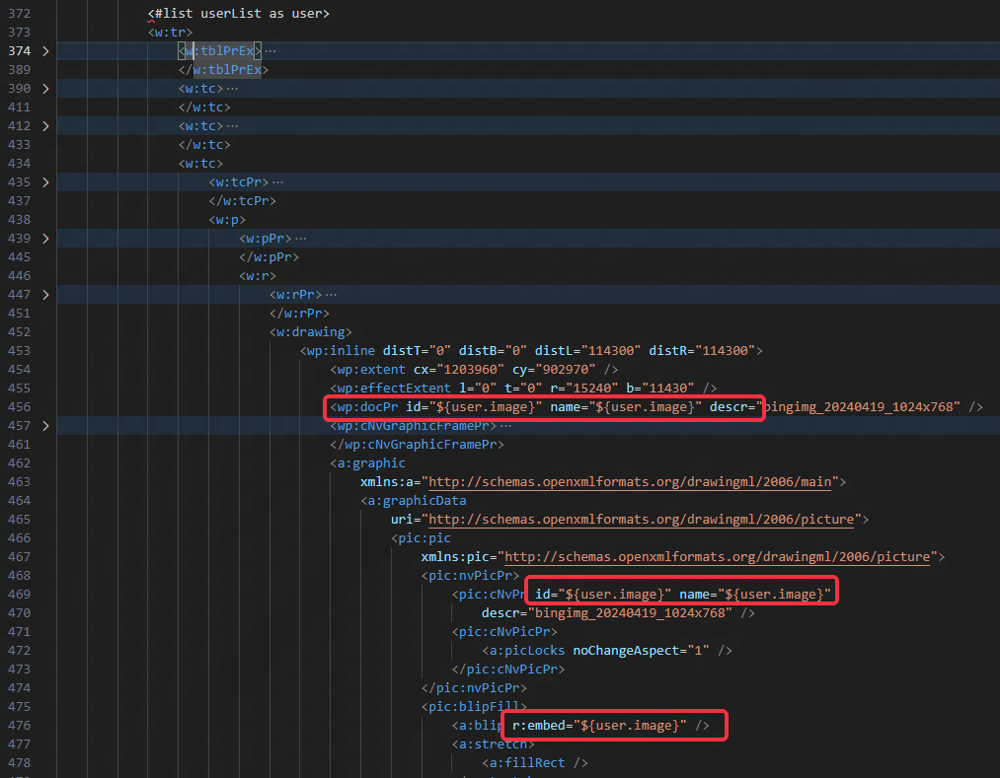

### 2.5 页眉模板
我们直接在文档页眉中输入占位符：

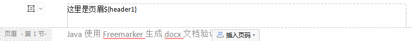

查看`word/header1.xml`:

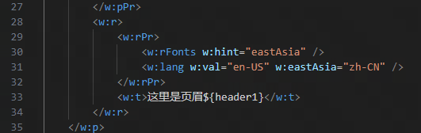

### 2.6 页脚模板
与页眉相同，不再赘述。
