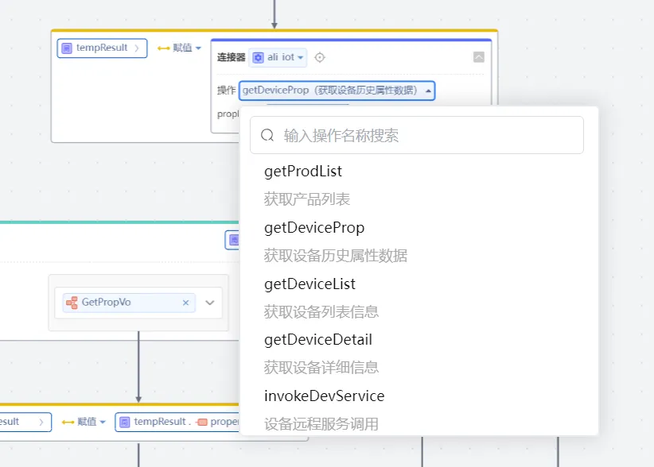

# 依赖库名称 阿里物联网开发平台连接器
连接阿里云物联网开发平台，支持获取设备历史数据、获取设备列表、查看设备详情

## 逻辑详情

### 逻辑一 getProdList 获取产品列表
* @param currentPage 当前页码
* @param pageSize    分页大小
* @return  GetProdVo 介绍参考 <com.yu.vo.GetProdVo>
* @throws IllegalArgumentException  入参格式校验异常
* @throws AliIotException 接口调用异常

### 逻辑二  getDeviceList  获取设备列表信息

* @param deviceDto  GetDeviceListDto类型 介绍参考<com.yu.dto.GetDeviceListDto>
* @return GetDeviceListVo 介绍参考<com.yu.vo.GetDeviceListVo>
* @throws IllegalArgumentException  入参格式校验异常
* @throws AliIotException 接口调用异常

### 逻辑三 getDeviceDetail  获取设备详细信息

* @param productKey 产品key String类型
* @param deviceName 设备key(设备名称） String类型
* @param iotId      设备唯一ID String类型
* @return GetDeviceDetailVo 介绍参考<com.yu.vo.GetDeviceDetailVo>
* @throws IllegalArgumentException  入参格式校验异常
* @throws AliIotException 接口调用异常

### 逻辑四 getDeviceProp  获取设备历史属性数据

* @param propDto GetPropDto类型 介绍参考<com.yu.dto.GetPropDto>
* @return GetPropVo 介绍参考<com.yu.vo.GetPropVo>
* @throws IllegalArgumentException  入参格式校验异常
* @throws AliIotException 接口调用异常

### 逻辑五 invokeDevService  设备远程服务调用

* @param servDto InvokeServDto类型 介绍参考<com.yu.dto.InvokeServDto>
* @return InvokeServVo 介绍参考<com.yu.vo.InvokeServVo>
* @throws IllegalArgumentException  入参格式校验异常
* @throws AliIotException 接口调用异常
## 使用步骤说明

1.  应用引用依赖库
2.  配置应用配置参数（如果有的话）
3.  逻辑调用示例截图
4.  应用中引入阿里物联网依赖包，按要求填入相应参数
[img.png](img.png)
5. 在服务端逻辑中调用连接器逻辑，使用匹配组件匹配相应的异常进行踔厉

## 应用演示链接

[使用了本依赖库的制品应用链接]
