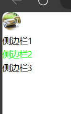

# foldable_sidebar（可展开收起的侧边栏）

**依赖库设计**

这个依赖库旨在提供一套用于低代码开发的工具集，以简化开发人员的工作流程。它包含了多个组件，每个组件都提供了特定的功能，使开发过程更加高效。

**主要特性**

- **组件一/图标侧边栏：** 提供功能一，可以设置主题色和图标链接功能二，可以根据设置的主题色修改悬浮和点击时的样式。功能三可以点击图标收起侧边栏
- **组件二/图标侧边栏项：** 作为侧边栏的子项，可以达到动态渲染的功能。另外可以设置图标侧边栏的点击链接地址，和设置每个侧边栏的图标

## 使用说明

### icon-sidebar（图标侧边栏）

- **attrs**
    - primaryColor: string 选择侧边栏主题色
    - iconUrl: string 选择侧边栏的图标地址

### icon-sidebar-item（图标侧边栏项）

- **attrs**
    - text: string 侧边栏项文本
    - url: string 链接地址
    - value: string 侧边栏项值
    - iconUrl: string 侧边栏图标

## 应用演示链接

