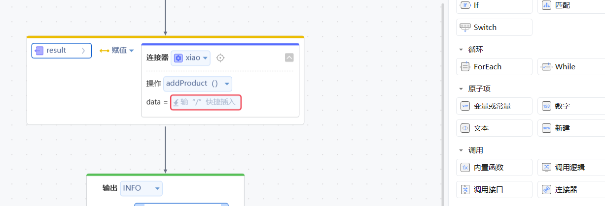

#销帮帮连接器

整合客户所喜好的业务场景及习惯，让销帮帮CRM更加专业、易用、安全

## 逻辑详情

###管理客户
####增加客户

输入参数

|字段	|类型	|必填 |	说明|
|-------|-------|----|------|
formId	|Long	|是	|表单模板id
dataList|	Object|	是|	表单数据,其中字段对应通过表单字段解释获得
corpid	|String	|是	|公司id
userId	|String	|否	|操作人id
返回参数

|字段|类型|说明|
|----|---|----|
|code|Integer|错误码|
msg|String|提示信息|
result|Object|返回信息|
dataId|Long|新建成功后的表单数据id|
####删除客户
输入参数

|字段|	类型|	必填|	说明|
|---|------|-------|-------|
|dataId|	Long|	是|	表单数据id|
|corpid	|String|	是|	公司id|
|userId	|String	|否	|操作人id|
输出参数

|字段|类型|说明|  
|---|---|------|  
|code|Integer|错误码
msg|String|提示信息
result|Object|返回信息
errorDataMemo|String|不允许删除的提示
####修改客户
输入参数

字段	|类型	|必填|	说明|
----|-------|----|-----|
dataId	|Long	|是	|表单数据id
dataList|	Object	|是|	表单数据,其中字段对应通过表单字段解释获得
corpid	|String	|是	|公司id
userId	|String	|否	|操作人id
输出参数

字段	|类型	|	说明|
----|-------|-----|
code	|Integer|	错误码
msg|	String|	提示信息
result|	Object|	返回信息
dataId|	Long|	编辑成功后的表单数据id
####查询客户
输入参数

字段|	类型|	必填|	说明
----|------|--------|------
conditions	|Array|	否|	条件集合
formId	|Long|	是	|表单id
isPublic	|Integer|	否|	是否公海客户
del	|Integer|	否|	0:客户列表 1:回收站数据，默认为0
page|	Integer	|否	|页码，默认为1
pageSize|	Integer|	否|	每页数量，默认为20，最大值100
corpid	|String	|是|	公司id
userId	|String	|否|	操作人id

输出参数

字段	|类型|	说明
----|----|-----
code|	Integer|	错误码
msg	|String	|提示信息
result|	Object|	返回信息
list	|Array|	客户列表
totalCount	|Integer|	总数据量
totalPage	|Integer|	总页码数
###管理产品
####增加产品
输入参数

字段	|类型|	必填|	说明
-----|----|----|-------
dataList	|Object	|是	|表单数据
corpid	|String|	是|	公司id
userId	|String|	否|	操作人id
返回参数

字段|	类型|	说明
----|------|-------
code|	Integer|	错误码
msg	|String|	提示信息
result|	Object|	返回信息
dataId|	Long|	新建成功后的表单数据id

####删除产品
输入参数

字段	|类型|	必填|	说明
---|----|------|-------
dataId	|Long	|是|	表单数据id
corpid	|String|	是|	公司id
userId	|String|	否	|操作人id
输出参数

|字段|类型|说明|  
|---|---|------|  
|code|Integer|错误码
msg|String|提示信息
result|Object|返回信息
errorDataMemo|String|不允许删除的提示
####修改产品
输入参数

字段	|类型	|必填|	说明|
----|-------|----|-----|
dataId	|Long	|是	|表单数据id
dataList|	Object	|是|	表单数据,其中字段对应通过表单字段解释获得
corpid	|String	|是	|公司id
userId	|String	|否	|操作人id
输出参数

字段|	类型	|说明
----|-------|----
code|	Integer	|错误码
msg	|String|	提示信息
result|	Object	|返回信息
errorDataMemo	|String|	不允许删除的提示
####查询产品
输入参数
产品列表接口即返回父产品(SPU)，也返回子产品(SKU)。根据num_3字段区分，父产品的num_3为0，子产品的num_3为对应的父产品id。与其他业务关联全部用子产品id。编辑产品、获取产品详情、删除产品时用父产品id
字段	|类型	|必填	|说明
----|------|-------|----
conditions|	Array|	否|	条件集合
page	|Integer|	否|	页码，默认为1
pageSize|	Integer|	否	|每页数量，默认为20，最大值100
corpid	|String	|是|	公司id
userId	|String	|否	|操作人id

输出参数

字段	|类型	|说明
----|-------|----
code|	Integer|	错误码
msg	|String	|提示信息
result|	Object	|返回信息
list	|Array	|产品列表
totalCount|	Integer	|总数据量
totalPage	|Integer|	总页码数

###管理产品分类
####增加产品分类

输入参数

字段	|类型|	必填|	说明
----|----|-----|-------
name|	String|	是	|分类名称
parentId|	Long	|否|	父分类id
corpid	|String	|是	|公司id
userId	|String	|否	|操作人id
返回参数

字段	|类型|	说明
----|----|----
code|	Integer|	错误码
msg	|String|	提示信息
result|	Object|	返回信息
####删除产品分类
输入参数

字段	|类型	|必填	|说明
-----|------|-------|----
dataId|	Long	|是|	需要删除的分类id
corpid|	String|	是	|公司id
userId|	String|	否	|操作人id
输出参数

字段|	类型	|说明
---|--------|----
code	|Integer|	错误码
msg	|String|	提示信息
result	|Object	|返回信息
####修改产品分类
输入参数

字段|	类型	|必填	|说明
----|-------|-------|----
name|	String	|是|	分类名称
dataId|	Long	|是|	需要修改的分类id
corpid|	String|	是	|公司id
userId|	String|	否	|操作人id
输出参数

字段	|类型	|说明
----|-------|---
code|	Integer|	错误码
msg	|String|	提示信息
result|	Object|	返回信息
####查询产品分类
输入参数

字段	|类型	|必填	|说明
-----|------|-------|----
corpid|	String|	是	|公司id
userId|	String|	否	|操作人id

输出参数

字段	|类型|	说明
----|----|----
code|	Integer|	错误码
msg	|String	|提示信息
result|	Object	|返回信息
list	|Array	|分类列表，为树状结构
corpid	|String	|公司id
id	|Integer	|分类id
name|	String	|分类名
parentId|	Integer|	父分类id
router	|String|	id路由，由根父id逐级到自身id
###管理订单
####增加合同订单
输入参数

字段|	类型	|必填	|说明
----|--------|------|----
formId|	Long	|是|	表单id
dataList|	Object	|是	表单数据
corpid	|String	|是|	公司id
userId	|String|	否	|操作人id
返回参数

字段	|类型	|说明
----|-------|----
code|	Integer|	错误码
msg	|String|	提示信息
result|	Object	|返回信息
dataId|	Long|	新建成功后的表单数据id
####删除合同订单
输入参数

字段	|类型|	必填|	说明
---|----|------|-------
dataId	|Long	|是|	表单数据id
corpid	|String|	是|	公司id
userId	|String|	否	|操作人id
输出参数

字段	|类型|	说明
----|----|-----
code|	Integer|	错误码
msg	|String	|提示信息
result|	Object|	返回信息
errorDataMemo|	String|	不允许删除的提示
####修改合同订单
输入参数

字段	|类型	|必填|	说明
---|--------|----|----
dataId|	Long|	是	|表单数据id
dataList|	Object|	是	表单数据
corpid	|String	|是|	公司id
userId	|String	|否|	操作人id
输出参数

字段	|类型	|说明
----|-------|----
code|	Integer|	错误码
msg	|String	|提示信息
result|	Object|	返回信息
dataId|	Long|	编辑成功后的表单数据id
####查询合同订单
输入参数

字段	|类型|必填|	说明
----|------|----|----
formId|	Long|	是|	表单id
conditions|	Array|	否|	条件集合
page	|Integer|	否|	页码，默认为1
pageSize|	Integer	|否|	每页数量，默认为20，最大值100
corpid	|String	|是|	公司id
userId	|String	|否|	操作人id

输出参数

字段	|类型	|说明
----|-------|----
code|	Integer|	错误码
msg	|String	|提示信息
result|	Object|	返回信息
list	|Array|	合同订单列表
totalCount|	Integer|	总数据量
totalPage	|Integer|	总页码数

## 使用步骤说明

1. 应用引用依赖库销帮帮连接器
2. 配置应用配置参数填写销帮帮平台token
3. 逻辑调用示例截图
   

## 应用演示链接

|操作标识	|操作名称|	所在分组	|对应的销帮帮接口文档|
|-----|-------|-----------|---------------|
addCustomer|增加客户|客户|https://open.xbongbong.com/openapi/api_list/CRM%E6%A8%A1%E5%9D%97/%E5%AE%A2%E6%88%B7%E6%A8%A1%E5%9D%97/%E6%96%B0%E5%BB%BA%E5%AE%A2%E6%88%B7%E6%8E%A5%E5%8F%A3/189
deleteCustomer|删除客户|客户|https://open.xbongbong.com/openapi/api_list/CRM%E6%A8%A1%E5%9D%97/%E5%AE%A2%E6%88%B7%E6%A8%A1%E5%9D%97/%E5%88%A0%E9%99%A4%E5%AE%A2%E6%88%B7%E6%8E%A5%E5%8F%A3/193
updateCustomer|编辑客户|客户|https://open.xbongbong.com/openapi/api_list/CRM%E6%A8%A1%E5%9D%97/%E5%AE%A2%E6%88%B7%E6%A8%A1%E5%9D%97/%E7%BC%96%E8%BE%91%E5%AE%A2%E6%88%B7%E6%8E%A5%E5%8F%A3/190
selectCustomer|查询客户|客户|https://open.xbongbong.com/openapi/api_list/CRM%E6%A8%A1%E5%9D%97/%E5%AE%A2%E6%88%B7%E6%A8%A1%E5%9D%97/%E5%AE%A2%E6%88%B7%E5%88%97%E8%A1%A8%E6%8E%A5%E5%8F%A3/191
addProduct|增加产品|产品|https://open.xbongbong.com/openapi/api_list/%E4%BA%A7%E5%93%81%E6%A8%A1%E5%9D%97/%E4%BA%A7%E5%93%81%E7%AE%A1%E7%90%86%E6%A8%A1%E5%9D%97/%E6%96%B0%E5%BB%BA%E4%BA%A7%E5%93%81%E6%8E%A5%E5%8F%A3/234
deleteProduct|删除产品|产品|https://open.xbongbong.com/openapi/api_list/%E4%BA%A7%E5%93%81%E6%A8%A1%E5%9D%97/%E4%BA%A7%E5%93%81%E7%AE%A1%E7%90%86%E6%A8%A1%E5%9D%97/%E5%88%A0%E9%99%A4%E4%BA%A7%E5%93%81%E6%8E%A5%E5%8F%A3/238
updateProduct|编辑产品|产品|https://open.xbongbong.com/openapi/api_list/%E4%BA%A7%E5%93%81%E6%A8%A1%E5%9D%97/%E4%BA%A7%E5%93%81%E7%AE%A1%E7%90%86%E6%A8%A1%E5%9D%97/%E7%BC%96%E8%BE%91%E4%BA%A7%E5%93%81%E6%8E%A5%E5%8F%A3/235
selectProduct|查询产品|产品|https://open.xbongbong.com/openapi/api_list/%E4%BA%A7%E5%93%81%E6%A8%A1%E5%9D%97/%E4%BA%A7%E5%93%81%E7%AE%A1%E7%90%86%E6%A8%A1%E5%9D%97/%E4%BA%A7%E5%93%81%E5%88%97%E8%A1%A8%E6%8E%A5%E5%8F%A3/236
addProductCategory|增加产品分类|产品分类|https://open.xbongbong.com/openapi/api_list/%E4%BA%A7%E5%93%81%E6%A8%A1%E5%9D%97/%E4%BA%A7%E5%93%81%E7%AE%A1%E7%90%86%E6%A8%A1%E5%9D%97/%E6%B7%BB%E5%8A%A0%E4%BA%A7%E5%93%81%E5%88%86%E7%B1%BB%E6%8E%A5%E5%8F%A3/239
deleteProductCategory|删除产品分类|产品分类|https://open.xbongbong.com/openapi/api_list/%E4%BA%A7%E5%93%81%E6%A8%A1%E5%9D%97/%E4%BA%A7%E5%93%81%E7%AE%A1%E7%90%86%E6%A8%A1%E5%9D%97/%E5%88%A0%E9%99%A4%E4%BA%A7%E5%93%81%E5%88%86%E7%B1%BB%E6%8E%A5%E5%8F%A3/241
updateProductCategory|编辑产品分类|产品分类|https://open.xbongbong.com/openapi/api_list/%E4%BA%A7%E5%93%81%E6%A8%A1%E5%9D%97/%E4%BA%A7%E5%93%81%E7%AE%A1%E7%90%86%E6%A8%A1%E5%9D%97/%E7%BC%96%E8%BE%91%E4%BA%A7%E5%93%81%E5%88%86%E7%B1%BB%E6%8E%A5%E5%8F%A3/240
selectProductCategory|查询产品分类|产品分类|https://open.xbongbong.com/openapi/api_list/%E4%BA%A7%E5%93%81%E6%A8%A1%E5%9D%97/%E4%BA%A7%E5%93%81%E7%AE%A1%E7%90%86%E6%A8%A1%E5%9D%97/%E4%BA%A7%E5%93%81%E5%88%86%E7%B1%BB%E5%88%97%E8%A1%A8%E6%8E%A5%E5%8F%A3/242
addOrder|增加订单|订单|https://open.xbongbong.com/openapi/api_list/CRM%E6%A8%A1%E5%9D%97/%E5%90%88%E5%90%8C%E8%AE%A2%E5%8D%95%E6%A8%A1%E5%9D%97/%E6%96%B0%E5%BB%BA%E5%90%88%E5%90%8C%E8%AE%A2%E5%8D%95%E6%8E%A5%E5%8F%A3/215
deleteOrder|删除订单|订单|https://open.xbongbong.com/openapi/api_list/CRM%E6%A8%A1%E5%9D%97/%E5%90%88%E5%90%8C%E8%AE%A2%E5%8D%95%E6%A8%A1%E5%9D%97/%E5%88%A0%E9%99%A4%E5%90%88%E5%90%8C%E8%AE%A2%E5%8D%95%E6%8E%A5%E5%8F%A3/219
updateOrder|编辑订单|订单|https://open.xbongbong.com/openapi/api_list/CRM%E6%A8%A1%E5%9D%97/%E5%90%88%E5%90%8C%E8%AE%A2%E5%8D%95%E6%A8%A1%E5%9D%97/%E7%BC%96%E8%BE%91%E5%90%88%E5%90%8C%E8%AE%A2%E5%8D%95%E6%8E%A5%E5%8F%A3/216
selectOrder|查询订单|订单|https://open.xbongbong.com/openapi/api_list/CRM%E6%A8%A1%E5%9D%97/%E5%90%88%E5%90%8C%E8%AE%A2%E5%8D%95%E6%A8%A1%E5%9D%97/%E5%90%88%E5%90%8C%E8%AE%A2%E5%8D%95%E5%88%97%E8%A1%A8%E6%8E%A5%E5%8F%A3/217
