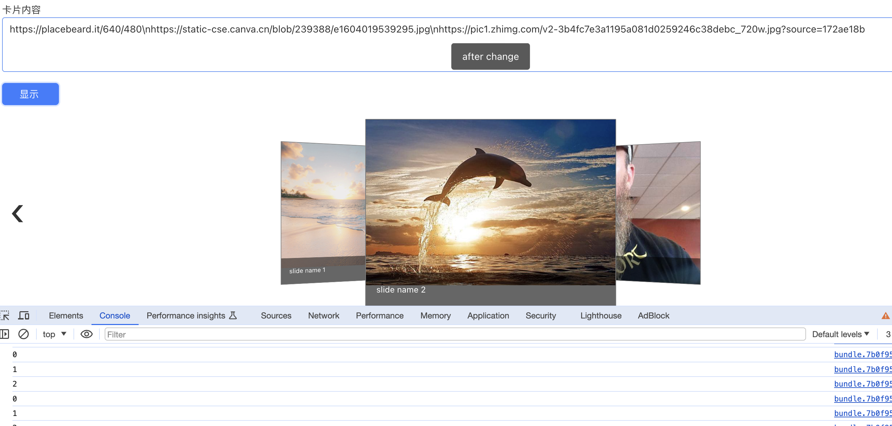

# 轮播图组件库

**依赖库设计**

这个依赖库旨在提供一套用于低代码开发的轮播图工具库，其核心是基于的3D轮播图

**主要特性**

- **组件一/逻辑一：** 提供3d轮播图组件。

## fdddf-carousel

**特性 1：** 支持图片和标题的轮播图。

**特性 2：** 支持自定义大小、自动播放、禁用3D等特性。

...

## 使用说明

### 组件（组件名）

- **attrs**
  - images: Array 图片数组
  - titles: Array 标题数组
  - width: Number 轮播图宽度
  - height: Number 轮播图高度
  - autoPlay: Boolean 是否自动播放
  - disable3d: Boolean 是否禁用3D
  - controlsVisible: Boolean 是否显示控制按钮
  - clickable: Boolean 是否可点击
  - autoplayTimeout: Number 自动播放间隔
  - display: Number 轮播图显示数量
  - perspective: Number 3D效果的透视距离

- **methods**
n/a

- **events**
  - afterSlideChange: 当轮播图切换时触发，参数index
  - beforeSlideChange: 当轮播图切换前触发，参数index

### 逻辑（逻辑名）

- **methodName(params):** 
n/a

## 应用演示链接

[示例演示链接](https://dev-testapp-qa.app.codewave.163.com/carousel_test)

