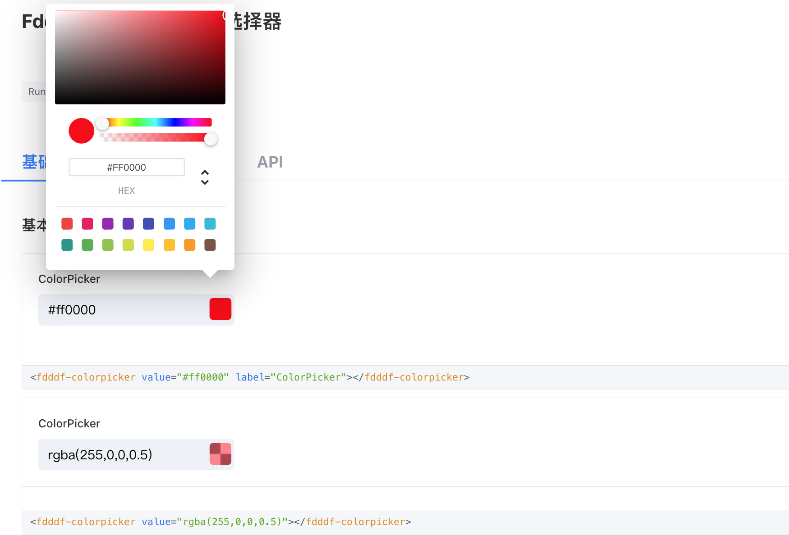

# 颜色选择器

**依赖库设计**

这个依赖库旨在提供前端UI颜色选择器，核心是封装 https://lightvue.org/vue-components/color-picker

**主要特性**

- **fdddf-colorpicker/支持多种选择方式及PC和H5的适配：**

## 组件一/逻辑一
颜色选择器 

**特性 1：** 支持多种选择方式hex, rgb, rgba，并支持调色板颜色自定义。

**特性 2：** change事件返回多种格式颜色值。

## fdddf-colorpicker

### 组件（组件名）

- **attrs**
    - value: 颜色值,hex 如"#000000"
    - label: 标题，默认为颜色选择器
    - colors: 调色板颜色列表
    - hidePalette: 是否显示调色板
    - withoutInput: 没有输入框

- **methods**
N/A

- **events**
    - change: 颜色值改变时触发，参数为颜色值对象，包括hex和rgba格式

### 逻辑（逻辑名）

N/A

## 应用演示链接

[查看示例演示](https://dev-testapp-qa.app.codewave.163.com/colorpicker_page)

