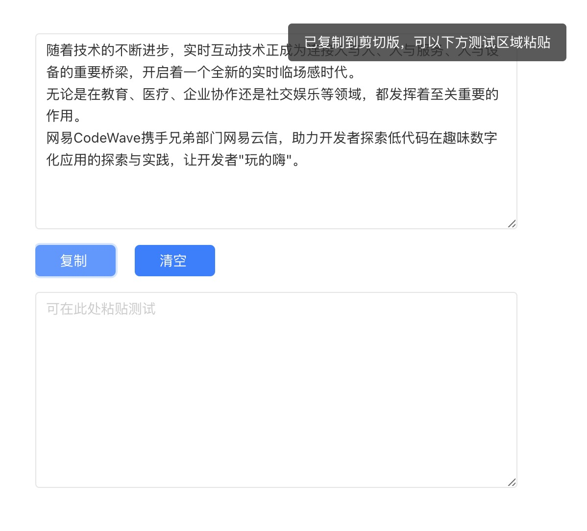

# 复制文本组件库

**依赖库设计**

这个依赖库旨在提供一个复制文本的方法

**主要特性**

- **组件一/逻辑一：** 提供复制文本方法。

## copyText

**特性 1：** 支持复制文本

...

## 使用说明

### 组件（组件名）

- **attrs**
n/a

- **methods**
n/a

- **events**
n/a

### 逻辑（逻辑名）

- **copyText(text):** 

复制文本

## 应用演示链接

[示例演示链接](https://dev-testdiff-qa.app.codewave.163.com/dashboard/copytest)

