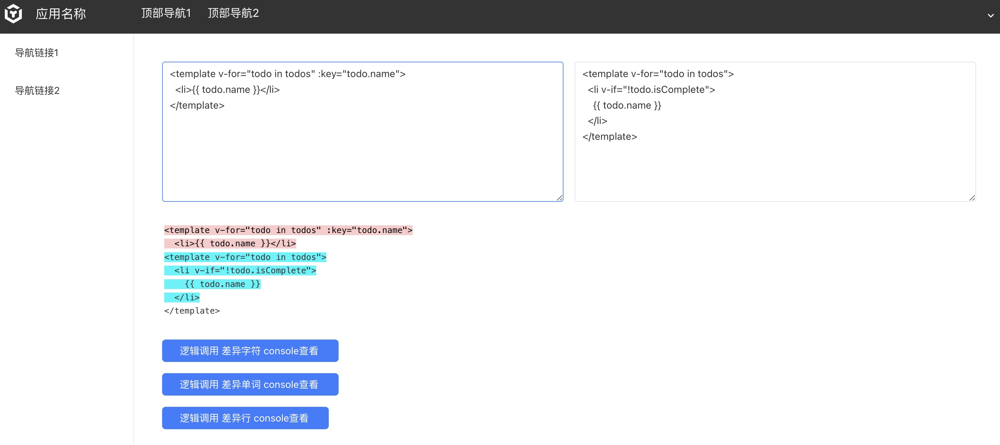

# 文本对比组件库

**依赖库设计**

这个依赖库旨在提供一套用于低代码开发的文本对比工具库

**主要特性**

- **组件一：** 提供文本对比组件

## diff-viewer

**特性 1：** 支持行、字符，单词对比

**特性 2：** 支持自定义新增、删除字体，背景色

- **逻辑一：** 提供文本行对比逻辑

返回结果参考 https://github.com/kpdecker/jsdiff

## getDiffLines

**特性 1：** 返回行级对比结果

## getDiffChars

**特性 1：** 返回字符级对比结果

## getDiffWords

**特性 1：** 返回单词级对比结果

## 使用说明

### 组件（diff-viewer）

- **attrs**
  - one: String 左侧文本
  - other: String 右侧文本
  - diffType: String 对比类型，可选值：line、char、word
  - delBackgroundColor: String 删除字体颜色
  - delColor: String 删除背景颜色
  - insBackgroundColor: String 新增字体颜色
  - insColor: String 新增背景颜色

- **methods**
n/a

- **events**
n/a

### 逻辑（逻辑名）

- **methodName(params):** 
n/a

## 应用演示链接

[示例演示链接](https://dev-testdiff-qa.app.codewave.163.com/dashboard/difftest)

