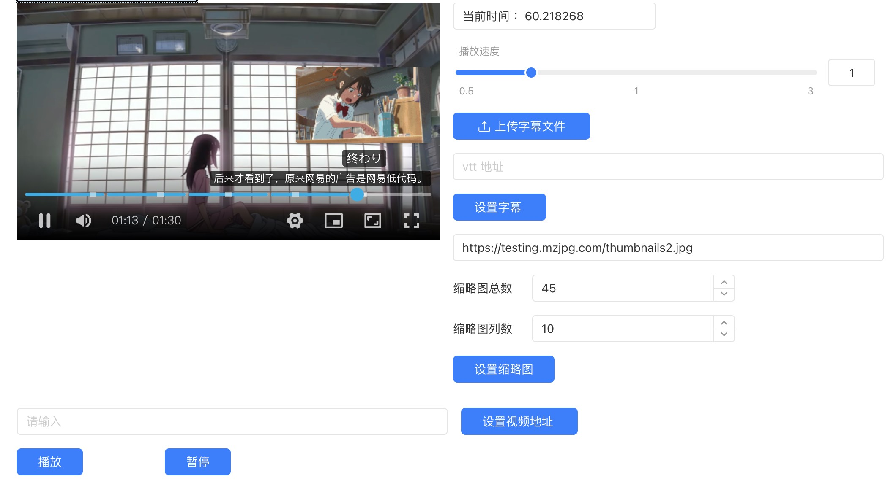

# 视频播放器组件库

**依赖库设计**

该依赖库旨在为低代码开发提供一个功能丰富的视频播放器组件库，支持多种自定义选项，适用于 Vue 2 和 Storybook 环境下的开发。

**主要特性**

- **组件：** 提供视频播放器组件

## VideoPlayer

**特性 1：** 支持播放、暂停、修改播放地址、设置播放速度、调整音量、设置视频封面、设置字幕及缩略图等功能。

**特性 2：** 提供丰富的视频属性，如播放地址、视频封面、缩略图、字幕、章节、进度条高亮数据、主题颜色等。支持多种播放器事件，如播放、暂停、时间跳转、静音、全屏、画中画等。

### 使用说明

#### 组件（VideoPlayer）

- **attrs**
  - url: String 视频地址
  - poster: String 视频封面图片地址
  - thumbnails_url: String 缩略图地址
  - thumbnails_number: Integer 缩略图数量
  - thumbnails_column: Integer 缩略图列数
  - subtitle_url: String 字幕地址 (URL)
  - chapters: List 视频章节数据源
  - highlight: List 进度条高亮数据
  - theme: String 主题颜色 (Hex格式)
  - autoplay: Boolean 是否自动播放
  - width: String 播放器宽度
  - height: String 播放器高度

- **methods**
  - `play()` 开始播放
  - `pause()` 暂停播放
  - `updatePlayerUrl(newUrl: String)` 修改播放地址
  - `setPlaybackRate(newRate: Decimal)` 设置播放速度
  - `setVolume(newVolume: Decimal)` 设置音量 (0-1)
  - `updatePlayerPoster(newPoster: String)` 设置视频封面
  - `updatePlayerHighlight(newHighlight: List)` 设置进度条高亮数据
  - `updatePlayerSubtitle(newSubtitleUrl: String)` 设置字幕地址
  - `updatePlayerThumbnails(newThumbnailsUrl: String, newThumbnailsNumber: Integer, newThumbnailsColumn: Integer)` 设置缩略图地址及缩略图参数

- **events**
  - onPause: 暂停播放时触发
  - onPlay: 点击播放时触发
  - onSeek: 播放时间跳转时触发
  - onMuted: 静音状态变化时触发
  - onFullscreen: 窗口全屏时触发
  - onFullscreenWeb: 网页全屏时触发
  - onPip: 进入画中画模式时触发

### 逻辑（VideoPlayerOptions）

- **属性**
  - `url`: 视频地址
  - `poster`: 视频封面图片地址
  - `thumbnails_url`: 缩略图地址
  - `thumbnails_number`: 缩略图数量
  - `thumbnails_column`: 缩略图列数
  - `subtitle_url`: 字幕地址 (URL)
  - `chapters`: 视频章节数据源
  - `highlight`: 进度条高亮数据
  - `theme`: 主题颜色 (Hex格式)
  - `autoplay`: 是否自动播放
  - `width`: 播放器宽度
  - `height`: 播放器高度

### 应用演示链接

https://dev-testdiff-qa.app.codewave.163.com/dashboard/videotest

