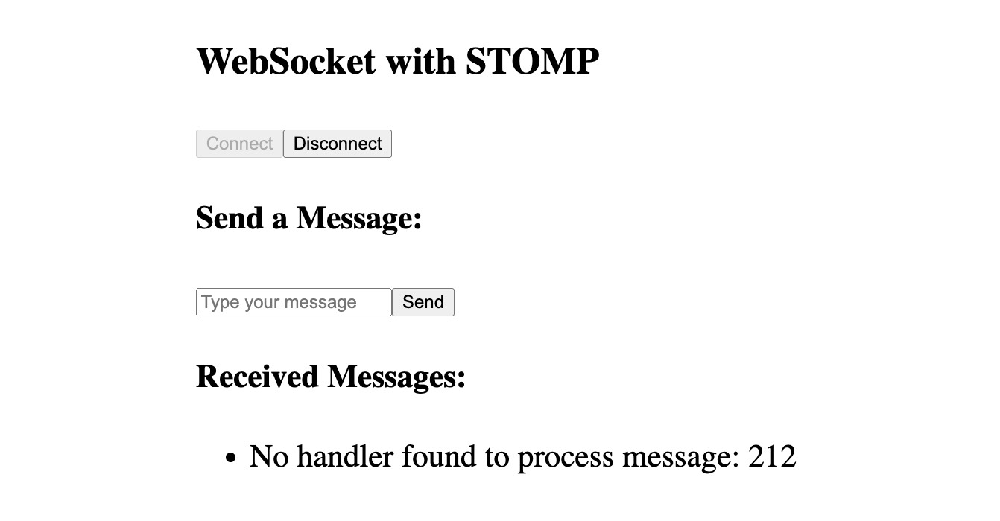

# Websocket前端使用示例

使用基于websocket的stomp协议，实现前端与后端的交互，后端可发送消息到前端。

## 逻辑详情

### connect

连接stomp服务端    
入参： 无  
出参： 无

### disconnect

断开连接

入参：无  
出参：无 

### send

发送消息到服务端

入参：  
* body String 消息内容 json字符串 如{"content":"Zhang san","userId":1}

出参：无

## 使用步骤说明

1.  应用引用依赖库
2.  配置应用配置参数 （无需配置）
3. 逻辑调用示例截图

## 应用演示链接

[使用了本依赖库的制品应用链接]

https://dev-websocket-qa.app.codewave.163.com/testwebsocket