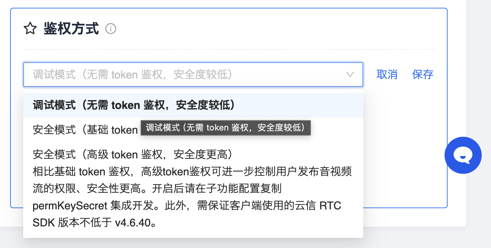
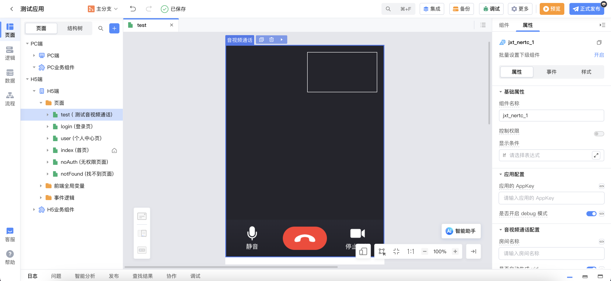
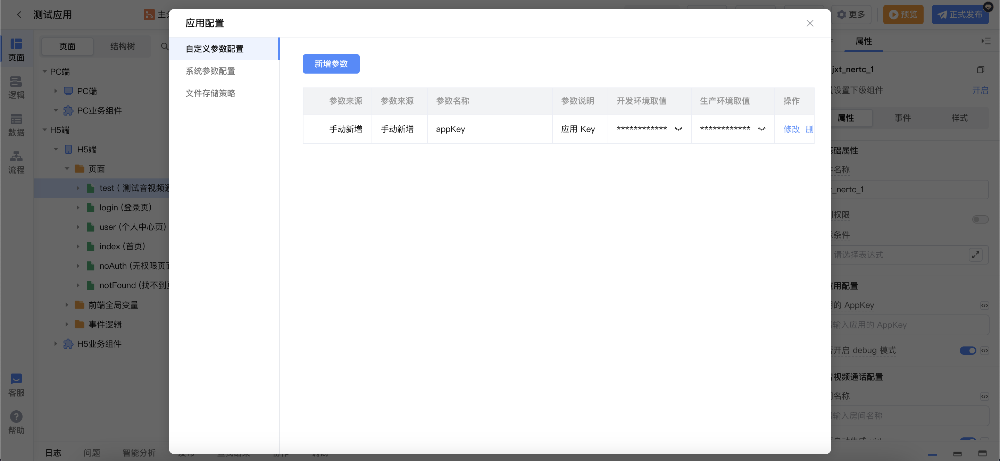
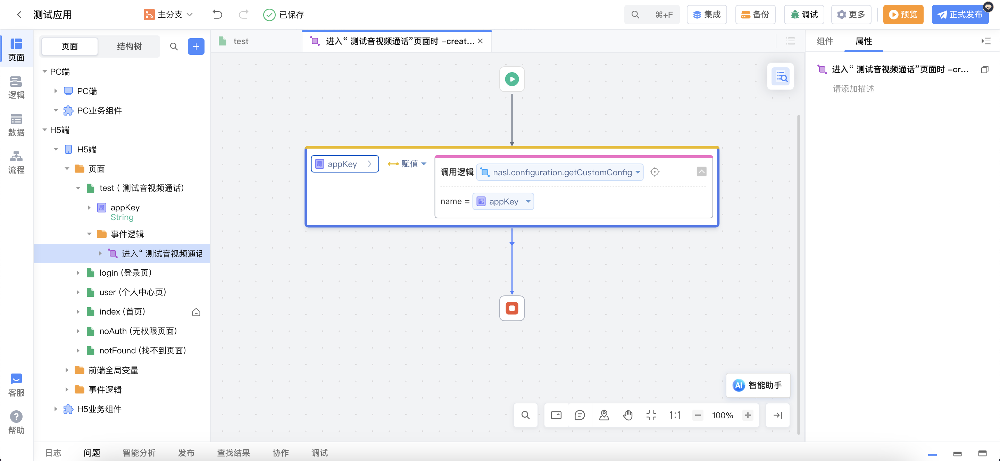
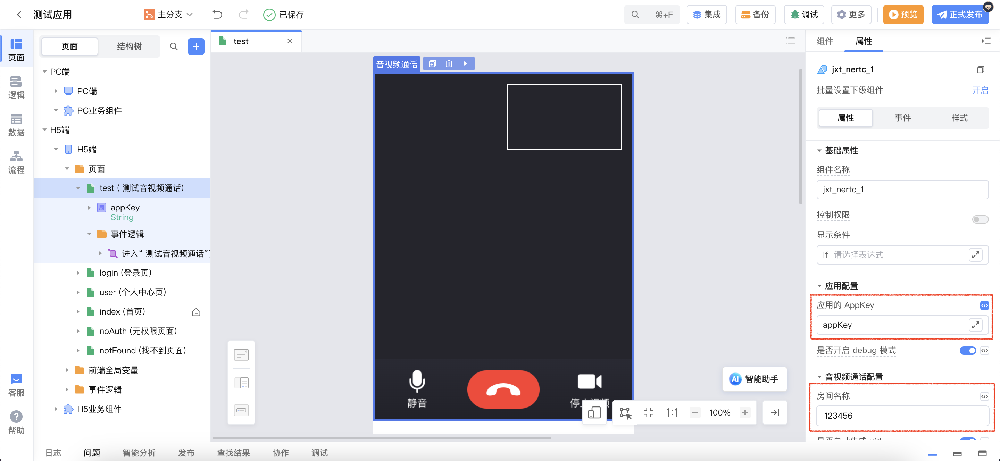
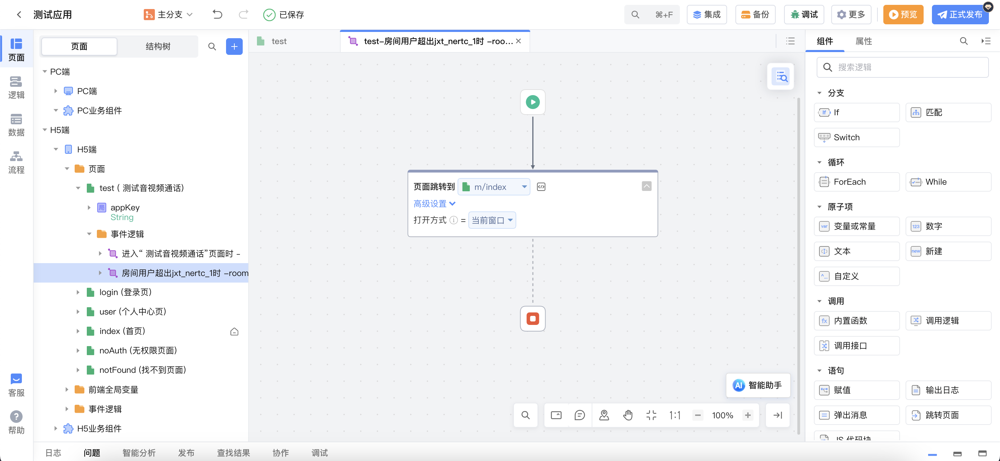

# library_jxt_im_video

## 背景

音视频通话 2.0（NetEase Real-Time Communication，NERTC）是网易云信推出的实时音视频开发平台。该依赖库即是对网易云信音视频通话部分功能的封装，帮助开发者在低代码开发平台更快地开发出音视频通话应用。

使用该组件需要先在网易云信[创建应用并获取 AppKey](https://doc.yunxin.163.com/console/guide/TIzMDE4NTA?platform=console)，然后[开通音视频通话 2.0 服务](https://doc.yunxin.163.com/nertc/quick-start/DA4NjQzNTU?platform=web)。

## 组件说明

组件的配置主要分为以下三类。

### 应用配置

| 组件属性 | 配置名称            | 类型    | 默认值 | 备注                                                                                                                                                                          |
| -------- | ------------------- | ------- | ------ | ----------------------------------------------------------------------------------------------------------------------------------------------------------------------------- |
| appKey   | 应用的 AppKey       | String  | 无     | 网易云信创建的应用的 AppKey                                                                                                                                                   |
| debug    | 是否开启 debug 模式 | Boolean | true   | 设置是否开启 debug 模式，详情说明可参考文档[createClient](https://doc.yunxin.163.com/docs/interface/nertc/web/typedoc/Latest/zh/html/modules/nertc.nertc-1.html#createclient) |

### 音视频通话配置

| 组件属性           | 配置名称         | 类型                                                                                    | 默认值                      | 备注                                                                                                                                                                                                            |
| ------------------ | ---------------- | --------------------------------------------------------------------------------------- | --------------------------- | --------------------------------------------------------------------------------------------------------------------------------------------------------------------------------------------------------------- |
| channelName        | 房间名称         | String                                                                                  | 无                          | 长度为 1 ~ 64 字节。目前支持以下 89 个字符：a-z, A-Z, 0-9, space, !#$%&()+-:;≤.,>? @[]^\\\_{ \| }~"                                                                                                             |
| autoUid            | 是否自动生成 uid | Boolean                                                                                 | true                        | 配置是否自动生成 Uid，使用 token 验证时一般需要用户提供 uid                                                                                                                                                     |
| uid                | 当前用户 id      | String                                                                                  | 无                          | 当选择非自动生成 uid 时，需要用户传入 uid                                                                                                                                                                       |
| authenticationType | 鉴权类型         | `调试模式（无需 token 鉴权）\|安全模式（基础 token 鉴权）\|安全模式（高级 token 鉴权）` | 调试模式（无需 token 鉴权） | 相关说明及生成相应 token 可参考[基础 token 鉴权](https://doc.yunxin.163.com/nertc/quick-start/Dc4NTE4OTY?platform=web)和[高级 token 鉴权](https://doc.yunxin.163.com/nertc/quick-start/jQ2MzAzNjY?platform=web) |
| token              | token            | String                                                                                  | 无                          | 鉴权类型为 **安全模式** (包括基础 token 鉴权和高级 token 鉴权)，绑定的后台生成的 token                                                                                                                          |
| permKey            | permKey          | String                                                                                  | 无                          | 鉴权模式为`安全模式（高级 token 鉴权）`时，绑定的 `permKey`值                                                                                                                                                   |
| audio              | 是否启动音频     | Boolean                                                                                 | true                        | 设置进入房间时是否开启音频                                                                                                                                                                                      |
| audioProfile       | 音频质量         | String                                                                                  | speech_low_quality          | 设置音频质量                                                                                                                                                                                                    |
| video              | 是否启动视频     | Boolean                                                                                 | 设置进入房间时是否开启视频  |
| videoQuality       | 视频分辨率       | String                                                                                  | 720P                        | 设置视频分辨率                                                                                                                                                                                                  |
| frameRate          | 视频通话帧率     | String                                                                                  | 最大取每秒 15 帧            | 设置视频通话帧率                                                                                                                                                                                                |

### 右上角窗口设置

| 组件属性    | 配置名称           | 类型   | 默认值  | 备注 |
| ----------- | ------------------ | ------ | ------- | ---- |
| subWidth    | 窗口宽度           | String | 165px   |      |
| subHeight   | 窗口高度           | String | 95px    |      |
| subZIndex   | 展示层级(z-index)  | number | 9       |      |
| subTop      | 距离容器顶部的距离 | String | 16px    |      |
| subRight    | 距离容器右边的距离 | String | 16px    |      |
| borderColor | 边框颜色           | String | #ffffff |      |

## 组件事件说明

| 事件名称            | 事件对象                                                                                                                                                                                                                                                                   | 说明                                                                   |
| ------------------- | -------------------------------------------------------------------------------------------------------------------------------------------------------------------------------------------------------------------------------------------------------------------------- | ---------------------------------------------------------------------- |
| afterJoinRoom       | { client: [Client](https://doc.yunxin.163.com/docs/interface/nertc/web/typedoc/Latest/zh/html/interfaces/client.client-1.html), uid: String }                                                                                                                              | 本地用户加入房间之后                                                   |
| afterLoadLocalSteam | { client: [Client](https://doc.yunxin.163.com/docs/interface/nertc/web/typedoc/Latest/zh/html/interfaces/client.client-1.html), stream: [Stream](https://doc.yunxin.163.com/docs/interface/nertc/web/typedoc/Latest/zh/html/interfaces/stream.stream-1.html), uid: String} | 本地音视频流加载完成之后                                               |
| roomOver            | 无                                                                                                                                                                                                                                                                         | 加入房间用户超出两个人时，对多余的用户触发，一般在该事件中进行页面跳转 |
| peerOnline          | [参考文档](https://doc.yunxin.163.com/docs/interface/nertc/web/typedoc/Latest/zh/html/interfaces/client.client-1.html#on)，同`peer-online`事件对象                                                                                                                         | 远端用户加入房间时                                                     |
| peerLeave           | [参考文档](https://doc.yunxin.163.com/docs/interface/nertc/web/typedoc/Latest/zh/html/interfaces/client.client-1.html#on)，同`peer-leave`事件对象                                                                                                                          | 远端用户离开房间时                                                     |
| permkeyWillExpire   | { client: [Client](https://doc.yunxin.163.com/docs/interface/nertc/web/typedoc/Latest/zh/html/interfaces/client.client-1.html) }                                                                                                                                           | permkey 即将过期时，高级 token 鉴权时才会触发                          |
| permkeyTimeout      | { client: [Client](https://doc.yunxin.163.com/docs/interface/nertc/web/typedoc/Latest/zh/html/interfaces/client.client-1.html) }                                                                                                                                           | permkey 过期时，高级 token 鉴权时才会触发                              |
| toggleAudio         | boolean                                                                                                                                                                                                                                                                    | 用户点击音频开关时，事件对象表示是开启/关闭 开关                       |
| toggleVideo         | boolean                                                                                                                                                                                                                                                                    | 用户点击视频开关时，事件对象表示是开启/关闭 开关                       |
| overVideo           | 无                                                                                                                                                                                                                                                                         | 结束视频通话时触发                                                     |

## 组件方法说明

| 方法名称      | 说明                                         |
| ------------- | -------------------------------------------- |
| updatePermKey | 更新 permKey 的值                            |
| reload        | 重新进入房间（如果当前在房间会先离开再进入） |

## 使用示例

实现音视频通话功能。

> 注：此示例鉴权方式采用**调试模式**，需在网易云信控制台设置鉴权方式为调试模式。

1. 创建音视频通话界面，拖入音视频通话组件。

2. 添加**应用配置**appKey，填入在网易云信创建的应用的 AppKey 值。

3. 页面添加进入事件，并创建`String`类型局部变量`appKey`，在页面进入事件中将应用配置中的 appKey 赋值给局部变量 `appKey`。

4. 音视频组件应用配置中绑定局部变量`appKey`，填写房间名称。

5. 发布应用即可查看应用实现效果。

扩展：添加**用户超出事件**和**结束视频通话事件**

当有第三个人进入房间时，虽然第三个用户无法接入视频，但第三个用户会停留在当前音视频通话页面，用户体验不佳，可通过添加**房间用户超出时**事件进行页面跳转。结束视频通话同理，可添加**结束视频通话时**事件，进行页面跳转。

