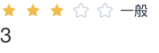

# library_jxt_rate

## 背景

评分组件通常用于收集用户反馈，如产品评价、服务评分等场景。它可以支持基本的星级评分，并提供丰富的自定义选项，如最大分数、辅助文字等。

## 组件说明

评分组件使用`Element UI`中的`Rate 组件`，并结合平台特性进行一些调整，给用户更好的使用体验。

以下是评分组件配置分组及说明。

**数据属性**

| 配置项 | 配置名称 | 类型   | 默认值 | 备注                                                     |
| ------ | -------- | ------ | ------ | -------------------------------------------------------- |
| value  | 评分值   | Number | 0      | 绑定当前评分值, 当评分值改变时，当前绑定变量的值也会改变 |
| max    | 最大分数 | Number | 5      | 设置最大分数                                             |

**主要属性**

| 配置项   | 配置名称         | 类型          | 默认值                                   | 备注                             |
| -------- | ---------------- | ------------- | ---------------------------------------- | -------------------------------- |
| showText | 是否展示辅助文本 | Boolean       | false                                    | 设置是否展示辅助文本             |
| texts    | 辅助文本         | Array<String> | ['极差', '失望', '一般', '满意', '惊喜'] | 设置辅助文本，数组项与评级星对应 |

**交互属性**

| 配置项    | 配置名称     | 类型    | 默认值 | 备注                          |
| --------- | ------------ | ------- | ------ | ----------------------------- |
| allowHalf | 是否允许半选 | Boolean | false  | 设置是否允许半选              |
| clearable | 是否允许清除 | Boolean | false  | 设置是否允许清除              |
| readonly  | 是否只读     | Boolean | false  | 设置是否只读                  |
| preview   | 是否预览展示 | Boolean | false  | 设置是否预览展示分数/辅助文本 |

**事件**

| 事件   | 事件名称 | 备注                                                               |
| ------ | -------- | ------------------------------------------------------------------ |
| change | 评分改变 | 当用户点击星级之后触发，回调参数为当前评分值，可绑定给评分改变事件 |

## 使用示例

评分组件展示辅助文本，页面展示评分。

1. 创建 H5 页面，将评分组件拖入到页面中。

2. 创建`Decimal`类型的页面局部变量`score`,将`score`变量绑定到评级组件的评分值属性，评分组件打开展示辅助文本。

3. 页面拖入文本组件，组件值绑定`score`变量。

4. 预览应用，点击评级组件的星星，即可看到相应展示效果。

