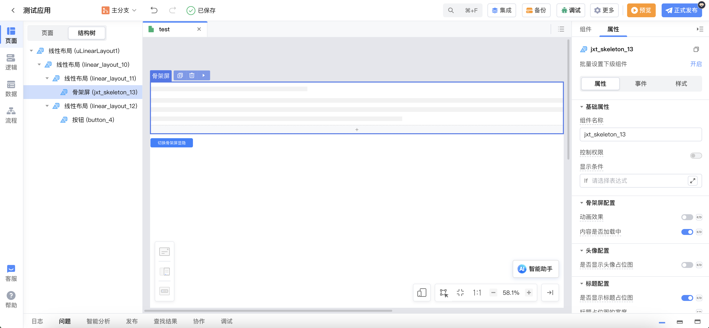
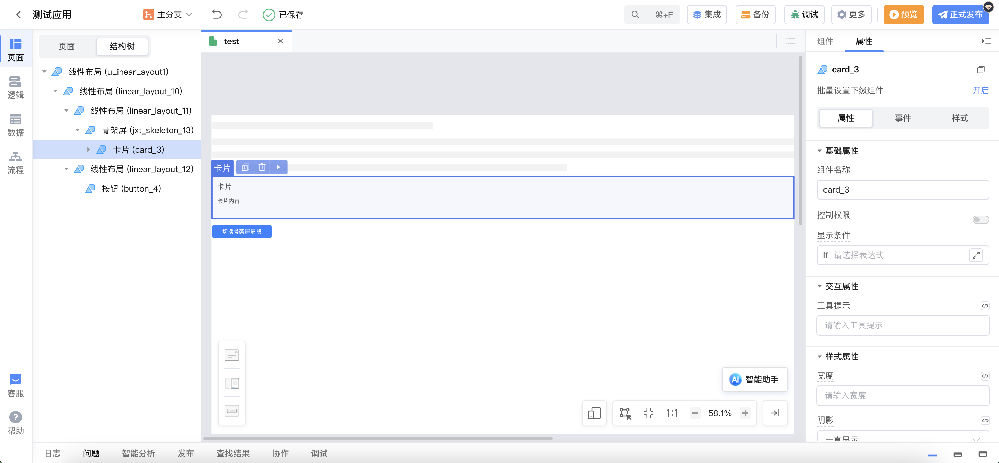
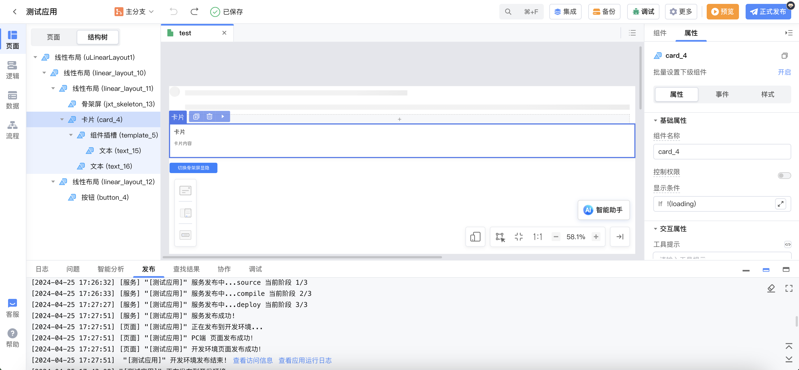
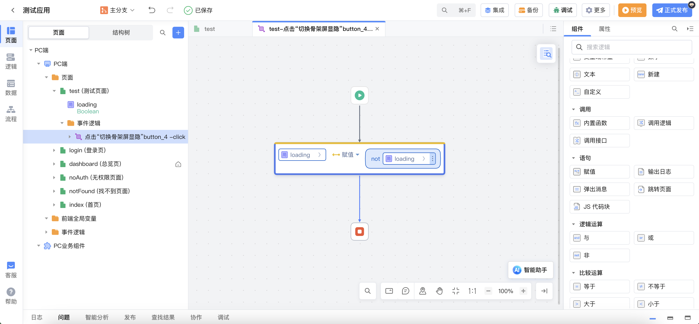

# library_jxt_skeleton

## 背景

在页面数据尚未加载前，页面通常处于长时间的空白状态，特别时网速较低时更为明显。

骨架屏能够在页面数据尚未加载前先给用户展示出页面的大致结构，直到请求数据返回后再渲染页面，填充好本应该展现的内容，给人一种创造即时转换的错觉。能够降低用户的焦灼情绪，又能使界面加载过程变得自然通畅，不会造成网页长时间白屏或者闪烁。

## 组件说明

骨架屏使用`Ant Design Vue`中的`Skeleton 组件`，并结合平台特性进行一些调整，给用户更好的使用体验。

以下是骨架屏组件配置分组及说明。

**骨架屏配置**

| 配置名称       | 类型    | 默认值 | 备注                                                                              |
| -------------- | ------- | ------ | --------------------------------------------------------------------------------- |
| 动画效果       | Boolean | false  | 设置骨架屏是否显示动画效果                                                        |
| 内容是否加载中 | Boolean | false  | 设置内容是否正在加载中。值为`true`时显示骨架屏；值为`false`时显示骨架插槽中的内容 |

**头像配置**

| 配置名称           | 类型         | 默认值 | 备注                                               |
| ------------------ | ------------ | ------ | -------------------------------------------------- |
| 是否显示头像占位图 | Boolean      | false  | 设置骨架屏中是否显示头像占位图                     |
| 头像占位图的大小   | 小\|正常\|大 | 正常   | 设置头像占位图的大小，仅当设置显示头像占位图时有效 |
| 头像的形状         | 圆形\|方形   | 圆形   | 设置头像的形状，仅当设置显示头像占位图时有效       |

**标题配置**

| 配置名称           | 类型    | 默认值 | 备注                                               |
| ------------------ | ------- | ------ | -------------------------------------------------- |
| 是否显示标题占位图 | Boolean | true   | 设置是否显示标题占位图                             |
| 标题占位图的宽度   | String  | -      | 设置标题占位图的宽度，仅当设置显示标题占位图时有效 |

**段落配置**

| 配置名称                 | 类型    | 默认值 | 备注                                                       |
| ------------------------ | ------- | ------ | ---------------------------------------------------------- |
| 是否显示段落占位图       | Boolean | true   | 设置是否显示段落占位图                                     |
| 段落占位图的行数         | Number  | 3      | 设置段落占位图的行数，仅当设置显示段落占位图时有效         |
| 段落最后一行占位图的宽度 | String  | 61%    | 设置段落最后一行占位图的宽度，仅当设置显示段落占位图时有效 |

## 使用示例

使用按钮模拟数据的加载状态，切换骨架屏的显隐。

1. 创建页面，在页面中实现如下图所示的布局。

2. 在骨架屏插槽内拖入需要展示的内容，此处拖入卡片。

> 注：可以不使用骨架屏的插槽，通过绑定给骨架屏内容是否加载中的变量控制内容的显隐，此时可在`样式` tab 对骨架屏的样式进行调整。

3. 调整卡片布局及内容如下图所示。

4. 添加局部变量`loading`，默认值为`true`。同时给切换骨架屏显隐按钮添加点击事件，切换变量`loading`的值。

5. 配置骨架屏，使其与内容结构一致。将内容是否加载中绑定为`loading`变量的值，设置骨架屏显示动画效果，设置骨架屏显示头像占位图，设置骨架屏段落行为 1 行。

6. 预览应用，点击按钮模拟数据加载中与加载完成，即可看到相应效果。

