# library_jxt_transition

## 背景

在实际开发中，我们可能需要通过类似 vue 中的 `transition` 和 `transition-group` 组件实现一些过渡和动画效果。该依赖库是对`transition`和`transition-group`组件的封装，但不仅仅是简单的封装，基于平台可视化操作的特性，结合`animate.css`预设了一些动画效果，用户只需在下拉框即可选择需要的动画效果，降低开发者的使用门槛。同时又结合`gsap`提供了自定的动画的功能，给开发者提供更多的过渡和动画效果的创作空间。

## 组件说明

`transition`和`transition-group`组件，结合`animate.css`预设了一些**进入动画**和**离开动画**效果。

动画名称对应效果可查看[animate.css 官网](https://animate.style/)

### 进入动画效果

#### Back entrances

-   backInDown
-   backInLeft
-   backInRight
-   backInUp

#### Bouncing entrances

-   bounceIn
-   bounceInDown
-   bounceInLeft
-   bounceInRight
-   bounceInUp

#### Fading entrances

-   fadeIn
-   fadeInDown
-   fadeInDownBig
-   fadeInLeft
-   fadeInLeftBig
-   fadeInRight
-   fadeInRightBig
-   fadeInUp
-   fadeInUpBig
-   fadeInTopLeft
-   fadeInTopRight
-   fadeInBottomLeft
-   fadeInBottomRight

#### Rotating entrances

-   zoomIn
-   zoomInDown
-   zoomInLeft
-   zoomInRight
-   zoomInRight

#### Sliding entrances

-   slideInDown
-   slideInLeft
-   slideInRight
-   slideInUp

### 离开动画效果

#### Back exits

-   backOutDown
-   backOutLeft
-   backOutRight
-   backOutUp

#### Bouncing exits

-   bounceOut
-   bounceOutDown
-   bounceOutLeft
-   bounceOutRight
-   bounceOutUp

#### Fading exits

-   fadeOut
-   fadeOutDown
-   fadeOutDownBig
-   fadeOutLeft
-   fadeOutLeftBig
-   fadeOutRight
-   fadeOutRightBig
-   fadeOutUp
-   fadeOutUpBig
-   fadeOutTopLeft
-   fadeOutTopRight
-   fadeOutBottomLeft
-   fadeOutBottomRight

#### Rotating exits

-   zoomOut
-   zoomOutDown
-   zoomOutLeft
-   zoomOutRight
-   zoomOutRight

#### Sliding exits

-   slideOutDown
-   slideOutLeft
-   slideOutRight
-   slideOutUp

### 动画方式及动画配置

`transition`和`transition-group`组件，支持使用预设动画和自定义动画。当使用预设动画时，支持动画配置，可进行`动画时间`，和`初次展示内容时执行进入动画效果`配置。当使用自定义动画时，仅**动画配置**中`初次展示内容时执行进入动画效果`配置有效。

### transition

使用`transition`组件实现动画效果，与 vue 中`transition`组件一致，需要对`transition`包裹的组件设置显示条件。当`transition`包裹的组件的显示条件变更时，即可进行动画效果的显示。

`transition`所有事件的事件对象`event`中包含`el`（执行动画的元素）、`gsap`（gsap 对象）。`进入动画刚开始时`和`离开动画刚开始时`事件中还包含`done`函数，用于动画执行完成后调用。

### transition-group

使用`transition-group`组件实现动画效果，需要对`transition-group`绑定`List<T>`数据源。当`数据源变更时，使用对应数据项渲染的组件即可进行动画效果的显示。

`transition-group`所有事件的事件对象`event`中包含`el`（执行动画的元素）、`gsap`（gsap 对象）、`index`（执行动画的元素在数据源中的索引）。`进入动画刚开始时`和`离开动画刚开始时`事件中还包含`done`函数，用于动画执行完成后调用。

## 使用步骤说明

### transition

#### 使用预设动画实现动画效果

该案例将`Boolean`类型的变量绑定到`transition`包裹组件的显示条件，通过按钮点击事件切换变量的值，对`transition`包裹组件实现动画效果。实现步骤如下：

1. 实现页面布局，将需要实现动画效果的组件拖入到`transition`组件中。

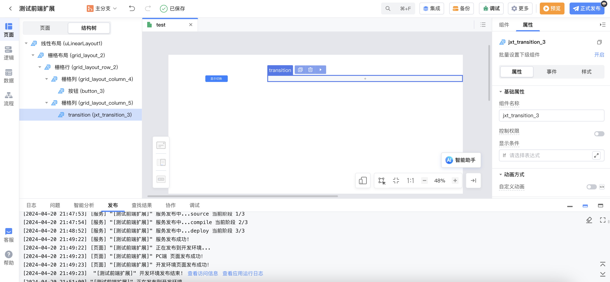

> 注意：由于预设动画很多依赖于元素为非内联元素，如果使用文本组件，需要对文本添加样式，设置为非内联元素。

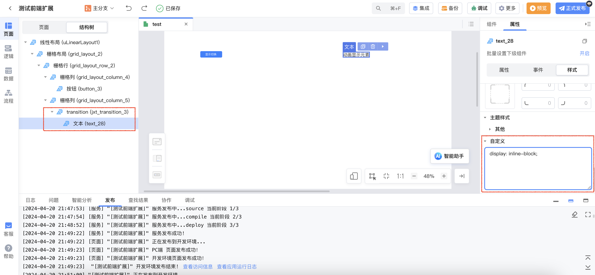

2. 在页面创建`Boolean`类型局部变量`show`，默认值为`false`，并将变量绑定到`transition`包裹组件的显示条件。

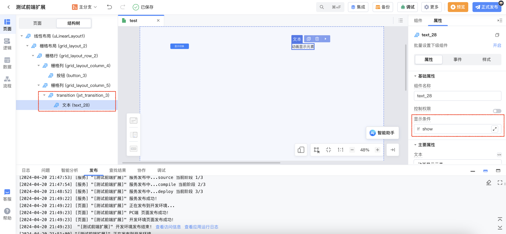

3. 给`显示切换`按钮添加点击事件，对局部变量`show`的值进行取反。

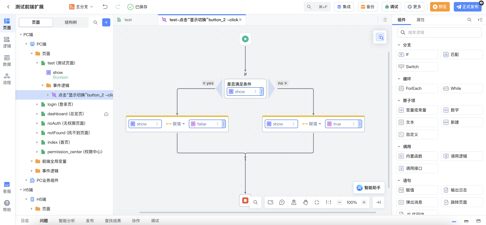

4. 选择`transition`组件，设置进入**进入动画**和**离开动画**。

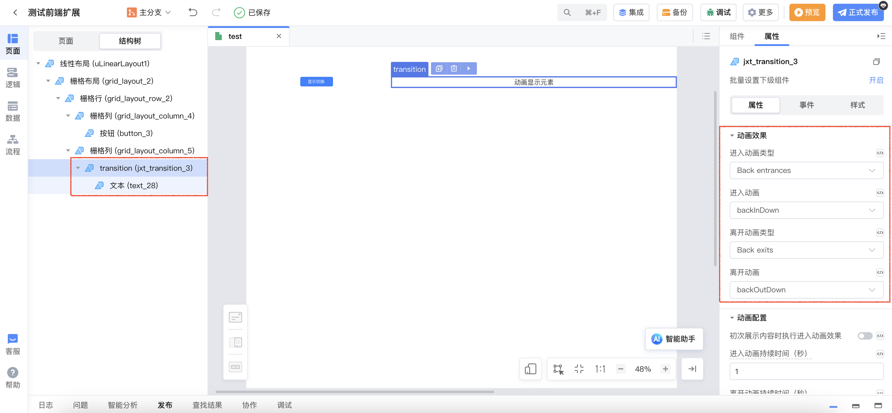

5. 预览应用，点击显示切换按钮，即可看到`transition`包裹组件在显示与隐藏切换时展示了选择的动画效果。

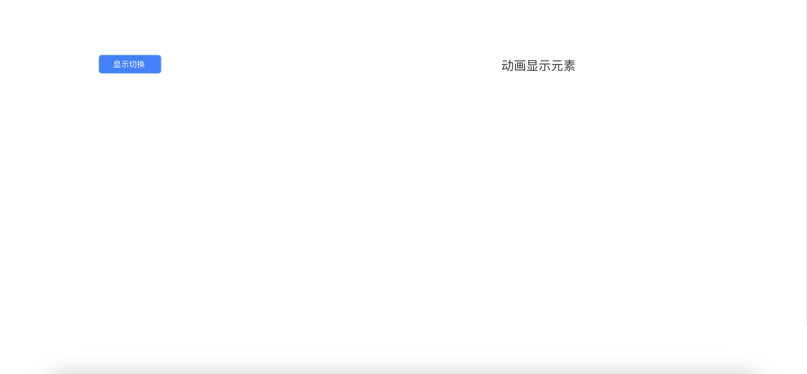

#### 自定义动画

实现 vue 官网[自定义动画效果](https://play.vuejs.org/#eNqNVFFv0zAQ/ismCHWT2qR0m5hCN8bQHkCIIdgDSH5xk2vq1bEj+9J1mvbfOTtJm0wwJlVN7rvz3efvLvcQfayqeFNDlEZzl1lZ4TnXsqyMRVY4UbGlNSUb+dcR14xxDdvgzGEpaoXswaO5QHFw2LwzZgFrqzuLMbcydylDW0ODPPrH49j/l4Ark7vUB3PkaPQlLI2FK41gQwRjRg+tryA2IRPloR/Xy1pnKI0mX+/0AaiWkScfO0BCxh0rlwkFv1I2jWcnbeYA/R5AphKZxPuUvQ31DkNBL0KvZFdszHKjoV8STb9iXlvhj1CyfkHiMLCJQGfvq7cACAcpG4ESDmUWS31d48EsPhmzt4ejnT6fTFkpQIr0hHrEB7SDikPaHJ+lPY3fvZD4NmVH0+lLSHfs/qMYtaTNllMeUmRK55+I1NV7RoB5shtxMhAoTCCQxdh8USNNH7vIlMzWZzzyQ8vO2Cv/5NH5jSkKBfOkCQsJ6NCNFdpJz7GpfbEI8zcBPxOUZDCQPGqD9t4hrnxLAt6MeIunmXOELoVyLRYYU/lcblhGunq312+yMFsesc1ELtsbEPN5QmHNHZM9XwLmSU8BMh3eK/8ad6maPixEti6sqXWestfHs8Xp6dH78OkKW0g9QVOlbDattgG8kzmufPdbewWyWGEPWBibg51YkcuaPvuT6RuCm9a05aNx1OyfSUkTceuMpt0UmPDW4XgUFobXoLm4B3i0QqxcmiS1rtZFnJky8b4Ppclr1SrnVwYVQJcZvZTFk/R0pJIK7HXlJRqWEUqZuy8B85usHTY6s4Js/Rf81lErPKvvFhxY386dD0k6wMZ99fMbbOl95+zoPuP8Ac6oOoxdCLuk5hDtXlxg+zmoJXVx4662CNT59lLdKm52MI9o//tv5l9X39M9io93Kj7+AeE2A2k=)。

1. 实现页面布局，将需要实现动画效果的组件拖入到`transition`组件中。

> 注意：由于预设动画很多依赖于元素为非内联元素，如果使用文本组件，需要对文本添加样式，设置为非内联元素。

2. 在页面创建`Boolean`类型局部变量`show`，默认值为`false`，并将变量绑定到`transition`包裹组件的显示条件。

3. 给`显示切换`按钮添加点击事件，对局部变量`show`的值进行取反。

4. 设置**动画方式**为`自定义动画`

> 注意：设置自定义动画后，**动画效果**配置及**动画配置**中除`初次展示内容时执行进入动画效果`外将全部失效。

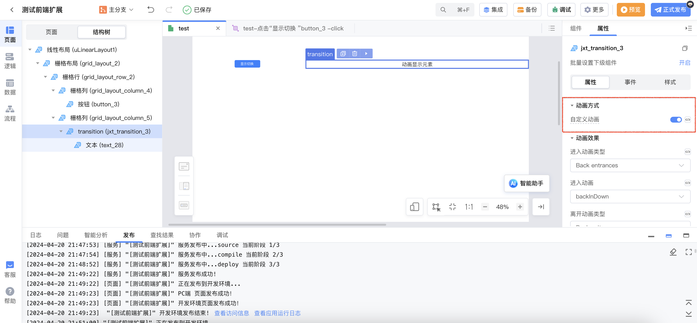

5. 选择`transition`组件，设置`进入动画开始前`事件，通过该事件，设置元素执行进入动画前的初始状态。

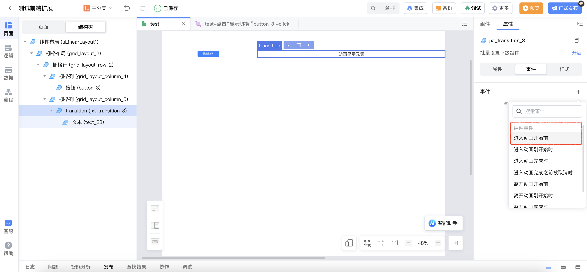

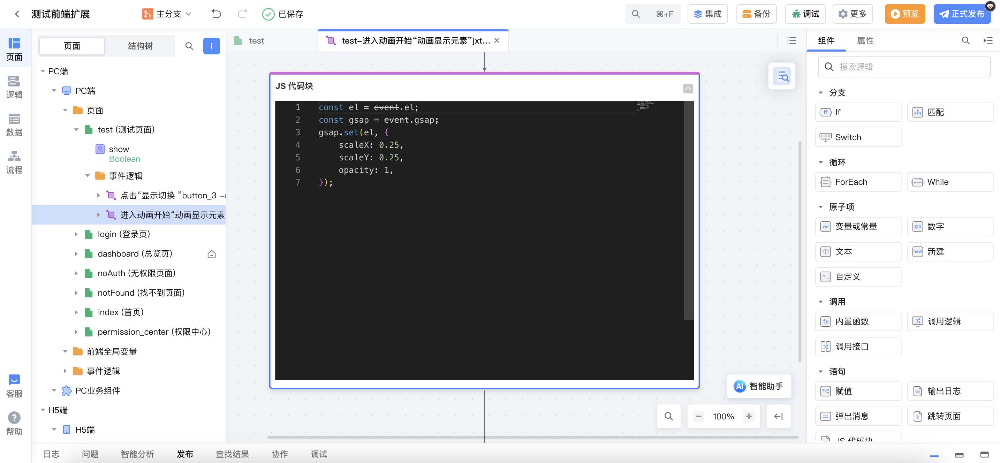

6. 选择`transition`组件，设置`进入动画开始时`事件，通过该事件，设置进入时执行的动画效果。

注意：此事件中存在`done`函数，用于在动画完成之后调用。

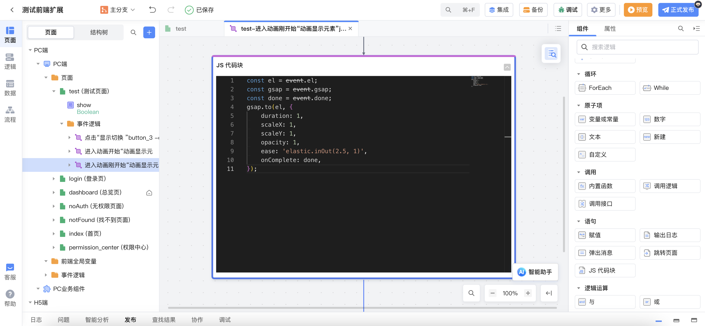

7. 选择`transition`组件，设置`离开动画开始时`事件，通过该事件，设置离开时执行的动画效果。

注意：此事件中存在`done`函数，用于在动画完成之后调用。

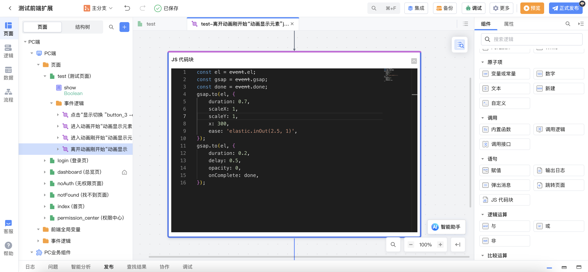

8. 预览应用，点击显示切换按钮，即可看到`transition`包裹组件在显示与隐藏切换时展示了自定义的动画效果。

### transition-group

#### 使用预设动画实现动画效果

该案例将`List<String>`类型的变量绑定到`transition-group`组件的数据源，通过按钮点击事件切换变量的值，对`transition-group`包裹组件实现动画效果。实现步骤如下：

1. 实现页面布局如下。

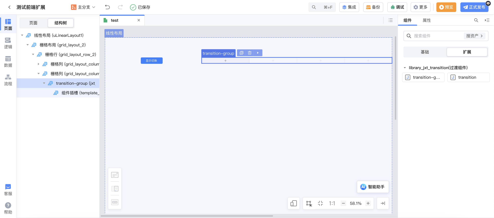

2. 在页面创建`List<String>`类型局部变量`list`，并将变量绑定到`transition-group`的数据源。

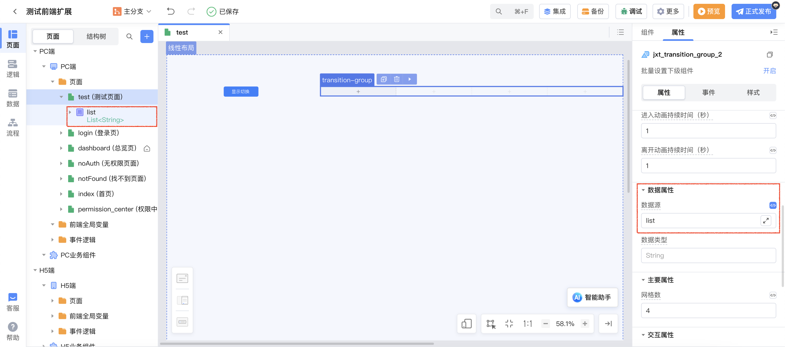

3. 拖拽文本组件到`transition-group`，并给文本组件绑定列表项的值。

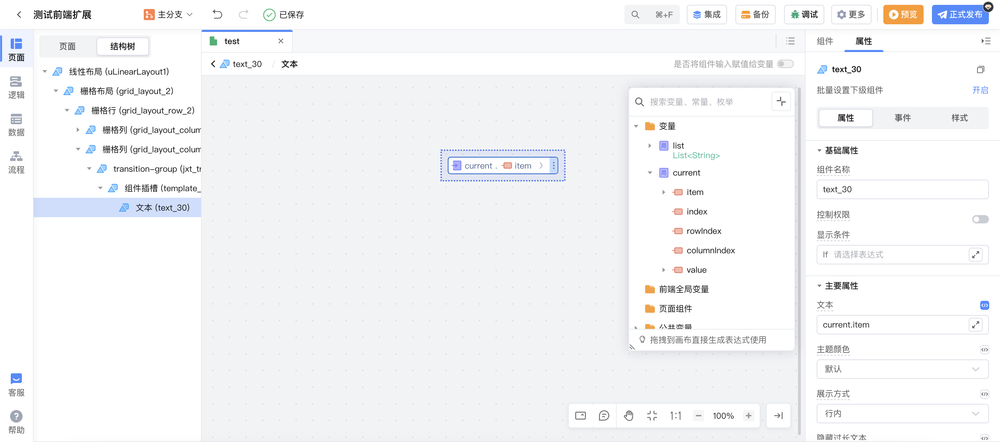

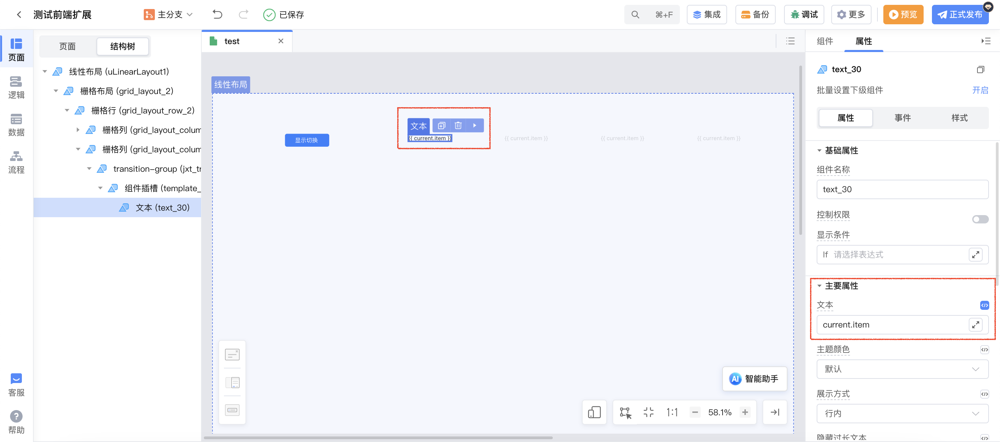

4. 显示切换按钮添加点击事件，当`list`长度大于 0 时清空`list`；否则给`list`赋值。

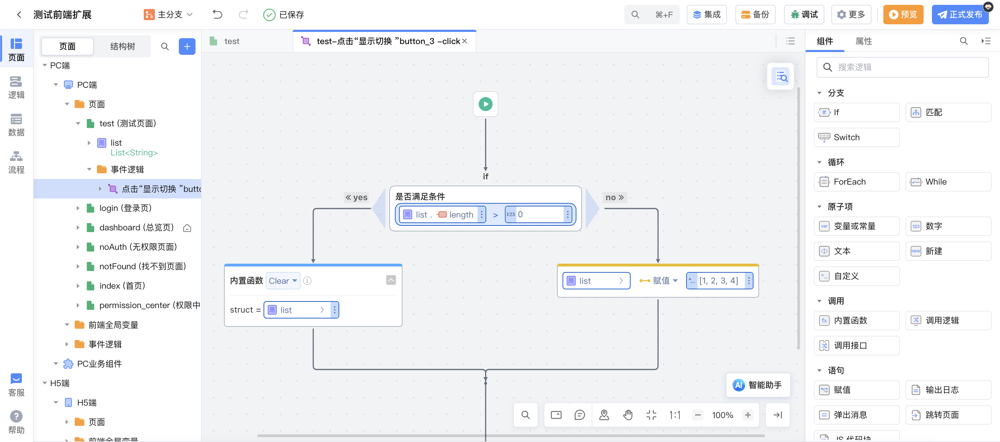

5. 选择`transition-group`组件，设置进入**进入动画**和**离开动画**。

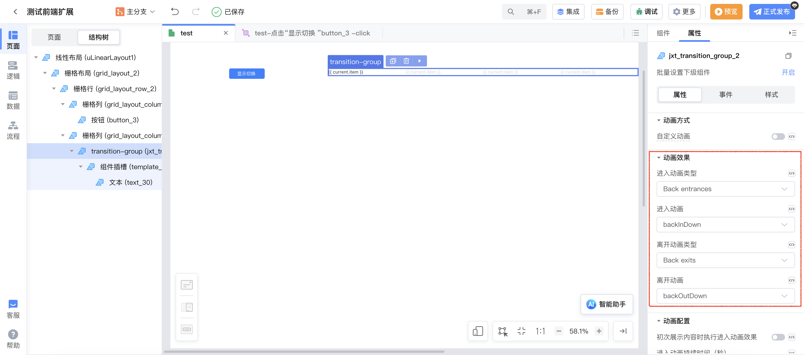

8. 预览应用，点击显示切换按钮，即可看到`transition-group`包裹组件在显示切换时展示了自定义的动画效果。

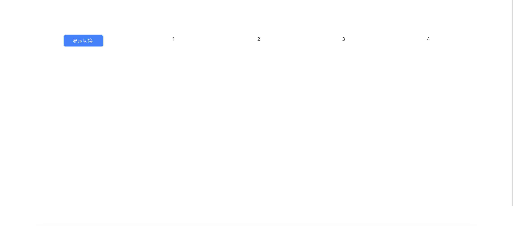
