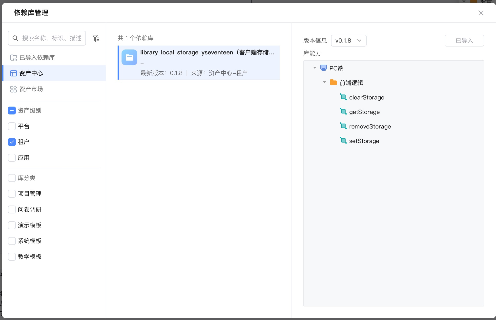

# library_local_storage_yseventeen

**依赖库设计**

客户端存储逻辑依赖库-标准版，仅支持基本操作。

封装localStorage操作方法，包括 :

1. 将值存储到本地存储中。

2. 从本地存储中获取值。
3. 从本地存储中删除值。
4. 清空本地存储。

## logics/config.js
通过修改config文件的 type 配置可以轻松切换操作的客户端存储类型，

类型支持 **window.localStorage, window.sessionStorage**;

```javascript
type: "localStorage", // 本地存储类型 localStorage/sessionStorage
expire: 60 * 60, //过期时间 单位：秒
```


### 逻辑

* **setStorage**： 设置客户端存储。

  入参1：【key】 string，必填；设置客户端存储的名；
  入参2：【value】 string，必填；设置客户端存储的值；
  入参3：【expire】 string，非必填，默认 60*60；设置客户端存储的过期时间单位：秒；
  无出参；

* **getStorage**：获取客户端存储，支持过期删除，未过期期间被调用自动续期进行保活。

  入参1：【key】 string，必填；客户端存储的名；
  出参1：string

* **removeStorage**：根据 Key 删除指定的客户端存储。

  入参1：【key】 string，必填；客户端存储的名；

* **clearStorage**：清空客户端存储

  无入参；
  无出参；

  


## 使用步骤说明
1.  应用引用依赖库
2.  无需配置
3.  逻辑调用示例截图



## 应用演示链接
https://dev-yseventeenlcap-yseventeen.app.codewave.163.com/dashboard/test

