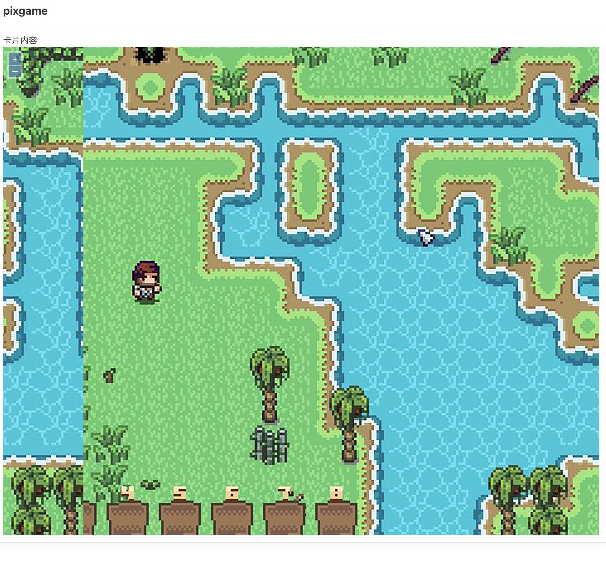

# 瓦片地图浏览器

**依赖库设计**

这个依赖库旨在提供前端渲染google xyz格式的瓦片地图。

参考 https://vuelayers.github.io/

**主要特性**

- **library_tilemap/支持多种选择方式及PC和H5的适配：**

## 组件一/逻辑一
mapviewer

**特性 1：** 支持google xyz格式的瓦片地图浏览。

**特性 2：** 配合TileMapUtils可以实现地图切片缓存

## mapviewer

### 组件（组件名）

- **attrs**
    - value: XYZ瓦片地址，默认为高德世界地图
    - zoomLevel: 默认3， 默认缩放等级
    - maxZoom: 默认18， 最大缩放等级
    - minZoom: 默认3， 最小缩放等级
    - tileSize: 默认256, 瓦片大小
    - width: 默认0，地图宽度, 0为100%
    - height: 默认400，地图高度

- **methods**
N/A

- **events**
N/A

### 逻辑（逻辑名）

N/A

## 应用演示链接

[查看示例演示](https://dev-tilemap-qa.app.codewave.163.com/maps)

