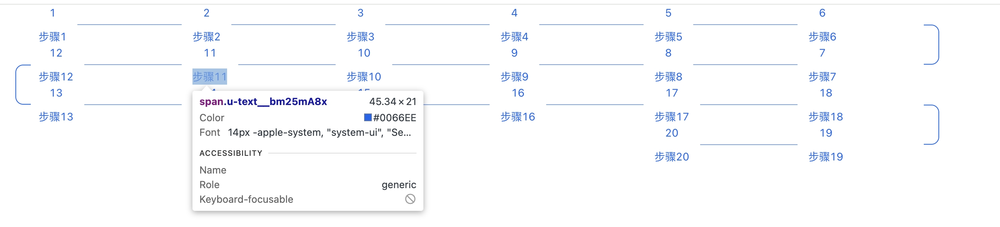

复制本文件到个人依赖库文件夹下，按照个人依赖库填写模板。本模板勿删，勿动
# lxy_turning_step_bar_library

**依赖库设计**

这个依赖库旨在提供转弯步骤条。它包含了一个组件，可根据设置长度自动匹配换行规则

**主要特性**

- **组件一：** 转弯步骤条。

...

## 使用说明

### 组件（组件名）

- **attrs**
  - value: 值
  - data-source: 数据源,仅支持变量
  - itemWidth: 步骤条宽度，可以用数字,px,%

- **methods**
  无

- **events**
  - onCellClick: 步骤条更新

## 应用演示链接

[查看示例演示](示例演示链接)

