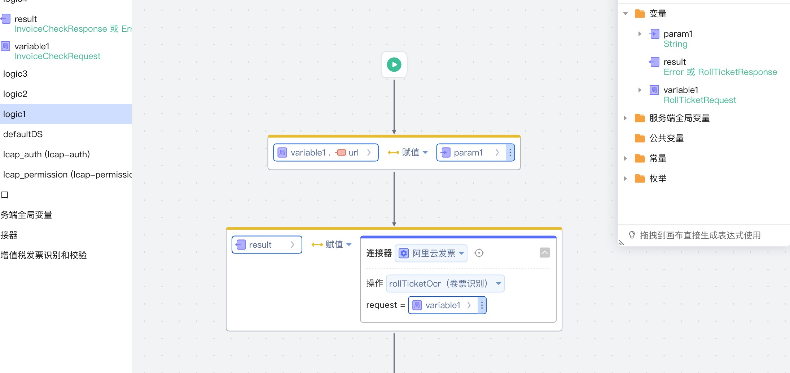

# OrcInvoice
增值税发票识别

## 逻辑详情

### rollTicketOcr

增值税发票卷票识别， 参考：https://market.aliyun.com/apimarket/detail/cmapi00042852

入参：  
RollTicketRequest(String url, String img)

出参：  
RollTicketResponse

### invoiceOcr

增值税发票识别， 参考： https://market.aliyun.com/apimarket/detail/cmapi027758

入参：  
OcrInvoiceRequest(String url, String img, Integer pdf_no)

出参：  
OcrInvoiceResponse

### invoiceCheck

增值发票验真， 参考：https://market.aliyun.com/apimarket/detail/cmapi00050226

入参：   
InvoiceCheckRequest(String fphm, String kprq, String fpdm, String xym, String bhsje)

出参：   
InvoiceCheckResponse

## 使用步骤说明

1.  应用集成中心中添加连接器：增值税发票识别和校验
2.  配置应用配置参数：填写连接器名称，appCode
3.  逻辑中调用连接器的方法

## 应用演示链接

https://dev-test430-qa.app.codewave.163.com/aliyun1
https://dev-test430-qa.app.codewave.163.com/aliyun2
https://dev-test430-qa.app.codewave.163.com/aliyun3

[使用了本依赖库的制品应用链接]

https://dev-test430-qa.app.codewave.163.com/
