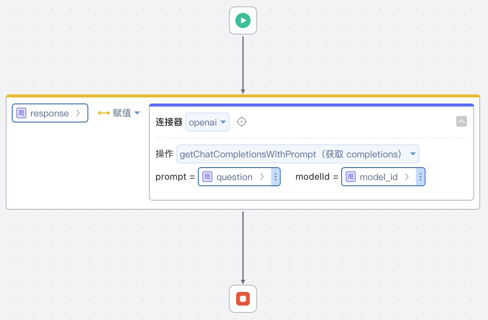

# OpenAI连接器
代码实现支持代理配置的OpenAI连接器

## 逻辑详情

### listModels

获取模型列表

入参： 无  
出参： List<String>

### getChatCompletions

获取聊天 completions

入参： `List<ChatMessage>`， String modelId   
出参： ChatResponse

### getChatCompletionsWithPrompt

获取聊天 completions

入参： String prompt, String modelId，  
出参： ChatResponse

## 使用步骤说明

1.  应用集成中导入连接库
2.  添加连接器并配置参数
     * secretKey String OpenAI密钥
     * customEndpoint String 自定义endpoint，空填写为null
     * proxyHost String 代理地址，空填写为null
     * proxyPort Integer 代理端口，空填写为0
     * proxyUsername String 代理用户名，空填写为null
     * proxyPassword String 代理密码，空填写为null
     * proxyType Integer 代理类型 0:http 1:socks
3.  逻辑调用示例截图

## 应用演示链接

[使用了本依赖库的制品应用链接]

https://dev-testdify-qa.app.codewave.163.com/testopenai

