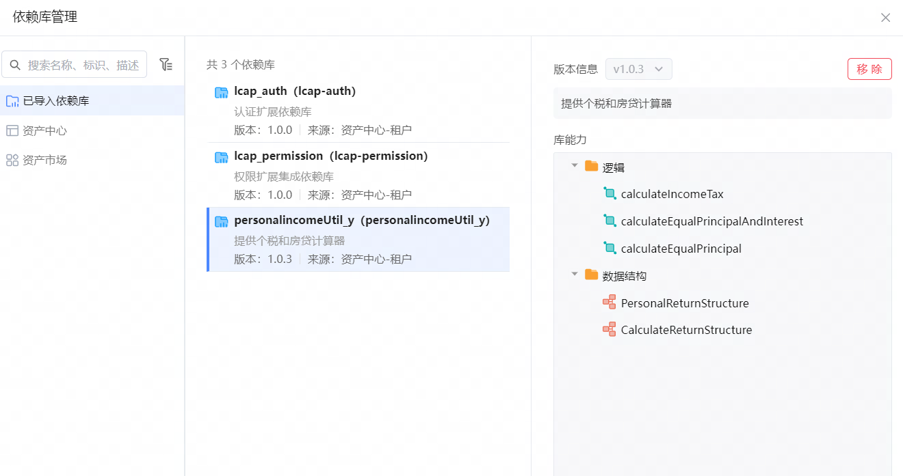
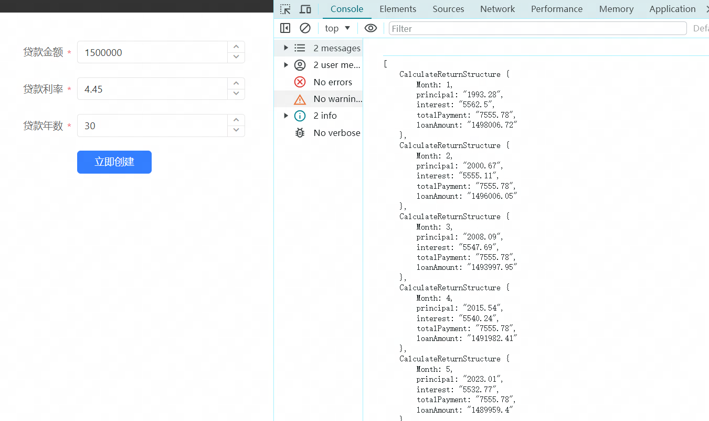
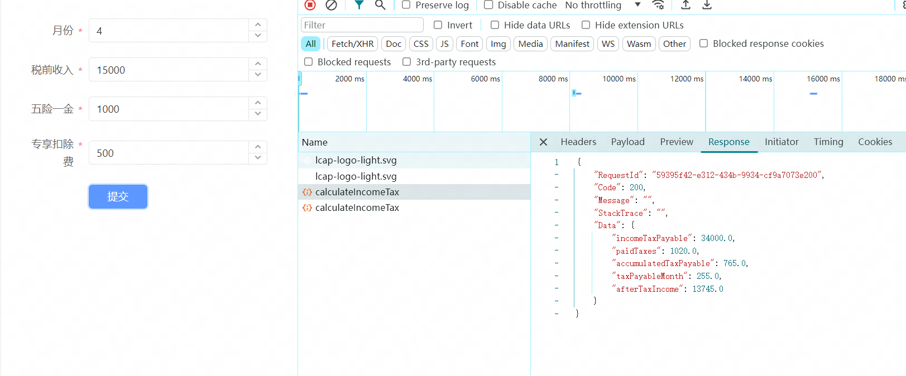

# 依赖库名称

personalincomeUtil_y依赖库包含个税计算器和房贷计算器方法

## 逻辑详情

### 逻辑一
* 个税计算器
calculateIncomeTax

输入参数：
/**
* @param Month 缴税期数 Integer类型
* @param income 税前月收入 Double类型
* @param totalSal 五险一金(每月) Double类型
* @param socInsur 专享扣除费 Double类型
* @return
*/

输出参数：
PersonalReturnStructure实体
包含返还参数:
Double incomeTaxPayable;//应纳所得税额
Double paidTaxes;//已缴税款
Double accumulatedTaxPayable;//累计应缴税款
Double taxPayableMonth;//本月应缴税款
Double afterTaxIncome;//本月税后收入

### (逻辑二与三出入参一致,区别为计算方式不同,一个为房贷等额本息,一个为房贷等额本金)
### 逻辑二

* 房贷等额本息
calculateEqualPrincipalAndInterest

输入参数:
/**
* @param loanAmount 贷款总额
* @param annualInterestRate 贷款利率
* @param loanTermInYears 贷款年数
  */

输出参数:
List<CalculateReturnStructure>
包含返还参数:
Integer month;//月份(期数)
String principal;//本金
String interest;//利息
String totalPayment;//总计
String loanAmount;//剩余贷款

返回参数示例:
[CalculateReturnStructure
{month=1, principal='4166.67', interest='5562.5', totalPayment='9729.17', loanAmount='1495833.33'},
CalculateReturnStructure{month=2, principal='4166.67', interest='5547.05', totalPayment='9713.72', loanAmount='1491666.67'}, 
CalculateReturnStructure{month=3, principal='4166.67', interest='5531.6', totalPayment='9698.26', loanAmount='1487500'}, 
CalculateReturnStructure{month=4, principal='4166.67', interest='5516.15', totalPayment='9682.81', loanAmount='1483333.33'}
......]

### 逻辑三
* 房贷等额本金
calculateEqualPrincipal

输入参数:
/**
* @param loanAmount 贷款总额
* @param annualInterestRate 贷款利率
* @param loanTermInYears 贷款年数
*/

输出参数:
List<CalculateReturnStructure>
包含返还参数:
Integer month;//月份(期数)
String principal;//本金
String interest;//利息
String totalPayment;//总计
String loanAmount;//剩余贷款

## 使用步骤说明

1.  应用引用依赖库

2. 成功效果

3. 
## 应用演示链接
jar包为:
[library-personalincomeUtil_y-1.0.3.zip](library-personalincomeUtil_y-1.0.3.zip)
使用了本依赖库的应用的链接。
https://dev-test123-suber.app.codewave.163.com/dashboard/test1

