# 平台流程能力扩展

平台流程能力扩展。

## 版本依赖

须基于CodeWave3.13版本，并且下列文件升级至1.2.0以上：
library-lcap_process_framework-1.2.0

## 逻辑详情

### 权限控制【重要！！！】

流程启动等逻辑本身不校验权限，建议业务自行做鉴权处理。下列二次校验方案仅为兜底方案。

当本依赖库服务端逻辑被前端直接调用时，会产生对应的http接口。若用户F12获取curl信息，篡改参数，可能会存在敏感信息泄漏。因此建议逻辑非必要不在前端中直接调用。
此外，可以借助reconfirmAuthorization二次校验机制，实现权限控制。（前后端调用均适用）

#### 二次校验复写逻辑reconfirmAuthorization

updateTaskHandler等逻辑开启了二次鉴权，当逻辑调用时，会调用reconfirmAuthorization进行二次鉴权。用户可以重写reconfirmAuthorization，验证logicName和当前登录人的关系，实现二次鉴权。

```
 /**
     * 判断当前用户是否有权操作logicName对应逻辑
     * logicName视为资源点，对齐进行二次鉴权
     *
     * @param logicName 示例：
     *                  updateTaskHandler
     *                  launchProcessCustomName
     *                  getNextNodeInfo
     *                  getNextNodeInfoByConditionalFlowId
     * @return
     */
    @NaslLogic(override = true)
    public Boolean reconfirmAuthorization(String logicName)
```

### 流程实例操作

#### 启动流程launchProcessCustomName

新增入参processInstanceName 流程实例名称，自定义流程实例名称。

注意：业务自行做鉴权处理。

```java
/**
 * 启动流程
 * @param data 传入数据
 * @param procDefKey 流程定义Key
 * @param processInstanceName 流程实例名称
 * @return 流程实例ID（与官方逻辑基本一致）
 */

@NaslLogic
public <T> String launchProcessCustomName(T data, String procDefKey, String processInstanceName) {

```

##### 复用平台流程一键生成的审批页/创建流程页场景

平台一键生成的审批页，须严格按照下面数据格式传递，否则将影响流程表单的显示。
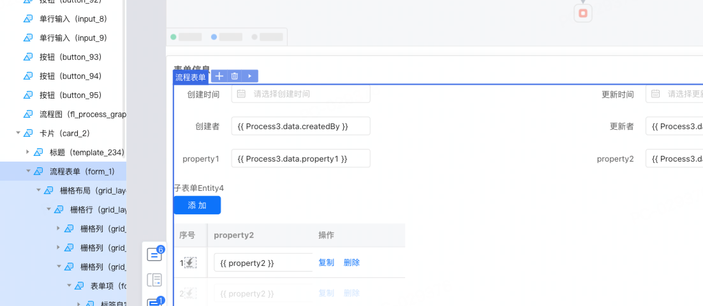

###### 单表单数据格式

官方依赖库示例：
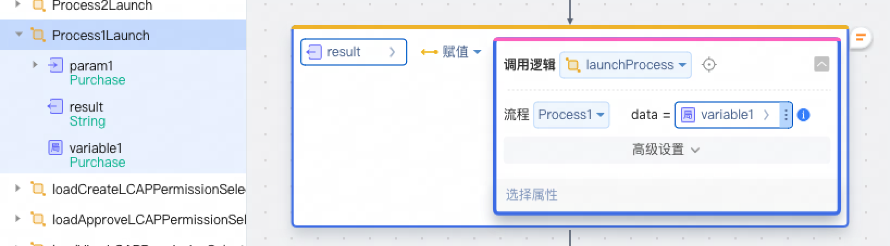
扩展依赖库示例：
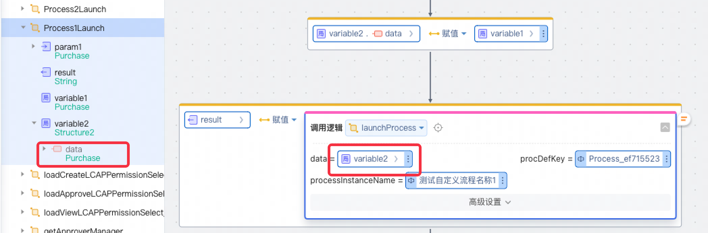
新建Structure2自定义数据结构。

###### 父子表单数据格式

官方依赖库示例：
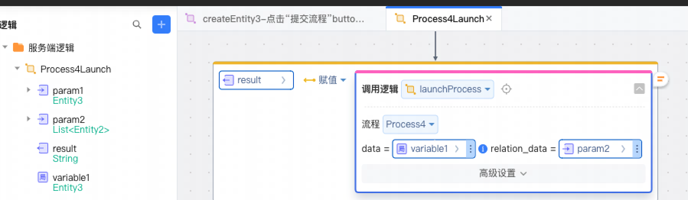
扩展依赖库示例：
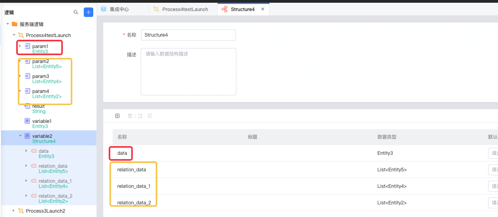
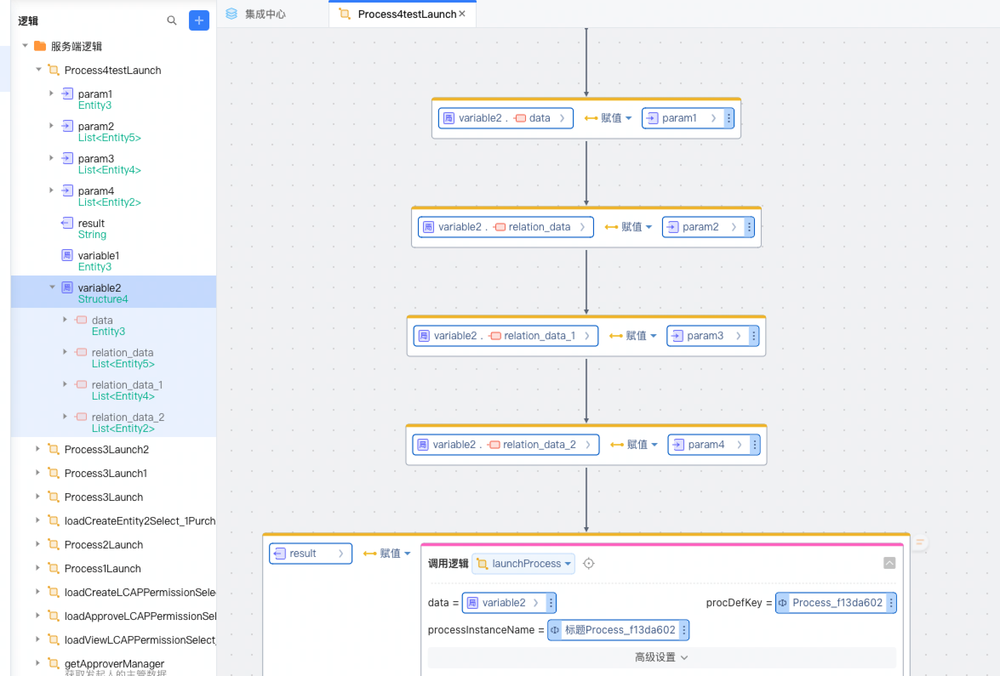
新增Structure3自定义数据结构，data和relation_data等参考官方一键生成逻辑中的param。
data、relation_data、relation_data_1等名称key须按规则命名。否则将影响一键生成的流程逻辑和页面的效果。

#### 结束流程实例，并记录流程结束状态endProcessWithStatus

endType：1结束 2取消并留存数据 3取消并删除数据

可使用getEndedProcessStatus获取本接口指定的状态。

```
/**
 * 结束流程实例，并记录流程结束状态
 *
 * @param processInstanceId
 * @param endType           1结束 2取消并留存数据 3取消并删除数据
 * @param operatorUser
 * @return
 */
@NaslLogic
public Boolean endProcessWithStatus(String processInstanceId, Integer endType, String operatorUser) {
    extProcessHandlingLogicService.endProcessWithStatus(processInstanceId, endType, operatorUser);
    return true;
}
```

### 流程实例查询

#### 获取结束的流程的状态getEndedProcessStatus

流程结束前-不支持使用本接口： 使用平台原生状态
流程结束后：
平台原生结束（平台原生）ORIGINAL_ENDED、
结束ENDED、取消CANCELLED（扩展）
删除DELETED-报错流程实例不存在

```
/**
 * 获取结束的流程的状态
 *
 * @param procInstId
 * @return 流程状态
 */
@NaslLogic
public String getEndedProcessStatus(String procInstId) {
    return extProcessInstanceSearchLogicService.getEndedProcessStatus(procInstId);
}
```

#### 分页获取流程实例（管理员）

```java
  /**
 * 分页获取流程实例
 * @param procDefKey
 * @param procInstStartTimeAfter
 * @param procInstStartTimeBefore
 * @param procInstInitiator
 * @param page
 * @param size
 * @param search 精确匹配
 * @param finished 实例是否完成
 * @return
 */
@NaslLogic
public ProcInstInfoPage pageProcInstInfo(String procDefKey, ZonedDateTime procInstStartTimeAfter,
                                         ZonedDateTime procInstStartTimeBefore, String procInstInitiator,
                                         Long page, Long size, String search, Boolean finished) {
```

### 流程定义查询

#### 获取下一节点getNextNodeInfo

```java
 /**
 * 获取下一节点
 *
 * @param procDefKey
 * @param taskDefName         节点名称
 * @return
 */
@NaslLogic
public Map<String, String> getNextNodeInfo(String procDefKey, String taskDefName) {
```

#### 获取下一节点（根据conditionalFlowIds条件流过滤）getNextNodeInfoByConditionalFlowId

```java

/**
 * 获取下一节点（根据conditionalFlowIds条件流过滤）
 *
 * @param procDefKey
 * @param taskDefName
 * @param conditionalFlowIds 想要获取的下一节点的分支流id列表
 * @return
 */

@NaslLogic
public Map<String, String> getNextNodeInfoByConditionalFlowId(String procDefKey, String taskDefName,
                                                              List<Integer> conditionalFlowIds) {

```

#### 获取流程定义列表信息getProcInstGraphByTaskId/getProcInstGraphByProcInstId

注意：

1. 未来节点的审批人信息只能根据当前变量获取。若后续节点对变量有变化，当前节点无法获取到未来信息。
2. 流程复杂时，列表节点顺序不一定完全正确。

```java
    /**
 * 获取流程信息
 * 未来节点的审批人信息只能根据当前变量获取。若后续节点对变量有变化，当前节点无法获取到未来信息。
 *
 * @param procInstId 流程实例ID
 * @return 流程信息
 */
@NaslLogic
public List<Element> getProcInstGraphByProcInstId(String procInstId)
```

##### 数据结构说明

1. Element节点信息

   | 字段名 | 类型 | 字段说明 | 备注 |
                        |---------------------|--------|-------|---|
   | current | Boolean | 是否当前活跃节点 ||
   | completed | Boolean | 任务是否完成 ||
   | name | String | 节点名称 ||
   | title | String| 节点标题 ||
   | type |String | 节点类型 ||
   | completeInfos | List<CompleteInfo>| 处理信息 ||

2. CompleteInfo节点处理信息

   | 字段名 | 类型 | 字段说明 | 备注 |
                        |---------------------|--------|-------|---|
   | assignee | ProcessUser | 处理人 |未完成节点不存在处理人信息|
   | completeTime | String | 处理完成时间 ||
   | completed | Boolean | 是否已完成 ||
   | candidates | List<ProcessUser> | 候选人 |待选人|
   | addSignTag | Boolean| 加签标志 ||

3. ProcessUser节点处理人信息

   | 字段名 | 类型 | 字段说明 | 备注 |
                        |---------------------|--------|-------|---|
   | userName | String | 名称 ||
   | displayName | String | 展示名称 ||

##### 展示流程列表，并且运行时获取并修改候选人示例

1. 给可修改候选人的节点配置处理人为流程自定义变量。一个节点对应一个变量。
2. 流程自定义变量默认值暂不可用，若业务场景需要有默认用户，建议使用流程启动事件做初始赋值。
3. 调用本接口获取流程信息。其中配置流程自定义变量为处理人的节点，对应的candidates值将会是流程自定义变量的值。
4. 调用【根据任务id/实例id修改流程自定义变量updateProcessVariableByTaskId/updateProcessVariableByProcInstId】可修改流程自定义变量
   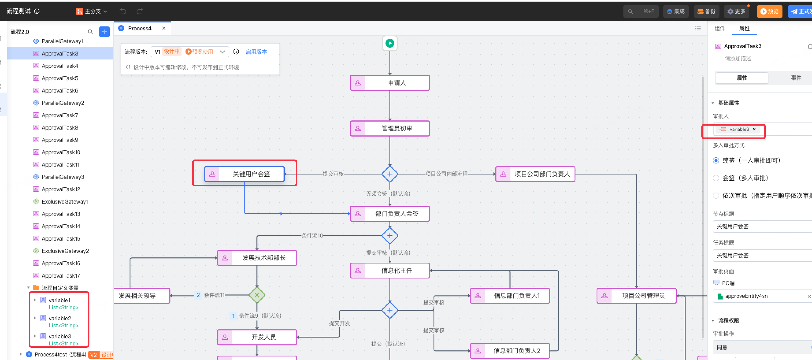

### 任务实例查询

#### 查询我的待办任务列表getMyPendingTasksByCustomUser

新增入参overrideLogicReq复写逻辑请求入参，当存在复写逻辑customGetUserName实现时，自动调用复写逻辑，传入overrideLogicReq，获取最终的用户名称。

注意：业务自行做鉴权处理。

```java
/**
 * 查询我的待办任务列表
 *
 * @param procDefKey 流程定义Key
 * @param procInstStartTimeAfter 流程实例开始时间后
 * @param procInstStartTimeBefore 流程实例开始时间前
 * @param procInstInitiator 流程实例发起人
 * @param page 页码
 * @param size 每页数量
 * @param search 搜索关键词（流程定义名）
 * @param overrideLogicReq 复写逻辑请求入参
 * @return 我的待办任务列表 （与官方逻辑基本一致）
 */

@NaslLogic
public MyPendingTaskPage getMyPendingTasksByCustomUser(String procDefKey, ZonedDateTime procInstStartTimeAfter,
                                                       ZonedDateTime procInstStartTimeBefore, String procInstInitiator,
                                                       Long page, Long size, String search, String overrideLogicReq) {
```

#### 查询我的已办任务列表getMyCompletedTasksByCustomUser

新增入参overrideLogicReq复写逻辑请求入参，当存在复写逻辑customGetUserName实现时，自动调用复写逻辑，传入overrideLogicReq，获取最终的用户名称。

注意：业务自行做鉴权处理。

```java
/**
 * 查询我的已办任务列表
 *
 * @param procDefKey 流程定义Key
 * @param procInstStartTimeAfter 流程实例开始时间后
 * @param procInstStartTimeBefore 流程实例开始时间前
 * @param procInstInitiator 流程实例发起人
 * @param page 页码
 * @param size 每页数量
 * @param search 搜索关键词（流程定义名）
 * @param overrideLogicReq 复写逻辑请求入参
 * @return 我的已办任务列表（与官方逻辑基本一致）
 */

@NaslLogic
public MyCompletedTaskPage getMyCompletedTasksByCustomUser(String procDefKey, ZonedDateTime procInstStartTimeAfter,
                                                           ZonedDateTime procInstStartTimeBefore, String procInstInitiator,
                                                           Long page, Long size, String search, String overrideLogicReq) {
```

#### 查询我的发起任务列表getMyInitiatedTasksByCustomUser

新增入参overrideLogicReq复写逻辑请求入参，当存在复写逻辑customGetUserName实现时，自动调用复写逻辑，传入overrideLogicReq，获取最终的用户名称。

注意：业务自行做鉴权处理。

```java
/**
 * 查询我的发起任务列表
 *
 * @param procDefKey 流程定义Key
 * @param procInstStartTimeAfter 流程实例开始时间后
 * @param procInstStartTimeBefore 流程实例开始时间前
 * @param procInstInitiator 流程实例发起人
 * @param page 页码
 * @param size 每页数量
 * @param search 搜索关键词（流程定义名）
 * @param overrideLogicReq 复写逻辑请求入参
 * @return 我的发起任务列表（与官方逻辑基本一致）
 */

@NaslLogic
public MyInitiatedTaskPage getMyInitiatedTasksByCustomUser(String procDefKey, ZonedDateTime procInstStartTimeAfter,
                                                           ZonedDateTime procInstStartTimeBefore, String procInstInitiator,
                                                           Long page, Long size, String search, String overrideLogicReq) {
```

#### 查询抄送给我的任务getMyCCTasksByCustomUser

新增入参overrideLogicReq复写逻辑请求入参，当存在复写逻辑customGetUserName实现时，自动调用复写逻辑，传入overrideLogicReq，获取最终的用户名称。

注意：业务自行做鉴权处理。

```java
/**
 * 查询抄送给我的任务
 *
 * @param procDefKey 流程定义Key
 * @param procInstStartTimeAfter 流程实例开始时间后
 * @param procInstStartTimeBefore 流程实例开始时间前
 * @param procInstInitiator 流程实例发起人
 * @param viewed 是否已读
 * @param page 页码
 * @param size 每页数量
 * @param search 搜索关键词（流程定义名）
 * @param overrideLogicReq 复写逻辑请求入参
 * @return 抄送我的任务列表（与官方逻辑基本一致）
 */

@NaslLogic
public MyCCTaskPage getMyCCTasksByCustomUser(String procDefKey, ZonedDateTime procInstStartTimeAfter,
                                             ZonedDateTime procInstStartTimeBefore, String procInstInitiator,
                                             Boolean viewed, Long page, Long size,
                                             String search, String overrideLogicReq) 
```

#### 根据任务id/实例id查询流程自定义变量getProcessVariableByTaskId/getProcessVariableByTaskId

```java
 /**
 * 获取流程自定义变量
 *
 * @param taskId
 * @param processVariableName
 * @param <T>
 * @return
 */
@NaslLogic
public <T> T getProcessVariableByTaskId(String taskId, String processVariableName) {
   return extCustomVarsLogicService.getProcessVariableByTaskId(taskId, processVariableName);
}
```

#### 分页获取任务实例（管理员）

```java
   /**
 * 分页获取任务实例（管理员）
 *
 * @param taskId
 * @param procDefKey
 * @param procInstId
 * @param taskDefName     节点名称
 * @param candidateUser   参与人名称
 * @param finished        任务是否已完成
 * @param page
 * @param size
 * @param startTimeBefore
 * @param startTimeAfter
 * @return
 */
@NaslLogic
public TaskInstPage pageRunTaskInstance(String taskId, String procDefKey, String procInstId, String taskDefName, String candidateUser, Boolean finished,
                                        Long page, Long size, ZonedDateTime startTimeBefore, ZonedDateTime startTimeAfter) {

```

### 任务实例操作

#### 提交任务submitTaskExcludeKey

```java
  /**
 * 提交任务
 *
 * @param data    传入数据
 * @param taskId  任务ID
 * @param comment 审批意见
 */
@NaslLogic
public <T> Boolean submitTaskExcludeKey(T data, String taskId, String comment)

```

##### 复用平台流程一键生成的审批页场景：前端发起示例

平台一键生成的审批页，须严格按照下面数据格式传递，否则将影响流程表单的显示。

新增Structure3自定义数据结构，data和relation_data等参考官方一键生成逻辑中的param。
data、relation_data、relation_data_1等名称key须按规则命名。否则将影响一键生成的流程逻辑和页面的效果。

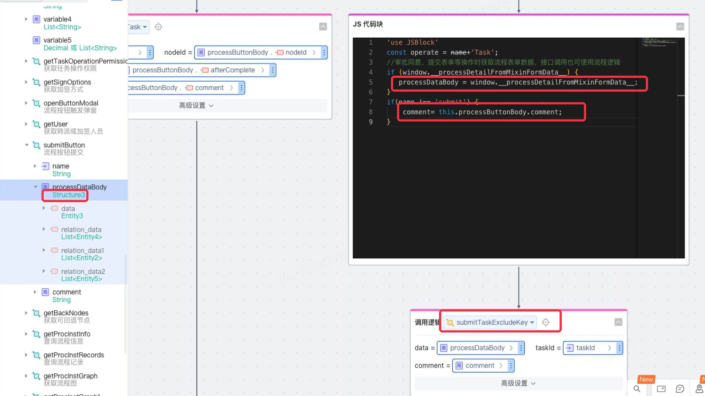
其中js代码块中window.__processDetailFromMixinFormData__的值为流程表单数据，可参考下面代码块。仅在平台一键生成的审批页可用。非一键生成的审批页，请自行按须组装表单数据。
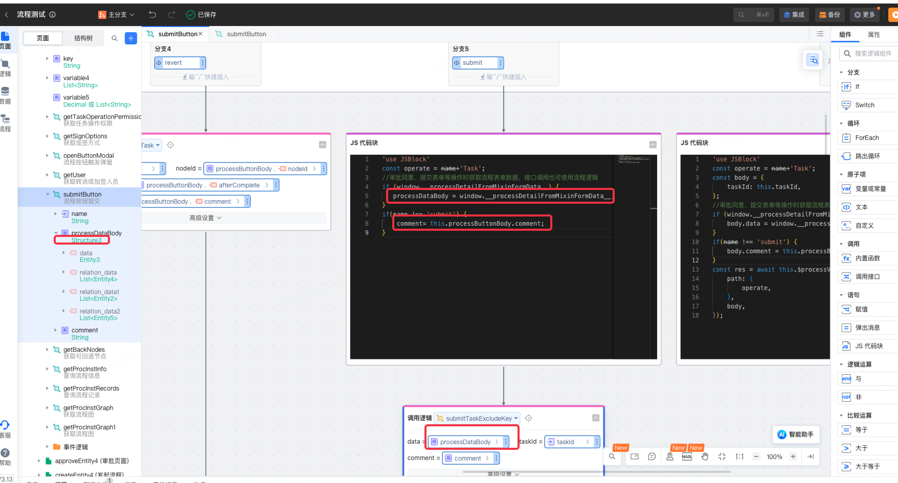

#### 拒绝任务rejectTaskExcludeKey

使用说明同提交任务submitTaskExcludeKey

```java
    /**
 * 拒绝任务
 *
 * @param data    传入数据
 * @param taskId  任务ID
 * @param comment 审批意见
 */
@NaslLogic
public <T> Boolean rejectTaskExcludeKey(T data, String taskId, String comment)

```

#### 同意任务approveTaskExcludeKey

使用说明同提交任务submitTaskExcludeKey

```java
   /**
 * 同意任务
 *
 * @param data    传入数据
 * @param taskId  任务ID
 * @param comment 审批意见
 * @param <T>
 * @return
 */
@NaslLogic
public <T> Boolean approveTaskExcludeKey(T data, String taskId, String comment)

```

#### 更新任务处理人（管理员）updateTaskHandlerAdmin

对当前任务做任务处理人修改操作。原审批方式或签/会签/依次不变。
会签/依次审批存在多个任务的场景，本逻辑仅基于当前任务修改候选人，不会创建新任务
如本人无原候选人abc三个人，现在要改成bcd，userNames传bcd。

注意：管理员可用，业务自行做鉴权处理。

```java
 /**
 * 更新任务实例候选处理人（当前任务审批人）
 * 基于已生成任务修改，不操作任务的增减
 *
 * @param taskId
 * @param updatedCandidateUsers
 * @param operatorUser
 * @return
 */
@NaslLogic
public Boolean updateTaskHandlerAdmin(String taskId, List<String> updatedCandidateUsers, String operatorUser) {
```

#### 新增任务实例候选处理人（管理员）addTaskHandlerAdm

基于已生成任务修改，审批方式不变。不同的审批方式，操作任务增减原则不同：
或签：多个候选人只会产生一个task。新增操作即对当前task新增候选人（候选人间为或的关系）
会签：多个候选人会产生多个task。新增操作即生成新的task，新task关联新候选人（候选人间为与的关系）。注：会签新增候选人时，若存在只有一个任务，且没有候选人，则先给任务加上候选人。若已存在有候选人的任务，则直接加任务
依次审批：多个候选人依次生成task。一个task对应一个候选人。新增操作即仅对当前task新增候选人（候选人间为或的关系）

```java
 /*
 * @param taskId              任务id
 * @param addedCandidateUsers 被添加的候选处理人
 * @param operatorUser        操作人
 * @return
 */
@NaslLogic
public Boolean addTaskHandlerAdmin(String taskId, List<String> addedCandidateUsers, String operatorUser) {
```

#### 减少任务实例候选处理人（管理员）removeTaskHandlerAdmin

基于已生成任务修改，审批方式不变。不同的审批方式，操作任务增减原则不同：
或签：多个候选人只会产生一个task。删除操作即对当前task删除候选人（候选人间为或的关系）
会签：多个候选人会产生多个task。删除操作即删除该候选人关联的task（候选人间为与的关系）。注：会签删除最后一个时，仅删除任务的候选人，不删除任务
依次审批：多个候选人依次生成task。一个task对应一个候选人。删除操作即仅对当前task删除候选人（候选人间为或的关系）

```java
 /*
 * @param taskId              任务id
 * @param removeTaskHandlerAdmin 被删除的候选处理人
 * @param operatorUser        操作人
 * @return
 */
@NaslLogic
public Boolean removeTaskHandlerAdmin(String taskId, List<String> removedCandidateUsers, String operatorUser) {
```

#### 根据任务id/实例id修改流程自定义变量updateProcessVariableByTaskId/updateProcessVariableByProcInstId

运行时基于流程实例修改流程自定义变量。
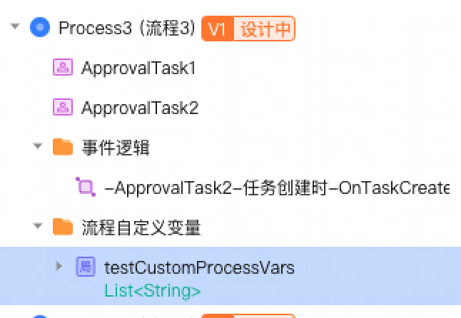

```java
    /**
 * 更新流程自定义变量
 * @param taskId
 * @param processVariableName
 * @param processVariableValue 类型须与流程定义中的自定义流程变量类型一致
 * @return
 * @param <T>
 */
@NaslLogic
public <T> Boolean updateProcessVariableByTaskId(String taskId, String processVariableName, T processVariableValue) {
   return extCustomVarsLogicService.updateProcessVariableByTaskId(taskId, processVariableName, processVariableValue);
}

/**
 * 更新流程自定义变量
 * @param procInstId
 * @param processVariableName
 * @param processVariableValue 类型须与流程定义中的自定义流程变量类型一致
 * @return
 * @param <T>
 */
@NaslLogic
public <T> Boolean updateProcessVariableByProcInstId(String procInstId, String processVariableName, T processVariableValue) {
   return extCustomVarsLogicService.updateProcessVariableByProcInstId(procInstId, processVariableName, processVariableValue);
}
```

##### 示例一：运行时修改未生成任务节点的配置人

1. 创建流程实例时，配置流程自定义变量，并指定配置人。
2. 调用本逻辑修改流程自定义变量。
3. Flowable执行到节点启动时，会获取流程自定义变量，作为审批人。Å

注意！！！本示例仅在节点启动前（即生成任务前）修改流程自定义变量，才会生效。
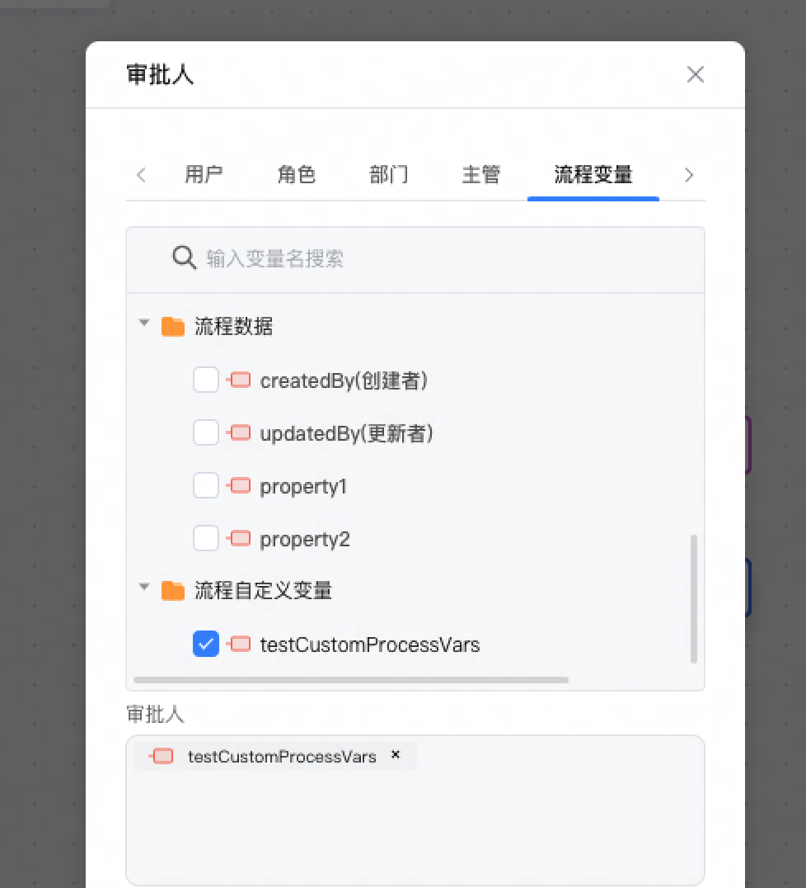

##### 示例二：运行时控制分支跳转

分支条件选择判断流程自定义变量。

注意！！！本示例仅在进入条件判断启动前修改流程自定义变量，才会生效。
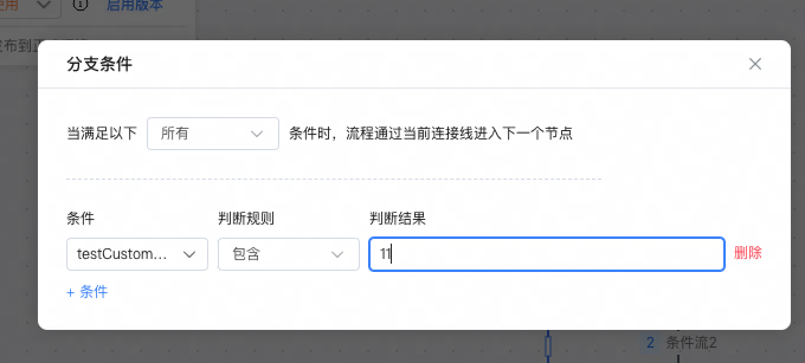

### 复写逻辑

#### 自定义获取用户名称customGetUserName

新增入参overrideLogicReq复写逻辑请求入参，当存在复写逻辑customGetUserName实现时，自动调用复写逻辑，传入overrideLogicReq，获取最终的用户名称。

```java

@NaslLogic(override = true)
public String customGetUserName(String req)
```

#### 流程监听事件customProcessOnEvent

```java
/**
 * 扩展依赖库监听事件，支持复写
 *
 * @param event 事件类型
 *              ProcessStartedEvent：流程启动事件
 *              ProcessEndedEvent：流程结束事件
 *              ProcessTerminatedEvent：流程终止事件
 *              TaskCreatedEvent：任务创建事件
 *              TaskClosedEvent：任务关闭事件
 *              TaskCancelledEvent：任务取消事件
 *              TaskNodeStartEvent：任务节点开始事件
 *              TaskNodeEndEvent：任务节点结束事件
 *              TaskOperationEvent：任务操作事件
 *              TaskApprovedEvent：任务审批通过事件
 *              TaskRejectedEvent：任务拒绝通过事件
 *              TaskReassignedEvent：任务转派事件
 *              TaskAddSignEvent：任务加签事件
 *              TaskSubmittedEvent：任务提交事件
 *              TaskRevertedEvent：任务回退事件
 *              TaskWithdrawnEvent：任务撤回事件
 * @param json ProcessEvent事件内容字符串
 * @return
 */
@NaslLogic(override = true)
public String customProcessOnEvent(String event, String json) {
   return "";
}
```

##### 示例：

```
event值：ProcessEndedEvent
json值：
{
"eventType" : "ProcessEndedEvent",
"procInstStartBy" : "DEVACC-processtest",
"procInstId" : "33147ea6-2342-11f0-b82b-acde48001122",
"procInstStartTime" : 1.745742768028E9,
"procDefId" : "Process_01158a46:1:d81f41c1-20e2-11f0-b0da-9ed7b1630921",
"procDefKey" : "Process_01158a46",
"procInstEndTime" : 1.745743377592E9,
"processData" : {
"relation_data" : [ ],
"data" : {
"property2" : "2",
"updatedTime" : "2025-04-27T08:32:47.886Z",
"property1" : "1",
"updatedBy" : "DEVACC-processtest",
"createdBy" : "DEVACC-processtest",
"createdTime" : "2025-04-27T08:32:47.886Z",
"id" : 3116032588896512
},
"relation_data_1" : [ ],
"relation_data_2" : [ ]
}
}
```

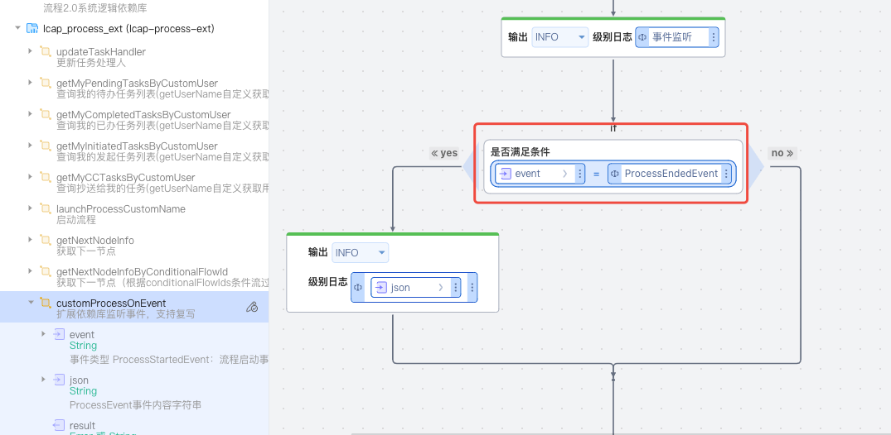

