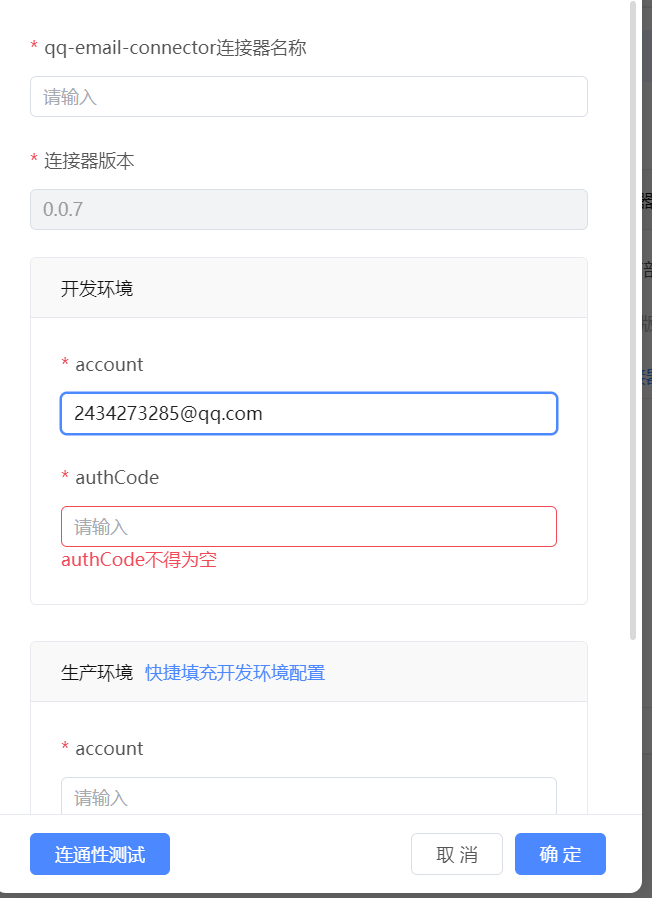

# QQ邮箱连接器
支持QQ邮箱收发邮件，发送邮件时支持设置主题，收件人，抄送人，正文等

## 逻辑详情

### 逻辑一  发送邮件 sendEmail  

* @param receiveAccount 接收方账号 必填
* @param subject        主题 必填
* @param content        内容 必填
* @param ccRecipients   抄送人 非必填
* @return Boolean 是否发送成功
### 逻辑二  接收邮件 getEmail

* @param needMsgCount 获取最新的几条邮件 必填 数值越大获取越慢
* @return MailBody 数组 返回封装的邮件消息体

## 使用步骤说明

1.  应用引用依赖库
2.  配置应用配置参数（如果有的话）
3.  逻辑调用示例截图
4.  填写账号 account 和授权码 authCode，点击连通性进行测试

5. 测试完成后点击确定，然后新建一个服务端逻辑，调用新建的连接器的相应逻辑，传入参数进行使用邮箱方法

## 应用演示链接

[使用了本依赖库的制品应用链接]
