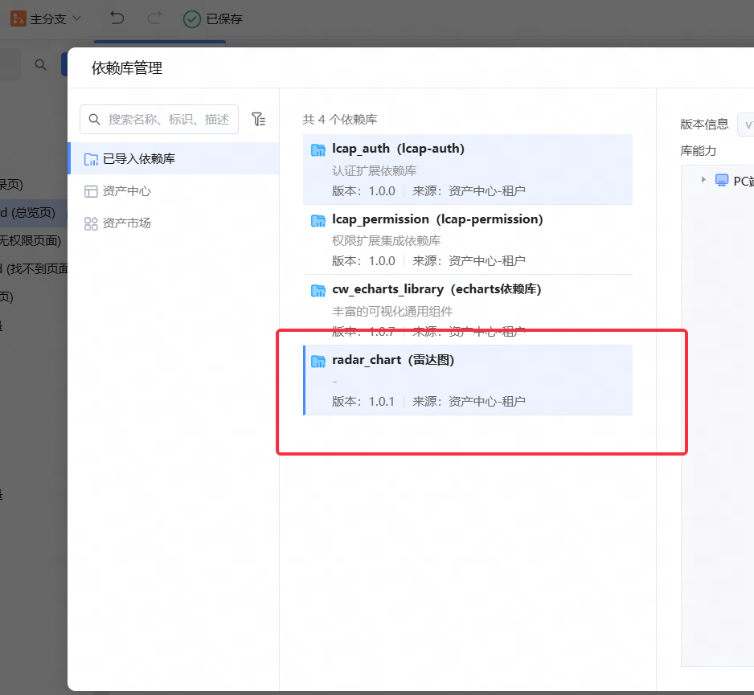
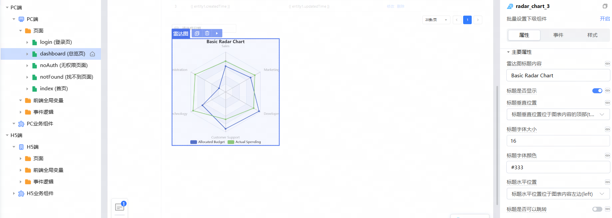

# 轮播图组件库

**依赖库设计**

这个依赖库旨在提供低代码平台可使用的雷达图，其核心是基于echarts

**主要特性**

- **组件一/逻辑一：** 提供雷达图组件。

**特性 1：** 雷达图，支持自定义标题、图例、系列、指标等内容

## 使用说明

1. 引入该依赖库

   

2. 拖拽组件到页面种

   

### 组件（组件名）

- **attrs**
   - titleText: String 雷达图标题内容
   - titleShow: Boolean 标题是否显示
   - titleVerticalPosition: String 标题垂直位置
   - titleFontSize: Number 标题字体大小
   - titleFontColor: String 标题字体颜色
   - titleHorizontalPosition: String 标题水平位置
   - titleLink: Boolean 标题是否可以跳转
   - titleHref: String 跳转地址
   - titletarget: String 链接打开方式
   - tooltipShow: Boolean 提示框是否显示
   - legendShow: Boolean 图例是否显示
   - legendTop: String 图例垂直位置
   - radarShape: String 雷达图轮廓形状
   - indicators: Array 雷达图指标列表
   - seriesSymbol: String 系列拐点图形
   - seriesSymbolSize: Number 系列拐点的大小
   - dataSeries: Array 雷达图系列列表
