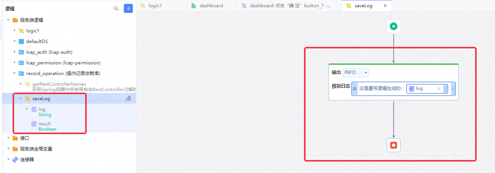

# 依赖库名称

作者： superName-w
record-operation一个利用Java提供的AOP机制来打印请求日志的依赖库。会打印请求的具体内容如下：全类名+方法名、请求ip，请求url，入参、出参、接口耗时；出现异常时打印error日志：异常信息、异常方法、异常栈、请求参数。

## 使用步骤说明

应用配置参数

1. loggingEnabled：布尔类型，用于开启或关闭日志打印功能。

2. - 开发环境默认值：true
   - 生产环境默认值：false

3. loggingFormat：字符串类型，定义日志的打印格式。

4. - simple：简易格式，打印请求详细信息和异常日志。
     - 全类名+方法名、请求ip，请求url、接口耗时
     - 打印error日志：异常信息、异常方法、异常栈、请求参数。
   - detailed：详细格式，打印请求详细信息、入参、出参和异常日志。
     - 全类名+方法名、请求ip，请求url，入参、出参、接口耗时
     - 打印error日志：异常信息、异常方法、异常栈、请求参数。
   - error：仅在出现异常时打印错误日志。
     - 打印error日志：异常信息、异常方法、异常栈、请求参数。
   - 如果配置为null或空字符串，则不打印任何日志。
   - 开发环境默认值：detailed
   - 生产环境默认值：simple

5.  loggingClassNames：指定需要拦截并记录日志的逻辑（控制类）。

   -   使用all表示拦截所有逻辑（控制类）。
-   如果配置为null或空字符串，则不拦截任何控制器类。
   -   逻辑名称需要使用英文逗号分隔，如：logic1,logic2
-   如果为依赖库逻辑命名规范为：依赖库标识(首字母大写)+逻辑名（大驼峰）例如：record-operation依赖库的getRestControllerNames逻辑需要写为Record_operationGetRestControllerNames
   -   开发环境默认值：all
-   生产环境默认值：all

注意：默认就屏蔽SystemTaskController类的日志。（流程相关）

依赖库逻辑：

1．方法：getRestControllerNames()

1. - 功能：获取Spring容器中所有带有@RestController注解的类的名称
   - 返回值：List<String>（类名列表）
   - 用途：主要用于获取带有@RestController注解的bean的名称  
   - 注意事项：在获取bean名称后，使用时需要注意不要复制$符号后面的内容

注意：如果为其它字符则会导致类型不一致导致发布失败。需要去排查你的应用参数是否输入正确。

2.方法：saveLog(String log)
1. - 功能：用于存储日志数据
   - 参数：log,拦截的日志信息
   - 返回值：Boolean
   - 用途：用户自定义日志存储逻辑

用户可直接双击saveLog，自定义log的解析逻辑，并将其按指定的方式存储（文件、数据库）

## 应用演示链接

1.引入依赖库

 

2.配置参数

3. 调用逻辑

   