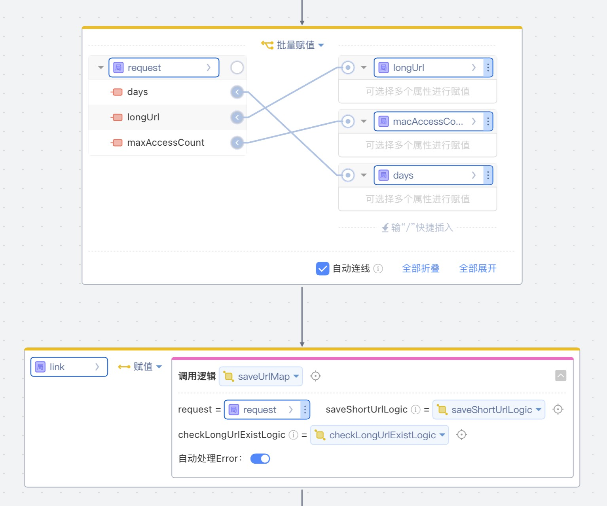

# ShortUrl
分享链接时，对用户拥有的短链有时间限制和次数限制。提供入参长连接转短连接的方法，方法可以配置链接有效期和访问次数的限制，

## 逻辑详情

### saveUrlMap

生成短链接哈希值  
入参： 
* ShortUrlRequest request 
* Function<Link, Link> saveShortUrlLogic 入库保存逻辑
* Function<String, Boolean> checkLongUrlExistLogic  检查长链接是否存在逻辑

出参： Link

### getLongUrl

获取长链接  

入参： 
* String shortCode
* Function<String, Link> findLinkByShortCode  根据短链接码查询短链接逻辑
* Function<Link, Boolean> updateLink  更新短链接访问次数逻辑

出参： String longUrl  

## 使用步骤说明

1.  应用引用依赖库
2.  配置应用配置参数 （无需配置）
3. 逻辑调用示例截图

## 应用演示链接

[使用了本依赖库的制品应用链接]

https://dev-testshorturl-qa.app.codewave.163.com/shorturl