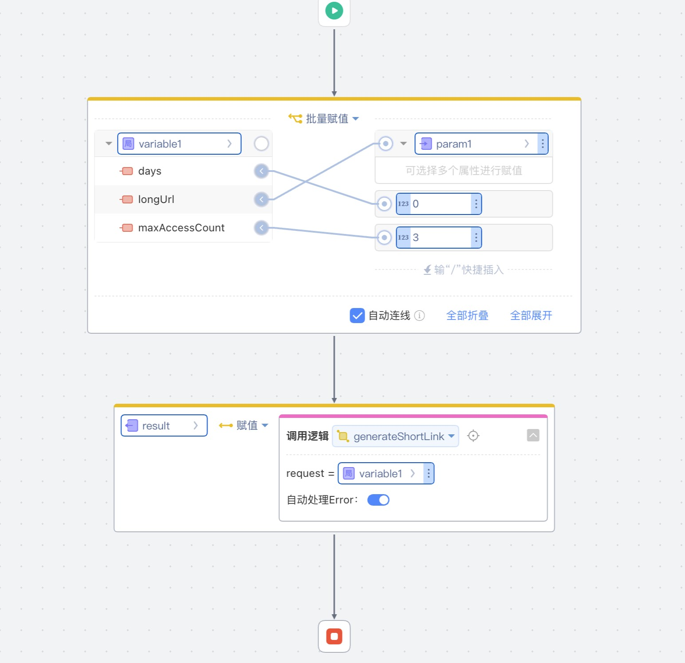

# ShortUrl
分享链接时，对用户拥有的短链有时间限制和次数限制。提供入参长连接转短连接的方法，方法可以配置链接有效期和访问次数的限制，

## 逻辑详情

### generateShortCode

生成短链接哈希值  
入参： ShortUrlRequest request  
出参： String shortCode

### getLongUrl

获取长链接  

入参： String shortCode  
出参： String longUrl  

## 使用步骤说明

1.  应用引用依赖库
2.  配置应用配置参数 
      1. shorturl.dataSourceUrl   JDBC地址，如 jdbc:mysql://127.0.0.1:3306/shorturl 
      2. shorturl.dataSourceUsername MySql数据库用户名
      3. shorturl.dataSourcePassword MySql数据库密码
3. 逻辑调用示例截图

## 应用演示链接

[使用了本依赖库的制品应用链接]
https://dev-testshorturl-qa.app.codewave.163.com/shorturl