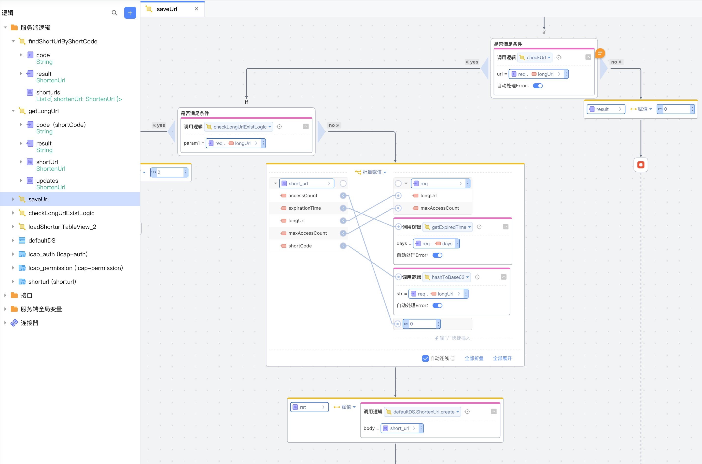

# ShortUrl
分享链接时，对用户拥有的短链有时间限制和次数限制。提供入参长连接转短连接的方法，方法可以配置链接有效期和访问次数的限制，

## 逻辑详情

### hashToBase62

将长链接转换为62进制

入参：
* str string

出参： String

### checkUrl

验证长链接是否合法

入参：
* url String

出参： Boolean

### checkExpiredTime

验证短链接是否过期

入参：
* expiredTime String 过期时间 格式 yyyy-MM-dd HH:mm:ss

出参： Boolean

### getExpiredTime

将天数转换为过期时间

入参：
* days Integer 天数
 
出参： String 格式 yyyy-MM-dd HH:mm:ss

## 使用步骤说明

1.  应用引用依赖库
2.  配置应用配置参数 （无需配置）
3.  逻辑调用示例截图

## 应用演示链接

[使用了本依赖库的制品应用链接]

https://dev-testshorturl-qa.app.codewave.163.com/shorturl_manager