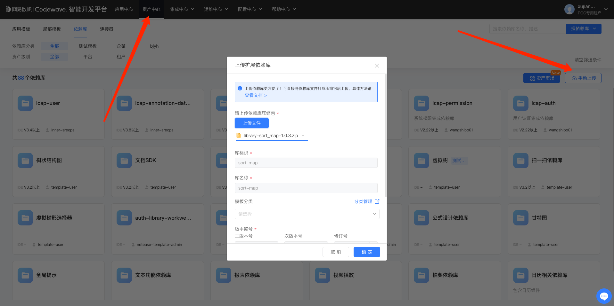
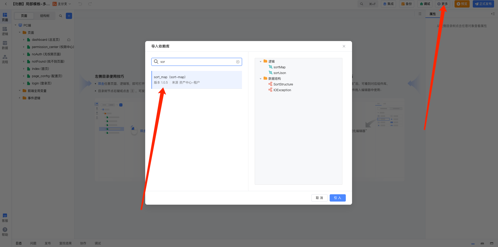

# **sort-map使用指南**

### **背景**

1. CodeWave当前支持的map都是无序的hashmap，这导致有些业务场景无法满足。所以这里提供了一个转为有序map的依赖库。
2. 当前支持的Json都是无序的，这里提供了一个调整json顺序的方法，满足调用第三方客户接口的json顺序要求。

### 使用步骤
1. 资产中心 -> 依赖库管理(租户或平台均可，建议租户) -> 手动上传

   

2. 在应用中导入该依赖库

   

### **接口详情**

#### **sortMap**

将输入的列表，转为有序的map

入参：List<SortStructure》

```json
[
    {
        "index":0,           // 序列号
        "key":"name",        // key
        "value":"张三"        // value
    }
]
```

出参：Map <String, String>


<br>

#### **sortJson**

将输入的json字符串，按照模板排序

入参：

jsonStr    需要转化的json

template 模板json，定义排列顺序

出参：

按照模板排序的json

**结构体**

```java
public class SortStructure {

    public Integer index;    
    public String key;    
    public String value;    
    public Integer getIndex() {
        return index;    
    }

    public void setIndex(Integer index) {
        this.index = index;    
    }

    public String getKey() {
        return key;    
    }

    public void setKey(String key) {
        this.key = key;    
    }

    public String getValue() {
        return value;    
    }

    public void setValue(String value) {
        this.value = value;    
   }
}
```

