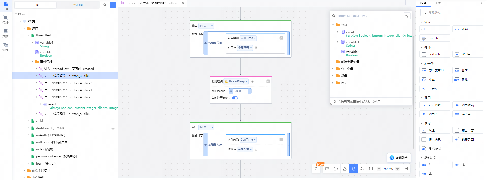
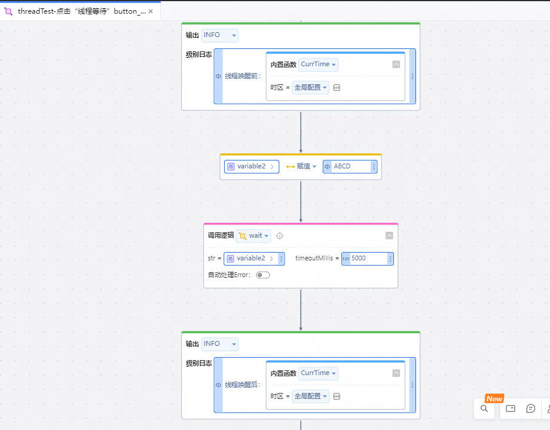
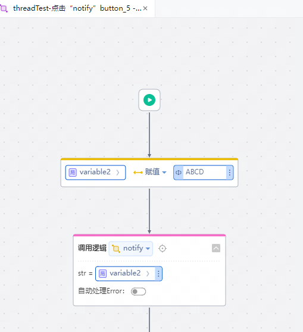
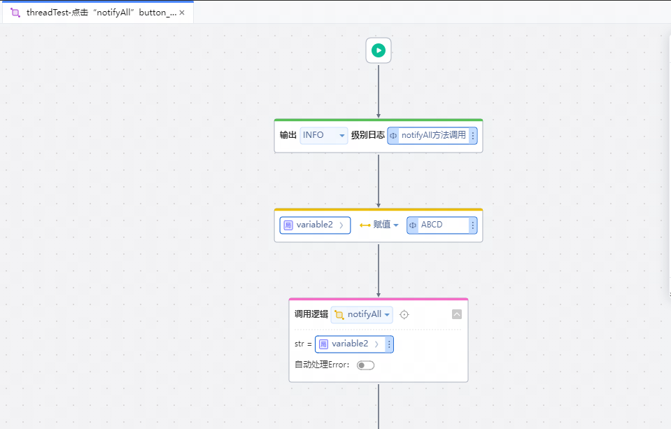
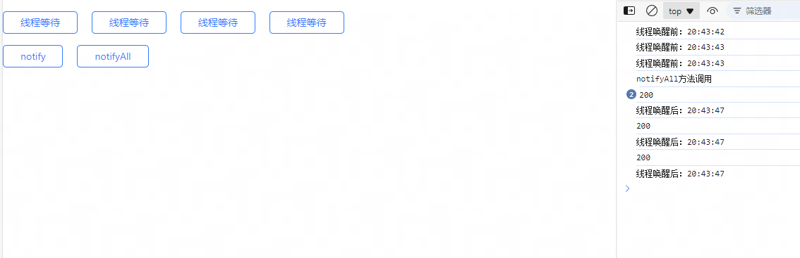

# 暂停当前线程

## 逻辑详情

### threadSleep

暂停线程。

| 参数名         | 类型      | 描述        | 是否必填 |
|-------------|---------|-----------|------|
| millisecond | Integer | 暂停的时间（毫秒） | 是    |

### wait

让线程进入等待状态，直到超过指定释放时间或者另一个线程调用该对象的 notify() 或 notifyAll() 方法为止。

| 参数名 | 类型      | 描述               | 是否必填 |
|-----|---------|------------------|------|
| str | String  | 调用wait方法的对象      | 是    |
|   timeoutMillis  | Integer | 超过指定时间线程自动释放（毫秒） | 是    |

### notify

唤醒该对象等待队列中的单个线程。

| 参数名 | 类型      | 描述            | 是否必填 |
|-----|---------|---------------|------|
| str | String | 调用notify方法的对象 | 是    |

### notifyAll

唤醒该对象等待队列中的所有线程。

| 参数名 | 类型      | 描述               | 是否必填 |
|-----|---------|------------------|------|
| str | String | 调用notifyAll方法的对象 | 是    |

## 使用步骤说明

1.下载依赖库后，应用引用依赖库

2.点击按钮调用ThreadSleep方法，暂停10秒（10000毫秒）

3.调用结果：

4.点击按钮调用wait方法,让线程进入等待状态，直到超过指定释放时间或者另一个线程调用该对象的 notify() 或 notifyAll() 方法为止。

5.调用notify方法,唤醒对象在等待队列中等待的单个线程

6.调用notifyAll方法,唤醒在对象的等待队列中等待的所有线程

