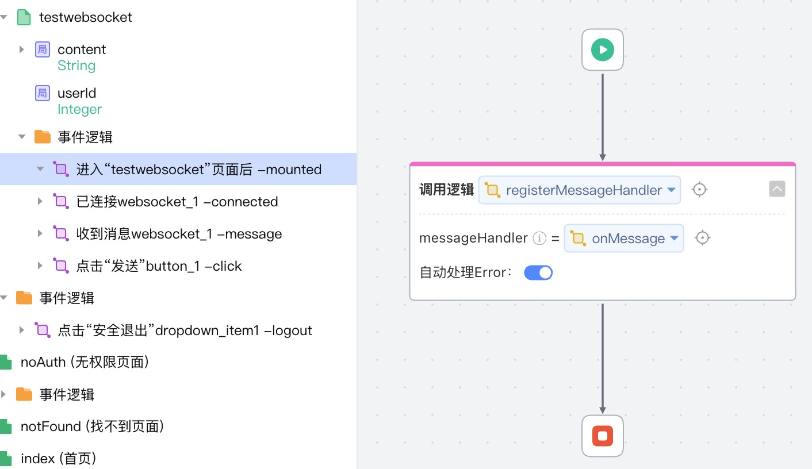

# websocket
IDE前后端使用websocket通信，后端主动可以向前端发送消息

## 逻辑详情

### registerMessageHandler

注册消息处理逻辑函数。  

入参： Function<CommonRequestMessage, CommonResponseMessage>  
出参： Boolean 无意义  

### sendMessage

向订阅的/topic/common发送消息，但不调用上述注册的逻辑函数

入参： CommonRequestMessage
出参： Boolean 无意义

CommonRequestMessage结构：
- content: String  消息内容
- userId: Long  发送者id

CommonReplyMessage结构
- content: String 消息内容
- userId: Long 发送者id

## 使用步骤说明

1.  应用引用依赖库
2.  无需配置应用配置参数
3.  逻辑调用示例截图

## 应用演示链接

[使用了本依赖库的制品应用链接]
https://dev-websocket-qa.app.codewave.163.com/dashboard/testwebsocket