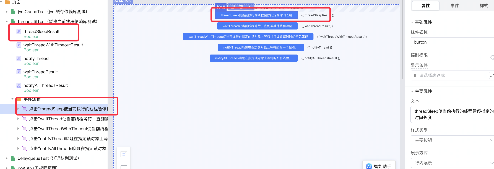
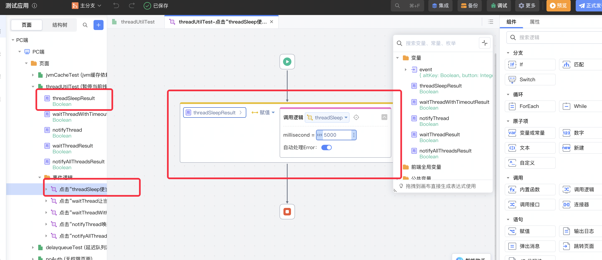
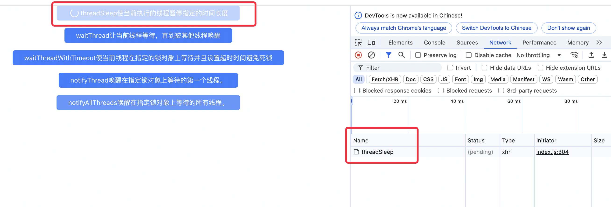
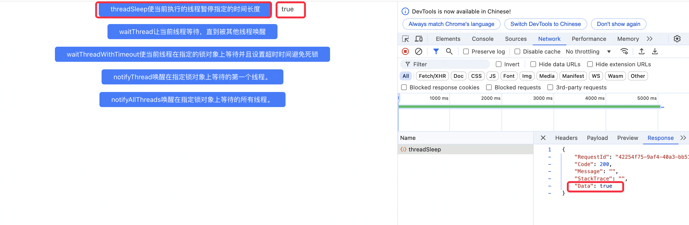
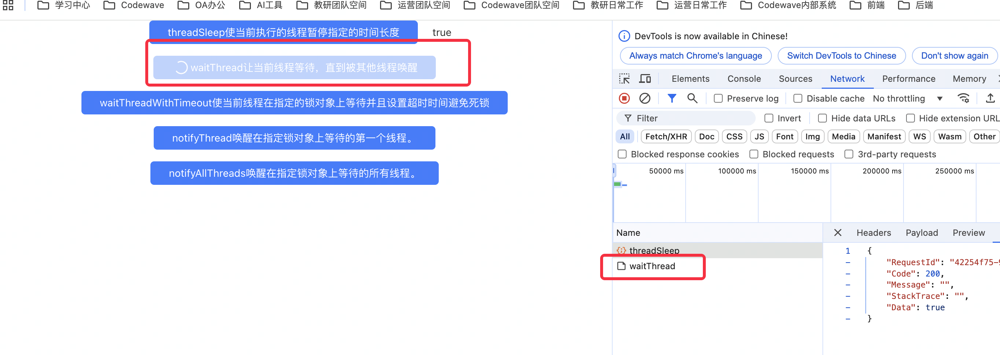
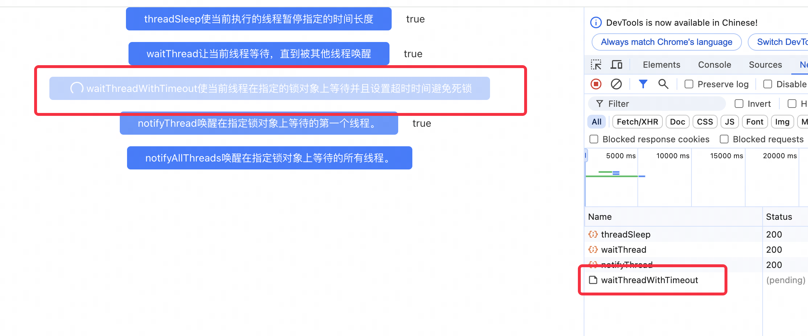
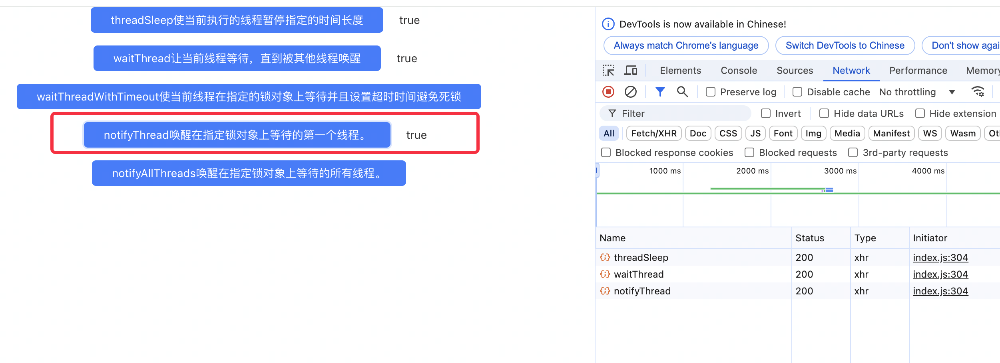
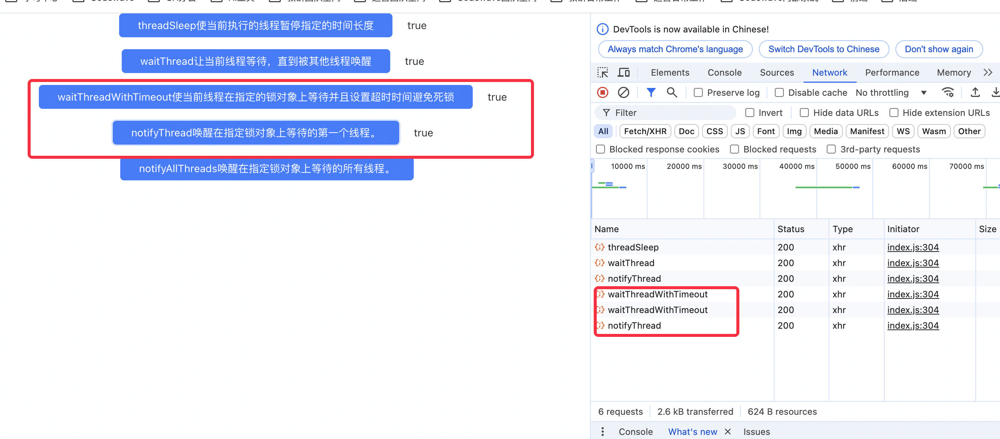
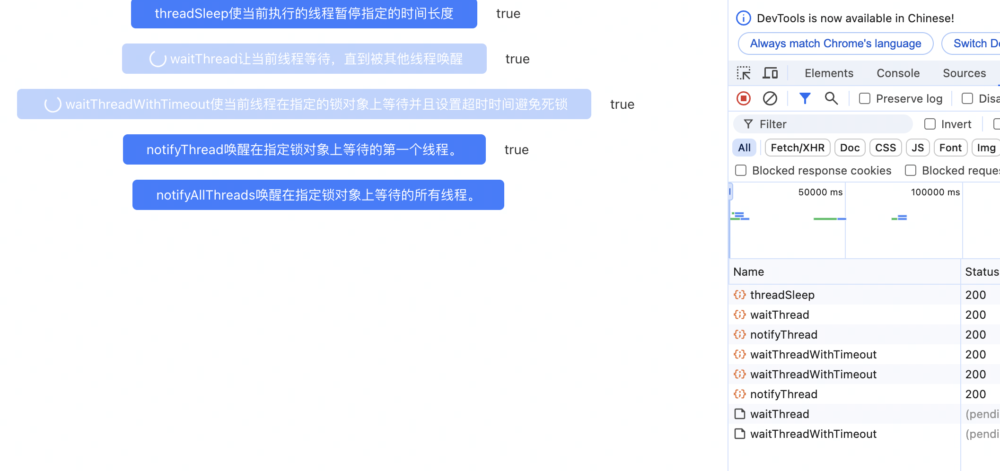
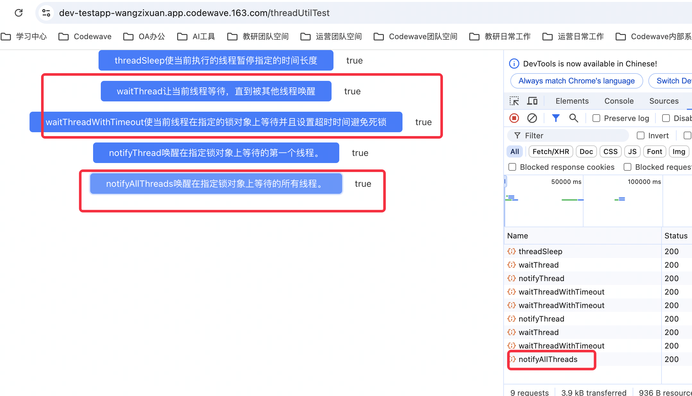

# Thread - Util 暂停当前线程依赖库（线程操作依赖库）

## 概述
`Thread - Util` 是一个基于 Java 的线程操作工具库，提供了线程暂停、等待、唤醒等常用操作的简单封装。这个库旨在简化多线程编程中的常见操作，提高代码的可读性和可维护性。

## 主要方法

### threadSleep

使当前线程暂停执行指定的时间。

| 参数名       | 类型   | 描述           | 是否必填 |
|-----------|------|--------------|------|
| millisecond | Long | 暂停的时间（毫秒）   | 是    |

**返回值**：Boolean
- true：线程成功暂停指定时间
- false：暂停失败（输入无效或线程被中断）

**异常处理**：
- 如果线程在睡眠期间被中断，会捕获 `InterruptedException` 异常，记录错误日志，重新设置线程的中断状态，并返回 false。

**注意事项**：
- 输入必须为正数，否则会记录错误日志并返回 false。
- 在需要精确定时的场景下可能不够准确。

### waitThread

使当前线程在指定的锁对象上等待，直到被其他线程唤醒。

| 参数名 | 类型   | 描述         | 是否必填 |
|-----|------|------------| ------ |
| lock | String | 用作锁对象的字符串 | 是     |

**返回值**：Boolean
- true：线程成功被唤醒
- false：等待过程中发生错误（如线程被中断）

**异常处理**：
- 如果等待过程中线程被中断，会捕获 `InterruptedException` 异常，记录错误日志，重新设置线程的中断状态，并返回 false。

**注意事项**：
- lock 不能为 null 或空字符串，否则会记录错误日志并返回 false。
- 使用 `String.intern()` 确保不同的字符串实例指向同一个锁对象。
- 必须在 synchronized 块中调用此方法，否则会抛出 `IllegalMonitorStateException`。

### waitThreadWithTimeout

使当前线程在指定的锁对象上等待，直到被唤醒或超时。

| 参数名    | 类型   | 描述           | 是否必填 |
|--------|------|--------------|------|
| lock   | String | 用作锁对象的字符串   | 是    |
| timeout | Long   | 超时时间（毫秒）    | 是    |

**返回值**：Boolean
- true：线程被唤醒或达到超时时间
- false：等待过程中发生错误（如线程被中断）

**异常处理**：
- 如果等待过程中线程被中断，会捕获 `InterruptedException` 异常，记录错误日志，重新设置线程的中断状态，并返回 false。

**注意事项**：
- lock 不能为 null 或空字符串，timeout 不能为负数，否则会记录错误日志并返回 false。
- 使用 `String.intern()` 确保不同的字符串实例指向同一个锁对象。
- 必须在 synchronized 块中调用此方法，否则会抛出 `IllegalMonitorStateException`。

### notifyThread

唤醒在指定锁对象上等待的单个线程。

| 参数名 | 类型   | 描述         | 是否必填 |
|-----|------|------------| ------ |
| lock | String | 用作锁对象的字符串 | 是     |

**返回值**：Boolean
- true：成功唤醒一个等待的线程
- false：唤醒过程中发生错误

**异常处理**：
- 如果当前线程不持有锁，会捕获 `IllegalMonitorStateException` 异常，记录错误日志，并返回 false。

**注意事项**：
- lock 不能为 null 或空字符串，否则会记录错误日志并返回 false。
- 使用 `String.intern()` 确保不同的字符串实例指向同一个锁对象。
- 必须在 synchronized 块中调用此方法，否则会抛出 `IllegalMonitorStateException`。

### notifyAllThreads

唤醒在指定锁对象上等待的所有线程。

| 参数名 | 类型   | 描述         | 是否必填 |
|-----|------|------------| ------ |
| lock | String | 用作锁对象的字符串 | 是     |

**返回值**：Boolean
- true：成功唤醒所有等待的线程
- false：唤醒过程中发生错误

**异常处理**：
- 如果当前线程不持有锁，会捕获 `IllegalMonitorStateException` 异常，记录错误日志，并返回 false。

**注意事项**：
- lock 不能为 null 或空字符串，否则会记录错误日志并返回 false。
- 使用 `String.intern()` 确保不同的字符串实例指向同一个锁对象。
- 必须在 synchronized 块中调用此方法，否则会抛出 `IllegalMonitorStateException`。

## 使用步骤说明

1. 在您的项目中引入 Thread - Util 依赖库。
2. 在需要使用线程操作的地方，调用相应的方法。
3. 检查返回的布尔值以确定操作是否成功。
4. 根据需要处理可能的异常情况。

## 使用示例

1. 下载依赖库后，应用引用依赖库
   
2. 在需要使用线程操作的地方，调用相应的方法。
   
   
3. 点击按钮调用threadSleep方法，让当前线程暂停5000毫秒
   
4. 调用结果：
   
5. 点击按钮调用waitThread方法,让线程进入等待状态，直到另一个线程调用该对象的 notifyThread() 或 notifyAllThreads() 方法为止。
   
6. 点击按钮调用waitThreadWithTimeout方法,让线程进入等待状态，直到另一个线程调用该对象的 notifyThread() 或 notifyAllThreads() 方法或者超时时间到期为止。
   
7. 调用notifyThread方法,对象的等待队列中等待的单个线程
   
   
8. 调用notifyAllThreads方法,唤醒在对象的等待队列中等待的所有线程
   
   
## 应用演示链接
https://dev-testapp-wanggexin.app.codewave.163.com/threadUtilTest