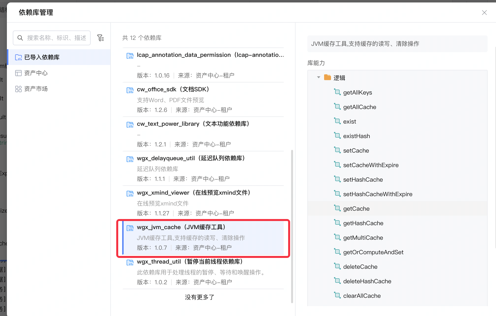
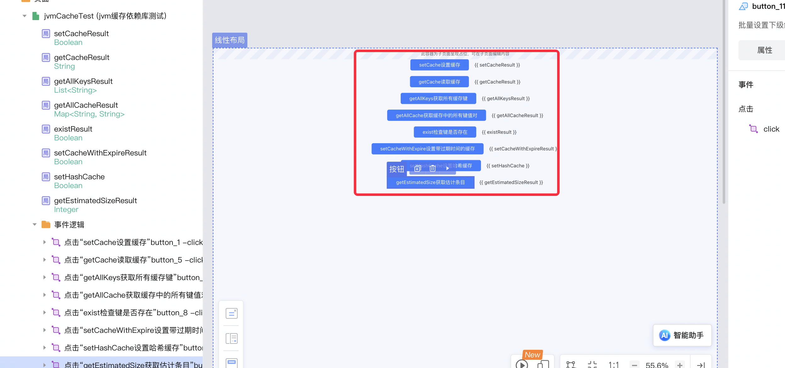
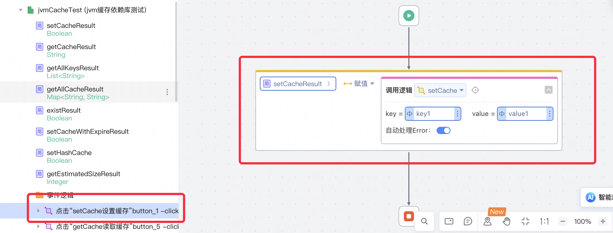
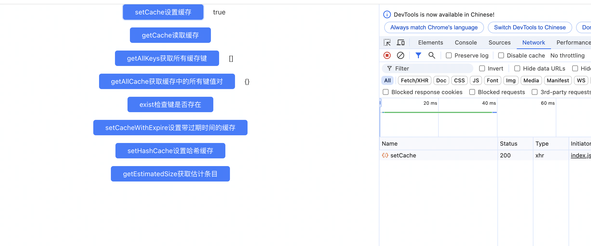
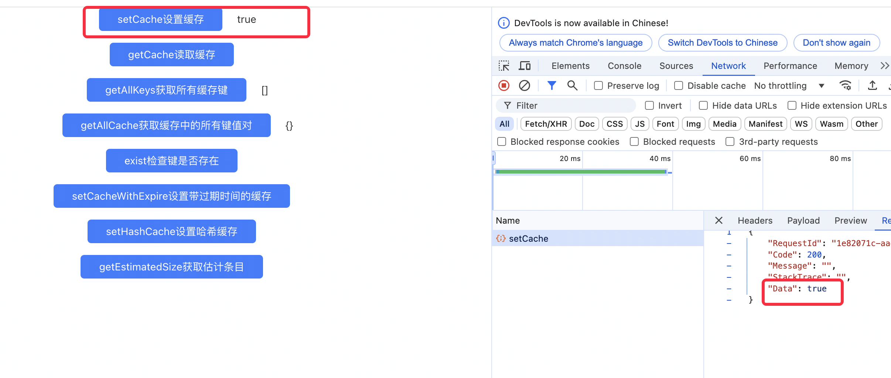
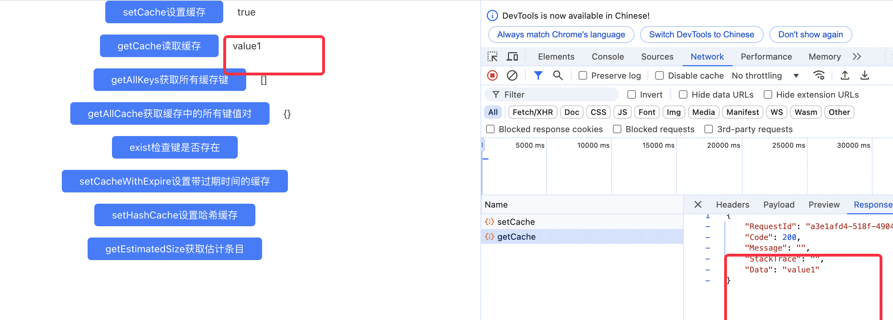

# JvmCache - JVM内存缓存依赖库

## 概述
`JvmCache` 是一个基于Caffeine实现的JVM内存缓存工具，用于高效地管理和操作内存中的缓存数据。

## 应用配置参数

JvmCache 提供了两个可配置的参数，用于调整缓存的性能和容量。这些参数可以通过环境变量或配置文件进行设置。

1. `initialCapacity`
  - 描述：初始的缓存空间大小
  - 单位：MB
  - 默认值：
    - 开发环境：10 
    - 生产环境：10 
  - 配置示例：`initialCapacity=20`

2. `maximumSize`
  - 描述：缓存的最大条目数
  - 单位：条目数量
  - 默认值：
    - 开发环境：10,000 
    - 生产环境：10,000 
  - 配置示例：`maximumSize=20000`

## 主要方法

### getAllKeys()

获取缓存中所有的键。

| 参数名 | 类型 | 描述 | 是否必填 |
|------|------|------|--------|
| 无    | 无   | 无   | 无     |

**返回值**：List< String>
- 包含所有缓存键的列表。如果缓存为空或未初始化，返回空列表。

**异常处理**：
- 如果缓存未初始化，抛出CacheException。

### getAllCache()

获取缓存中的所有键值对。

| 参数名 | 类型 | 描述 | 是否必填 |
|------|------|------|--------|
| 无    | 无   | 无   | 无     |

**返回值**：Map<String, String>
- 包含所有缓存的键值对。如果缓存为空或未初始化，返回空Map。

**异常处理**：
- 如果缓存未初始化，抛出CacheException。
- 其他异常会被捕获并记录，返回空Map。

### exist(String key)

检查指定的键是否存在于缓存中。

| 参数名 | 类型   | 描述         | 是否必填 |
|-------|-------|------------|--------|
| key   | String | 要检查的缓存键 | 是     |

**返回值**：Boolean
- true：如果键存在
- false：如果键不存在或为空

**异常处理**：
- 如果缓存未初始化，抛出CacheException。

### existHash(String key, String hashField)

检查指定的哈希键是否存在于缓存中。

| 参数名     | 类型   | 描述     | 是否必填 |
|-----------|-------|--------|--------|
| key       | String | 主键     | 是     |
| hashField | String | 哈希字段 | 是     |

**返回值**：Boolean
- true：如果哈希键存在
- false：如果哈希键不存在或参数无效

**异常处理**：
- 如果缓存未初始化，抛出CacheException。

### setCache(String key, String value)

设置缓存键值对。

| 参数名 | 类型   | 描述   | 是否必填 |
|-------|-------|-------|--------|
| key   | String | 缓存键 | 是     |
| value | String | 缓存值 | 是     |

**返回值**：Boolean
- true：设置成功
- false：设置失败（key为空）

**异常处理**：
- 如果缓存未初始化或设置过程中发生异常，抛出CacheException。

### setCacheWithExpire(String key, String value, Long expire)

设置带过期时间的缓存键值对。

| 参数名  | 类型   | 描述           | 是否必填 |
|--------|-------|--------------|--------|
| key    | String | 缓存键         | 是     |
| value  | String | 缓存值         | 是     |
| expire | Long   | 过期时间（毫秒） | 是     |

**返回值**：Boolean
- true：设置成功
- false：设置失败（参数无效）

**异常处理**：
- 如果缓存未初始化或设置过程中发生异常，抛出CacheException。

### setHashCache(String key, String hashField, String value)

设置哈希缓存。

| 参数名     | 类型   | 描述     | 是否必填 |
|-----------|-------|--------|--------|
| key       | String | 主键     | 是     |
| hashField | String | 哈希字段 | 是     |
| value     | String | 缓存值   | 是     |

**返回值**：Boolean
- true：设置成功
- false：设置失败（参数无效）

**异常处理**：
- 如果缓存未初始化或设置过程中发生异常，抛出CacheException。

### getCache(String key)

获取指定键的缓存值。

| 参数名 | 类型   | 描述   | 是否必填 |
|-------|-------|-------|--------|
| key   | String | 缓存键 | 是     |

**返回值**：String
- 对应的缓存值，如果不存在或已过期返回null。

**异常处理**：
- 如果缓存未初始化或获取过程中发生异常，抛出CacheException。

### getHashCache(String key, String hashField)

获取指定哈希键的缓存值。

| 参数名     | 类型   | 描述     | 是否必填 |
|-----------|-------|--------|--------|
| key       | String | 主键     | 是     |
| hashField | String | 哈希字段 | 是     |

**返回值**：String
- 对应的哈希缓存值，如果不存在或已过期返回null。

**异常处理**：
- 如果缓存未初始化或获取过程中发生异常，抛出CacheException。

### getMultiCache(List<String> keys)

批量获取多个键的缓存值。

| 参数名 | 类型          | 描述             | 是否必填 |
|-------|---------------|----------------|--------|
| keys  | List<String>  | 要获取的键的列表 | 是     |

**返回值**：Map<String, String>
- 包含存在的键值对。

**异常处理**：
- 如果缓存未初始化或批量获取过程中发生异常，抛出CacheException。

### deleteCache(String key)

删除指定的缓存键值对。

| 参数名 | 类型   | 描述         | 是否必填 |
|-------|-------|------------|--------|
| key   | String | 要删除的缓存键 | 是     |

**返回值**：Boolean
- true：删除成功
- false：删除失败（key为空或删除过程中发生异常）

**异常处理**：
- 如果缓存未初始化，抛出CacheException。

### deleteHashCache(String key, String hashField)

删除指定的哈希缓存。

| 参数名     | 类型   | 描述     | 是否必填 |
|-----------|-------|--------|--------|
| key       | String | 主键     | 是     |
| hashField | String | 哈希字段 | 是     |

**返回值**：Boolean
- true：删除成功
- false：删除失败（参数无效或删除过程中发生异常）

**异常处理**：
- 如果缓存未初始化，抛出CacheException。

### clearAllCache()

清空所有缓存。

| 参数名 | 类型 | 描述 | 是否必填 |
|------|------|------|--------|
| 无    | 无   | 无   | 无     |

**返回值**：Boolean
- true：清空成功
- false：清空失败（清空过程中发生异常）

**异常处理**：
- 如果缓存未初始化，抛出CacheException。

### getEstimatedSize()

获取缓存的估计大小。

| 参数名 | 类型 | 描述 | 是否必填 |
|------|------|------|--------|
| 无    | 无   | 无   | 无     |

**返回值**：Long
- 缓存中的估计条目数。

**异常处理**：
- 如果缓存未初始化，抛出CacheException。

### getOrComputeAndSet(String key, Long expireAfterWriteMillis, Function<String, String> computeFunction)

获取缓存，如果缓存不存在则执行指定的计算函数，并将计算结果存入缓存。

| 参数名                  | 类型                        | 描述                           | 是否必填 |
|------------------------|----------------------------|------------------------------|--------|
| key                    | String                     | 缓存键                         | 是     |
| expireAfterWriteMillis | Long                       | 写入后的过期时间（毫秒）         | 是     |
| computeFunction        | Function<String, String>   | 如果缓存不存在时，用于计算值的函数 | 是     |

**返回值**：String
- 缓存中的值或计算后的新值。如果计算结果为null，则返回null且不会更新缓存。

**异常处理**：
- 如果缓存未初始化或操作过程中发生异常，抛出CacheException。

## 使用示例

## 使用步骤说明

1. 在您的项目中引入 JvmCache 依赖库。
2. 在需要使用缓存的地方，调用相应的方法。
3. 检查返回的值以确定操作是否成功。
4. 根据需要处理可能的异常情况。

## 使用示例

1. 下载依赖库后，应用引用依赖库
   
2. 在需要使用缓存操作的地方，调用相应的方法。
   
   
3. 点击按钮调用setCache方法，设置缓存
   
4. 调用结果：
   
5. 点击按钮调用getCache方法，获取缓存值
   

## 应用演示链接
https://dev-testapp-jvmcache.app.codewave.163.com/jvmCacheTest