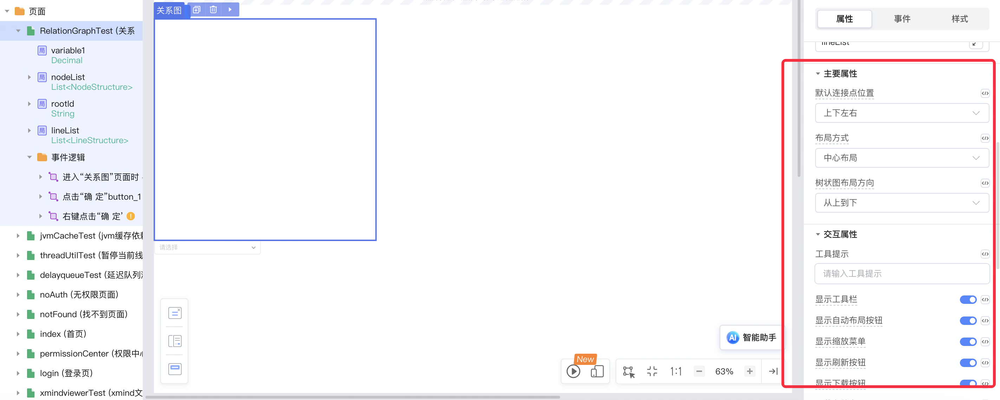

# wgx_relation_graph

## 背景

关系图组件通常用于展示复杂的网络结构，如组织架构、社交网络、知识图谱等场景。它可以直观地展示节点之间的关系。

以下是关系图组件的配置分组及说明。

## 配置说明

### 数据属性

| 配置项 | 配置名称   | 类型                      | 默认值 | 备注                                     |
|--------|------------|---------------------------|--------|------------------------------------------|
| rootId | 根节点     | String                    | -      | 设置根节点的 ID                          |
| nodes  | 节点数据   | List<T>或者匿名数据结构   | []     | 设置节点数据，每个对象包含节点的详细信息 |
| lines  | 关系线数据 | List<T>或者匿名数据结构   | []     | 设置关系线数据，每个对象描述节点间的连接 |

#### nodes 数据结构

| 属性                      | 类型    | 描述                           |
|---------------------------|---------|--------------------------------|
| id                        | String  | 节点的唯一标识符               |
| text                      | String  | 节点显示的文本                 |
| color                     | String  | 节点的背景颜色                 |
| fontColor                 | String  | 节点文本的颜色                 |
| borderWidth               | Integer | 节点边框的宽度                 |
| borderColor               | String  | 节点边框的颜色                 |
| nodeShape                 | Integer | 节点的形状 0:圆形 1方形;         |
| width                     | Integer | 节点的宽度                     |
| height                    | Integer | 节点的高度                     |
| opacity                   | Decimal | 节点的不透明度 (值范围：0到1,或者0到100)，设置为0可以实现隐藏的效果                |
| isHide                    | Boolean | 是否隐藏节点                   |
| disableDrag               | Boolean | 是否禁用节点拖拽               |
| disableDefaultClickEffect | Boolean | 是否禁用节点的默认点击效果     |

#### lines 数据结构

| 属性         | 类型    | 描述                   |
|--------------|---------|------------------------|
| from         | String  | 起始节点的 ID          |
| to           | String  | 结束节点的 ID          |
| text         | String  | 关系线的文本           |
| color        | String  | 关系线的颜色           |
| lineWidth    | Integer | 关系线的宽度           |
| isHide       | Boolean | 是否隐藏关系线         |
| lineShape    | Integer | 关系线的形状 0:直线;1:曲线;2:折线;3:圆弧;4:圆弧折线;5:圆弧折线2;6:圆弧折线          |
| fontColor    | String  | 关系线文本的颜色       |
| opacity      | Decimal | 关系线的不透明度 透明度(值范围：0到1,或者0到100)，设置为0可以实现隐藏的效果       |
| isHideArrow  | Boolean | 是否隐藏关系线的箭头   |
| useTextPath  | Boolean | 是否使用文本路径       |

### 主要属性

| 配置项               | 配置名称       | 类型   | 默认值   | 备注                   |
|----------------------|----------------|--------|----------|------------------------|
| defaultJunctionPoint | 默认连接点位置 | String | 'border' | 设置默认的连接点位置   |
| layout               | 布局方式       | String | 'center' | 设置布局方式 tree:树状布局/center:中心布局/force:自动布局 |
| layoutFrom           | 树状图布局方向 | String | 'top'    | 设置树状图布局方向，只有当布局方式为树状图时有效 left:从左到右/top:从上到下/right:从右到左/bottom:从下到上 |

### 交互属性

| 配置项                   | 配置名称         | 类型    | 默认值 | 备注                               |
|--------------------------|-------------------|---------|--------|-----------------------------------|
| allowShowMiniToolBar     | 显示工具栏       | Boolean | true   | 设置是否显示工具栏                 |
| allowAutoLayoutIfSupport | 显示自动布局按钮 | Boolean | true   | 设置是否在工具栏中显示自动布局按钮 |
| disableZoom              | 禁用缩放         | Boolean | false  | 设置是否禁用缩放功能               |
| disableDragNode          | 禁用节点拖拽     | Boolean | false  | 设置是否禁用节点拖拽功能           |

### 样式属性

| 配置项                  | 配置名称       | 类型    | 默认值 | 备注                       |
|-------------------------|----------------|---------|--------|----------------------------|
| backgroundColor         | 背景颜色       | String  | '#fff' | 设置图表的背景颜色         |
| backgroundImage         | 图谱水印 URL   | String  | null   | 设置图谱水印的 URL         |
| backgroundImageNoRepeat | 不重复显示水印 | Boolean | false  | 设置是否不重复显示水印     |

### 组件逻辑

| 方法名 | 描述               | 参数 | 返回值 |
|--------|-------------------|------|--------|
| reload | 重新加载关系图数据 | 无   | 无     |

## 使用示例

创建一个简单的组织架构关系图。

1. 创建 页面 页面，将关系图组件拖入到页面中。

   

2. 创建数据集，包含节点数据和关系线数据。将数据集绑定到关系图组件的相应属性,可以是用匿名结构或者自定义数据结构(我这里直接在进入页面赋值了)。

   

3. 设置根节点 ID，并配置适当的交互属性，如允许显示工具栏和自动布局按钮。

   

4. 预览应用，即可看到关系图的展示效果。用户可以拖拽节点，使用工具栏进行缩放和自动布局等操作。

   