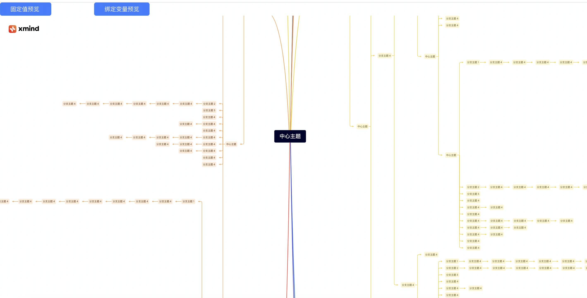
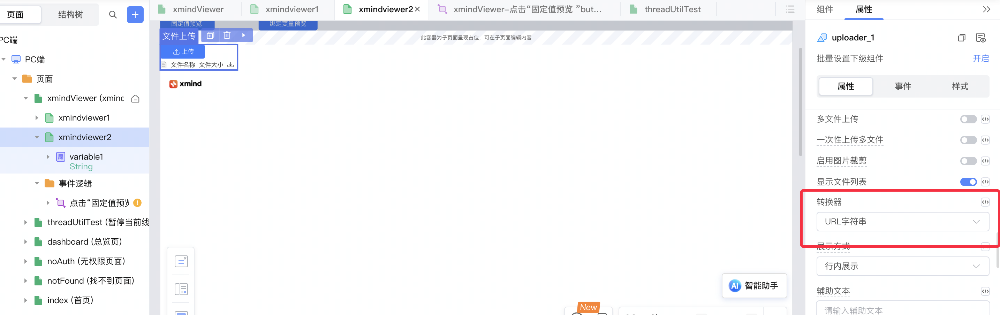
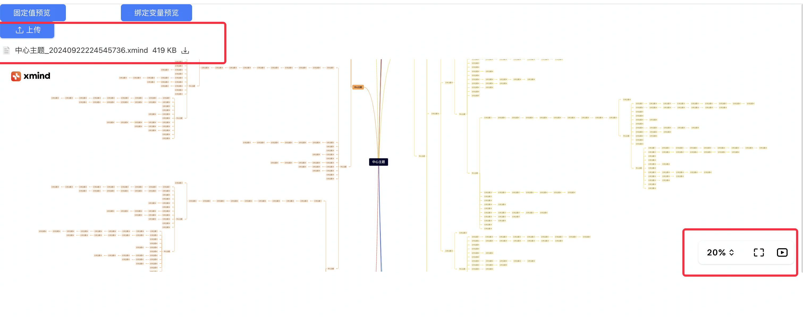

# 依赖库名称

## 依赖库设计

这个依赖库旨在提供一个xmind预览组件，用于在低代码开发中快速预览xmind文件。

## 主要特性

### 组件一：xmind预览组件

这个组件用于在低代码开发中预览xmind文件。它提供了一个简单的界面，允许用户只需要提供xmind文件地址并在界面上显示xmind文件的内容，并且支持缩放以及全屏观看。

## 使用说明

### 步骤

1. 引入组件
    

2. 拖入页面
    

3. 配置属性
    

4. 配合上传组件获取xmind文件地址
    
    

5. 预览效果
    

### 组件详情（组件名）

- **Attributes (attrs)**
  - `fileurl`: xmind文件的url地址，根据url加载xmind文件。

- **Methods**
  - 无

- **Events**
  - 无

## 应用演示链接

[查看示例演示](#)   *(请将此处的`#`替换为实际的演示链接)*