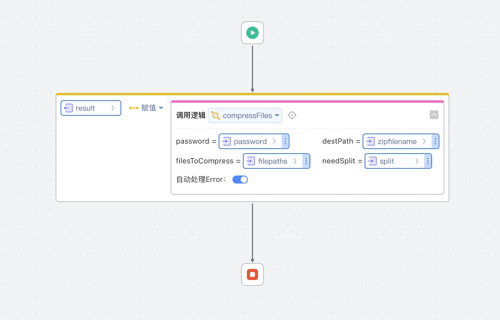

# zip包加密依赖库
文件zip包加密依赖库

## 逻辑详情

### compressFiles

压缩文件  
入参：
* 密码
* 压缩包名称
* 待压缩文件列表，可包含路径，支持http/https URL
* 是否分割压缩

出参：
* FileUploadResponse 同文件上传响应，但多2个参数filePaths和results，表示分割的多个文件路径列表和URL

### asyncCompressFiles

异步压缩文件

入参：
* 密码
* 压缩包名称
* 待压缩文件列表，可包含路径，支持http/https URL
* 是否分割压缩
* 压缩完成回调， 参数为FileUploadResponse

出参：
* Boolean 无实际意义

## 使用步骤说明

1.  应用引用依赖库
2.  配置应用配置参数

全局配置：
* 应用地址，https://
* 默认加密密码
* 加密方式, 默认AES 0：ZipStandard，1：AES
* 压缩级别，默认压缩级别为5, 1-9, 0 为不压缩
* 分割大小，分割大小, 默认为10M
* 压缩方式，默认为DEFLATE, 0：DEFLATE，1：STORE

3.  逻辑调用示例截图

## 应用演示链接

[使用了本依赖库的制品应用链接]
https://dev-testdiff-qa.app.codewave.163.com/dashboard/ziptest